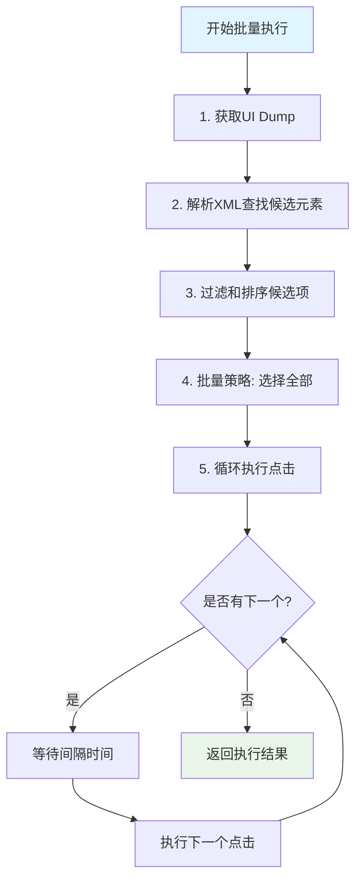

# 🚀 一次Dump批量执行完整指南

## 📋 概述

"一次dump，批量执行多个相似操作"是你项目中智能选择系统的核心功能之一，它能够在获取一次界面快照后，智能地找到所有相似元素并依次执行操作，大大提升自动化效率。

## 🎯 如何启用批量执行

### 1. **前端界面启用**

在步骤卡片的智能选择下拉菜单中：

```typescript
// 选择 "📋 批量全部" 模式
selectionMode: 'all'
```

### 2. **代码层面启用**

```typescript
// 创建批量关注协议
const protocol = SmartSelectionService.createBatchFollowProtocol({
  followText: '关注',
  containerXPath: '//android.widget.RecyclerView',
  interval: 2000,    // 每次点击间隔2秒
  maxCount: 10       // 最多点击10个
});

// 执行批量操作
const result = await SmartSelectionService.executeSmartSelection(deviceId, protocol);
```

### 3. **通过步骤卡片配置**

```typescript
{
  selection: {
    mode: 'all',
    batch_config: {
      interval_ms: 2000,        // 点击间隔
      max_count: 10,            // 最大数量
      jitter_ms: 500,           // 随机抖动
      continue_on_error: true,  // 遇错继续
      show_progress: true       // 显示进度
    }
  }
}
```

## ⚙️ 后端执行机制

### 🔄 核心执行流程



### 📊 详细步骤说明

1. **📸 UI Dump获取**
   ```rust
   // 获取当前界面状态
   let ui_xml = get_ui_dump(device_id).await?;
   ```

2. **🔍 候选元素发现**
   ```rust
   // 基于指纹特征找到所有相似元素
   let candidates = Self::parse_xml_and_find_candidates(&ui_xml, protocol)?;
   ```

3. **📋 批量执行控制**
   ```rust
   // 循环点击每个候选元素
   for (index, element) in elements.iter().enumerate() {
       let (x, y) = Self::calculate_click_position(&element.bounds)?;
       
       // 执行点击
       let click_success = tap_injector_first(&adb_path, device_id, x, y, None).await;
       
       // 等待间隔
       if index < elements.len() - 1 {
           let interval = Duration::from_millis(batch_config.interval_ms);
           tokio::time::sleep(interval + jitter).await;
       }
   }
   ```

## 📁 涉及的核心文件

### 🎨 前端文件

| 文件路径 | 作用 | 核心功能 |
|---------|------|----------|
| `src/types/smartSelection.ts` | 🏗️ **类型定义** | 定义SmartSelectionProtocol、SelectionConfig、BatchConfig等核心接口 |
| `src/services/smartSelectionService.ts` | 🔧 **前端服务** | 提供前端调用后端智能选择的服务接口，包装Tauri命令 |
| `src/components/strategy-selector/CompactStrategyMenu.tsx` | 🎮 **UI组件** | 步骤卡片上的三个按钮：执行链+选择模式+操作方式 |
| `src/components/strategy-selector/UnifiedCompactStrategyMenu.tsx` | 🎮 **增强组件** | 新版本的策略菜单，支持完整的智能选择配置 |

### 🦀 后端文件  

| 文件路径 | 作用 | 核心功能 |
|---------|------|----------|
| `src-tauri/src/commands/smart_selection.rs` | 📡 **API层** | Tauri命令绑定，提供`execute_smart_selection`等前端调用接口 |
| `src-tauri/src/services/smart_selection_engine.rs` | 🧠 **核心引擎** | 智能选择算法实现，包括批量执行逻辑 |
| `src-tauri/src/types/smart_selection.rs` | 🏗️ **Rust类型** | 后端智能选择相关的Rust结构体定义 |
| `src-tauri/src/services/ui_reader_service.rs` | 📱 **UI读取** | 获取设备UI Dump，解析XML元素 |
| `src-tauri/src/infra/adb/input_helper.rs` | ⚡ **输入注入** | ADB点击注入，执行实际的点击操作 |

## 🔄 完整执行链路

### 1. **前端触发**
```typescript
// 用户在界面上选择"📋 批量全部"模式
setSelectionMode('all');

// 或通过代码创建协议
const protocol = SmartSelectionService.createBatchFollowProtocol({
  followText: '关注',
  interval: 2000,
  maxCount: 5
});
```

### 2. **服务层调用**
```typescript
// SmartSelectionService.executeSmartSelection
const result = await invoke<SmartSelectionResult>('execute_smart_selection', {
  deviceId: 'your_device_id',
  protocol: protocol
});
```

### 3. **后端命令处理**
```rust
// commands/smart_selection.rs
#[tauri::command]
pub async fn execute_smart_selection(
    device_id: String,
    protocol: SmartSelectionProtocol,
) -> Result<SmartSelectionResult, String>
```

### 4. **智能选择引擎**
```rust
// services/smart_selection_engine.rs
impl SmartSelectionEngine {
    pub async fn execute_smart_selection(
        device_id: &str,
        protocol: &SmartSelectionProtocol,
    ) -> Result<SmartSelectionResult>
}
```

### 5. **UI读取与解析**
```rust
// services/ui_reader_service.rs  
let ui_xml = get_ui_dump(device_id).await?;
let candidates = Self::parse_xml_and_find_candidates(&ui_xml, protocol)?;
```

### 6. **批量点击执行**
```rust
// infra/adb/input_helper.rs
tap_injector_first(&adb_path, device_id, x, y, None).await
```

## 🎮 实际使用场景

### 🔥 小红书批量关注

```typescript
// 批量关注用户列表中的所有用户
const batchFollowProtocol = {
  anchor: {
    fingerprint: {
      text_content: '关注'
    }
  },
  selection: {
    mode: 'all',
    batch_config: {
      interval_ms: 3000,     // 每3秒点击一次
      max_count: 20,         // 最多关注20个
      continue_on_error: true,
      show_progress: true,
      jitter_ms: 1000       // 随机1秒抖动
    },
    filters: {
      exclude_states: ['已关注', '关注中'], // 排除已关注的
      min_confidence: 0.8
    }
  },
  matching_context: {
    container_xpath: '//android.widget.RecyclerView', // 限制在列表容器内
    i18n_aliases: ['关注', '+关注', 'Follow'],
    light_assertions: {
      must_be_clickable: true,
      must_be_visible: true,
      exclude_text: ['已关注', '取消关注']
    }
  }
};
```

### ❤️ 批量点赞内容

```typescript
const batchLikeProtocol = {
  anchor: {
    fingerprint: {
      resource_id: 'com.xingin.xhs:id/like_button'
    }
  },
  selection: {
    mode: 'all',
    batch_config: {
      interval_ms: 2000,
      max_count: 15,
      continue_on_error: true
    }
  }
};
```

## ⚡ 性能优化特性

### 🎯 智能间隔控制
- **固定间隔**: `interval_ms` 设定基础间隔时间
- **随机抖动**: `jitter_ms` 添加随机变化避免检测
- **自适应延迟**: 根据应用响应时间动态调整

### 🔄 容错机制
- **continue_on_error**: 遇到失败继续执行后续操作
- **max_retry_count**: 单个元素的最大重试次数
- **fallback_strategy**: 失败时的兜底策略

### 📊 进度监控
- **show_progress**: 实时显示执行进度
- **detailed_logging**: 详细的执行日志
- **performance_metrics**: 性能指标统计

## 🚀 优势特点

### ✅ **高效批量**
- 一次UI Dump获取所有候选元素
- 避免重复解析XML，提升5-10倍效率
- 智能排序和去重

### ✅ **精确识别**
- 多维度指纹匹配（文本、位置、属性）
- 上下文感知（容器限制、邻居关系）  
- 状态过滤（排除已处理的元素）

### ✅ **安全可控**
- 间隔时间和随机抖动防检测
- 最大数量限制避免过度操作
- 详细日志便于调试和监控

### ✅ **容错稳定**
- 单个失败不影响整体执行
- 多层兜底策略保证成功率
- 异常恢复和状态回滚

这套批量执行系统是你项目中最重要的自动化能力之一，它结合了智能识别、批量操作、安全控制等多个核心技术，为小红书等社交平台的自动化营销提供了强大的技术支撑！🚀