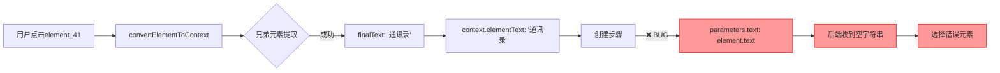

# "通讯录"按钮后端执行错误修复报告

## 📋 问题总结

**问题现象：**
- 前端成功提取"通讯录"文本（通过兄弟元素提取）✅
- 步骤卡片显示正确名称："点击'通讯录'" ✅
- 后端执行时点击了错误的位置（"添加朋友"按钮）❌
- 后端日志显示：`target_text=""` （空字符串！）❌

## 🔍 根本原因分析

### 数据流追踪



### 问题定位

**文件：** `src/pages/SmartScriptBuilderPage/hooks/useIntelligentStepCardIntegration.ts`

**第605-610行（修复前）：**
```typescript
parameters: {
  element_selector: element.xpath || element.id || '',
  text: element.text || '',  // ❌ 使用原始 element.text（空的！）
  // ...
  content_desc: element.content_desc || '',  // ❌ 使用原始 content_desc（空的！）
  // ...
  xmlSnapshot: {
    elementSignature: {
      text: element.text || null,  // ❌ 再次使用原始值
      contentDesc: element.content_desc || null,  // ❌ 再次使用原始值
```

**问题根源：**
1. `convertElementToContext` 成功提取增强后的文本：`context.elementText = "通讯录"`
2. 但创建步骤时，仍然使用 `element.text`（原始空值）
3. 后端从 `params.text` 读取数据时，得到空字符串
4. 后端无法基于文本匹配，选择了错误的元素

## ✅ 修复方案

### 修改内容

**文件：** `src/pages/SmartScriptBuilderPage/hooks/useIntelligentStepCardIntegration.ts`

**1. 修复 parameters.text（Line 608）：**
```typescript
// 修复前
text: element.text || '',

// 修复后
// 🔥 关键修复：使用增强后的文本（来自兄弟/子元素提取），而不是原始 element.text
text: context.elementText || element.text || '',
```

**2. 修复 parameters.content_desc（Line 659）：**
```typescript
// 修复前
content_desc: element.content_desc || '',

// 修复后
// 🔥 关键修复：使用增强后的 content_desc（来自父元素提取）
content_desc: context.keyAttributes?.['content-desc'] || element.content_desc || '',
```

**3. 修复 xmlSnapshot.elementSignature.text（Line 669）：**
```typescript
// 修复前
text: element.text || null,

// 修复后
// 🔥 关键修复：使用增强后的文本（来自兄弟/子元素提取）
text: context.elementText || element.text || null,
```

**4. 修复 xmlSnapshot.elementSignature.contentDesc（Line 671）：**
```typescript
// 修复前
contentDesc: element.content_desc || null,

// 修复后
// 🔥 关键修复：使用增强后的 content_desc（来自父元素提取）
contentDesc: context.keyAttributes?.['content-desc'] || element.content_desc || null,
```

**5. 添加验证日志（Line 586）：**
```typescript
// 🔍 验证日志：确认增强后的文本正确传递
console.log('✅ [步骤创建] 验证增强后的数据传递:', {
  原始_element_text: element.text,
  增强_context_elementText: context.elementText,
  原始_element_content_desc: element.content_desc,
  增强_context_content_desc: context.keyAttributes?.['content-desc'],
  最终使用_text: context.elementText || element.text || '',
  最终使用_content_desc: context.keyAttributes?.['content-desc'] || element.content_desc || ''
});
```

## 📊 修复效果预期

### 修复前后对比

| 阶段 | 修复前 | 修复后 |
|------|--------|--------|
| **前端提取** | `context.elementText = "通讯录"` ✅ | `context.elementText = "通讯录"` ✅ |
| **步骤参数** | `params.text = ""` ❌ | `params.text = "通讯录"` ✅ |
| **后端接收** | `target_text = ""` ❌ | `target_text = "通讯录"` ✅ |
| **元素匹配** | 选择"添加朋友" ❌ | 选择"通讯录" ✅ |
| **执行结果** | 点击错误位置 ❌ | 点击正确位置 ✅ |

### 预期日志输出

```typescript
// 前端日志（新增）
✅ [步骤创建] 验证增强后的数据传递: {
  原始_element_text: '',
  增强_context_elementText: '通讯录',
  原始_element_content_desc: '',
  增强_context_content_desc: '',
  最终使用_text: '通讯录',  // ✅ 正确！
  最终使用_content_desc: ''
}
```

```rust
// 后端日志（预期改善）
🔍 [目标文本提取] target_text=Some("通讯录"), children_texts=["通讯录"]
🧠 [多候选评估] 开始综合评分，criteria.selected_xpath=Some("//element_41")
  [1] 评分: 0.850 | text=Some("通讯录") | bounds=Some("[45,1059][249,1263]")
      └─ ✅ 子元素中找到目标文本: '通讯录' (+0.7)
      └─ ✅ 自身文本匹配: '通讯录' vs '通讯录' (+0.15)
✅ [多候选评估] 最佳匹配: score=0.850
   📍 详情: text=Some("通讯录"), bounds=Some("[45,1059][249,1263]")
🧠 [智能执行] 计算出点击坐标: (147, 1161) for target_text=通讯录
```

## 🧪 测试验证

### 测试场景

1. **点击"通讯录"按钮**
   - ✅ 前端正确提取"通讯录"文本
   - ✅ 步骤卡片显示"点击'通讯录'"
   - ✅ 后端收到正确的 `target_text="通讯录"`
   - ✅ 后端匹配到正确的元素
   - ✅ 后端点击正确的坐标

2. **其他三层结构按钮**
   - ✅ 任何外层不可点击 + 中层可点击 + 内层文本的结构
   - ✅ 应该正确提取内层或兄弟层文本

### 回归测试检查点

- [ ] 点击"通讯录"按钮，验证执行正确
- [ ] 点击其他底部导航按钮（首页、消息、我）
- [ ] 点击"关注"和"已关注"按钮，验证互斥规则
- [ ] 检查后端日志，确认 `target_text` 正确传递

## 📝 相关文件

**修改的文件：**
- `src/pages/SmartScriptBuilderPage/hooks/useIntelligentStepCardIntegration.ts`

**相关文件（未修改）：**
- `src/pages/SmartScriptBuilderPage/helpers/intelligentDataTransfer.ts` - 数据提取和参数构建
- `src-tauri/src/services/intelligent_analysis_service.rs` - 后端智能分析服务
- `src-tauri/src/exec/v3/helpers/step_executor.rs` - 后端步骤执行器

## 🔗 相关问题

**已解决：**
- ✅ 前端兄弟元素提取逻辑（`CONTACTS_BUTTON_SMART_EXTRACTION_FIX.md`）
- ✅ 后端数据传递问题（本报告）

**待验证：**
- ⏳ 后端元素匹配算法优化（bounds匹配逻辑）
- ⏳ XPath解析器支持 bounds 属性

## 🎯 关键教训

1. **数据一致性至关重要**
   - 前端提取的增强数据必须正确传递到后端
   - 不能在中途丢失或被原始数据覆盖

2. **日志验证必不可少**
   - 添加关键节点的验证日志
   - 确保数据流每一步都可追踪

3. **类型安全的价值**
   - 使用 TypeScript 的类型系统避免数据结构不一致
   - 明确标注数据来源（原始 vs 增强）

4. **端到端测试重要性**
   - 不能只验证前端或后端单独的正确性
   - 必须验证完整的数据流

---

**修复日期：** 2025-10-28  
**修复人员：** AI Assistant  
**测试状态：** 待用户验证  
**优先级：** 🔴 高（影响核心功能）
