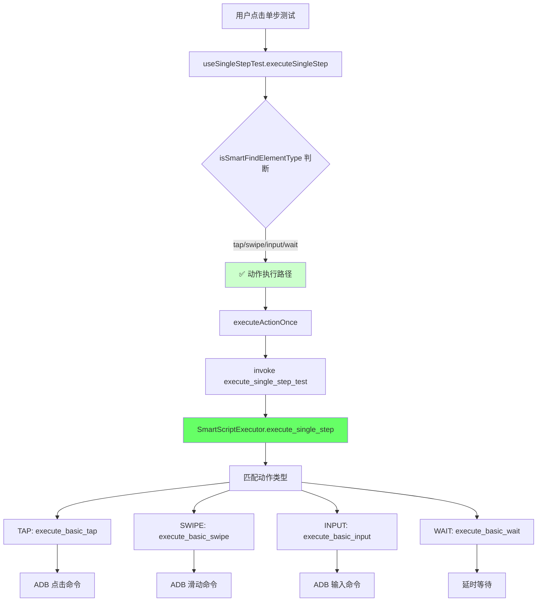

# 🎯 动作执行路径详解：TAP/SWIPE/TEXT 等操作详细分析

## 📋 动作执行路径概览

在架构分裂中，**动作执行路径**是唯一真正工作的路径，负责处理所有非智能查找的基础操作。

### 🔄 动作执行流程



## 🎯 具体动作类型详解

### 1. **TAP (点击操作)**

#### 前端步骤配置
```typescript
const tapStep = {
  step_type: "tap",              // 基础点击
  parameters: {
    bounds: "[100,200][300,400]", // 目标区域坐标
    // 或者
    x: 200,                      // 直接指定坐标
    y: 300,
    duration: 100                // 点击持续时间（可选）
  }
};
```

#### 后端执行逻辑
```rust
// src-tauri/src/services/smart_script_executor_impl.rs
SmartActionType::Tap => self.execute_basic_tap(step).await,

// 实际执行（推断实现）
async fn execute_basic_tap(&self, step: &SmartScriptStep) -> Result<()> {
    // 1. 解析坐标参数
    let (x, y) = self.parse_tap_coordinates(&step.parameters)?;
    
    // 2. 使用注入器执行点击
    let injector = SafeInputInjector::from_env(AdbShellInputInjector::new(self.adb_path.clone()));
    
    match injector.tap(&self.device_id, x as u32, y as u32, None).await {
        Ok(()) => info!("✅ 点击成功: ({}, {})", x, y),
        Err(e) => {
            warn!("⚠️ 注入器失败，使用直接ADB命令: {}", e);
            // 回退到直接 ADB 命令
            self.execute_adb_tap(x, y).await?;
        }
    }
    
    Ok(())
}
```

#### 底层 ADB 命令
```bash
# 实际执行的 ADB 命令
adb -s [设备ID] shell input tap 200 300

# 长按版本（如果有 duration 参数）
adb -s [设备ID] shell input swipe 200 300 200 300 1000
```

### 2. **SWIPE (滑动操作)**

#### 前端步骤配置
```typescript
const swipeStep = {
  step_type: "swipe",            // 基础滑动
  parameters: {
    start_x: 500,                // 起始X坐标
    start_y: 800,                // 起始Y坐标
    end_x: 500,                  // 结束X坐标  
    end_y: 200,                  // 结束Y坐标
    duration: 1000,              // 滑动持续时间(ms)
    
    // 增强滑动参数（可选）
    direction: "up",             // 方向：up/down/left/right
    distance_ratio: 0.7,         // 滑动距离比例
    speed: "normal"              // 滑动速度
  }
};
```

#### 后端执行逻辑
```rust
// 使用增强滑动执行器
SmartActionType::Swipe => self.execute_basic_swipe(step).await,

pub async fn execute_basic_swipe(&self, step: &SmartScriptStep) -> Result<()> {
    info!("🚀 执行增强滑动: {}", step.name);
    
    // 1. 获取设备屏幕尺寸
    let metrics: DeviceMetrics = metrics_provider.get(&self.device_id)
        .unwrap_or_else(|| {
            warn!("⚠️ 无法获取设备屏幕尺寸，使用默认值 1080x1920");
            DeviceMetrics::new(1080, 1920)
        });
    
    // 2. 创建增强滑动执行器
    let enhanced_executor = EnhancedSwipeExecutor::new(
        self.device_id.clone(),
        self.adb_path.clone(),
        metrics.width_px,
        metrics.height_px,
    );
    
    // 3. 执行增强滑动（包含UI变化验证）
    match enhanced_executor.execute_enhanced_swipe(&step.parameters).await {
        Ok(result) => {
            info!("✅ 增强滑动执行完成: 方法={} UI变化={}", 
                  result.execution_method, result.validation.ui_changed);
        }
        Err(e) => {
            // 回退到原始滑动方法
            warn!("🔄 回退到原始滑动方法");
            return self.execute_legacy_swipe(step).await;
        }
    }
}
```

#### 底层 ADB 命令
```bash
# 基础滑动命令
adb -s [设备ID] shell input swipe 500 800 500 200 1000

# 增强滑动可能包含多次操作和验证
# 1. 执行前截图
# 2. 执行滑动
# 3. 执行后截图
# 4. 对比UI变化
```

### 3. **INPUT (文本输入)**

#### 前端步骤配置
```typescript
const inputStep = {
  step_type: "input",            // 文本输入
  parameters: {
    text: "Hello World",         // 要输入的文本
    bounds: "[100,200][500,300]", // 输入框坐标（可选）
    clear_before: true,          // 输入前是否清空
    
    // 高级输入参数
    input_method: "ime",         // 输入法：ime/clipboard
    delay_between_chars: 50      // 字符间延迟(ms)
  }
};
```

#### 后端执行逻辑
```rust
SmartActionType::Input => self.execute_basic_input(step).await,

async fn execute_basic_input(&self, step: &SmartScriptStep) -> Result<()> {
    let text = step.parameters["text"].as_str()
        .ok_or_else(|| anyhow::anyhow!("缺少text参数"))?;
    
    // 1. 如果需要清空现有内容
    if step.parameters.get("clear_before").and_then(|v| v.as_bool()).unwrap_or(false) {
        let injector = SafeInputInjector::from_env(AdbShellInputInjector::new(self.adb_path.clone()));
        
        // 全选 + 删除
        injector.keyevent_symbolic(&self.device_id, "KEYCODE_CTRL_A").await?;
        injector.keyevent_symbolic(&self.device_id, "KEYCODE_DEL").await?;
    }
    
    // 2. 输入文本
    let injector = SafeInputInjector::from_env(AdbShellInputInjector::new(self.adb_path.clone()));
    match injector.input_text(&self.device_id, text).await {
        Ok(()) => info!("✅ 文本输入成功: {}", text),
        Err(e) => {
            warn!("⚠️ 注入器失败，使用直接ADB命令: {}", e);
            self.execute_adb_input_text(text).await?;
        }
    }
    
    Ok(())
}
```

#### 底层 ADB 命令
```bash
# 清空输入框
adb -s [设备ID] shell input keyevent KEYCODE_CTRL_A
adb -s [设备ID] shell input keyevent KEYCODE_DEL

# 输入文本（空格转义为 %s）
adb -s [设备ID] shell input text "Hello%sWorld"

# 或者使用 IME 输入法（高级模式）
adb -s [设备ID] shell ime enable com.android.adb.keyboard
adb -s [设备ID] shell ime set com.android.adb.keyboard
```

### 4. **WAIT (等待操作)**

#### 前端步骤配置
```typescript
const waitStep = {
  step_type: "wait",             // 等待操作
  parameters: {
    duration: 3000,              // 等待时长(ms)
    
    // 条件等待（高级）
    wait_for: "element",         // 等待类型：time/element/page
    target_element: "关注",      // 等待出现的元素
    timeout: 10000               // 超时时间
  }
};
```

#### 后端执行逻辑
```rust
SmartActionType::Wait => self.execute_basic_wait(step).await,

async fn execute_basic_wait(&self, step: &SmartScriptStep) -> Result<()> {
    let duration = step.parameters.get("duration")
        .and_then(|v| v.as_u64())
        .unwrap_or(1000);
    
    info!("⏰ 等待 {}ms", duration);
    
    // 简单延时等待
    tokio::time::sleep(std::time::Duration::from_millis(duration)).await;
    
    // TODO: 实现条件等待
    // if let Some(wait_for) = step.parameters.get("wait_for") {
    //     match wait_for.as_str().unwrap_or("time") {
    //         "element" => self.wait_for_element(step).await?,
    //         "page" => self.wait_for_page_state(step).await?, 
    //         _ => {} // 默认时间等待
    //     }
    // }
    
    info!("✅ 等待完成");
    Ok(())
}
```

#### 实际执行
```rust
// 简单的延时等待，无 ADB 命令
tokio::time::sleep(Duration::from_millis(3000)).await;
```

## 🔧 动作执行的技术特点

### 1. **双重保障机制**
```rust
// 优先使用注入器，失败时回退到直接ADB命令
match injector.tap(&device_id, x, y, None).await {
    Ok(()) => info!("✅ 注入器执行成功"),
    Err(e) => {
        warn!("⚠️ 注入器失败，使用直接ADB命令: {}", e);
        self.execute_direct_adb_command().await?;
    }
}
```

### 2. **安全注入器包装**
```rust
// 自动重试机制（默认重试2次，间隔120ms）
let injector = SafeInputInjector::from_env(AdbShellInputInjector::new(adb_path));

// 环境变量配置：
// INJECTOR_RETRIES=2       # 重试次数
// INJECTOR_DELAY_MS=120    # 重试间隔
```

### 3. **设备指标获取**
```rust
// 自动获取设备分辨率和密度，失败时使用默认值
let metrics: DeviceMetrics = metrics_provider.get(&device_id)
    .unwrap_or_else(|| DeviceMetrics::new(1080, 1920));
```

### 4. **增强执行验证**
```rust
// 滑动操作会验证UI是否真的发生了变化
let result = enhanced_executor.execute_enhanced_swipe(&parameters).await?;
if !result.validation.ui_changed {
    warn!("⚠️ 滑动操作可能未生效 - UI未发生变化");
}
```

## 📊 动作类型对比表

| 动作类型 | ADB 命令 | 是否需要坐标 | 特殊功能 | 回退机制 |
|---------|---------|------------|---------|---------|
| **TAP** | `input tap X Y` | ✅ 必需 | 支持长按 | 注入器→直接命令 |
| **SWIPE** | `input swipe X1 Y1 X2 Y2 Duration` | ✅ 必需 | UI变化验证、增强执行器 | 增强→原始→直接命令 |
| **INPUT** | `input text "Text"` | ❌ 可选 | 清空、IME、字符转义 | 注入器→直接命令 |
| **WAIT** | 无（纯延时） | ❌ 不需要 | 条件等待（待实现） | 无需回退 |

## ✅ 总结：为什么动作执行路径是"真实"的

1. **完整的命令链路**：前端 → 后端 → ADB 命令 → 设备操作
2. **真实的设备交互**：所有操作都会在设备上产生实际效果
3. **可靠的回退机制**：注入器失败时自动回退到直接ADB命令
4. **增强的执行验证**：滑动等操作会验证UI变化确保生效
5. **环境适配能力**：自动获取设备参数，支持不同分辨率和密度

与策略匹配路径的"虚假成功"不同，动作执行路径提供的是**真实可靠的设备自动化能力**。