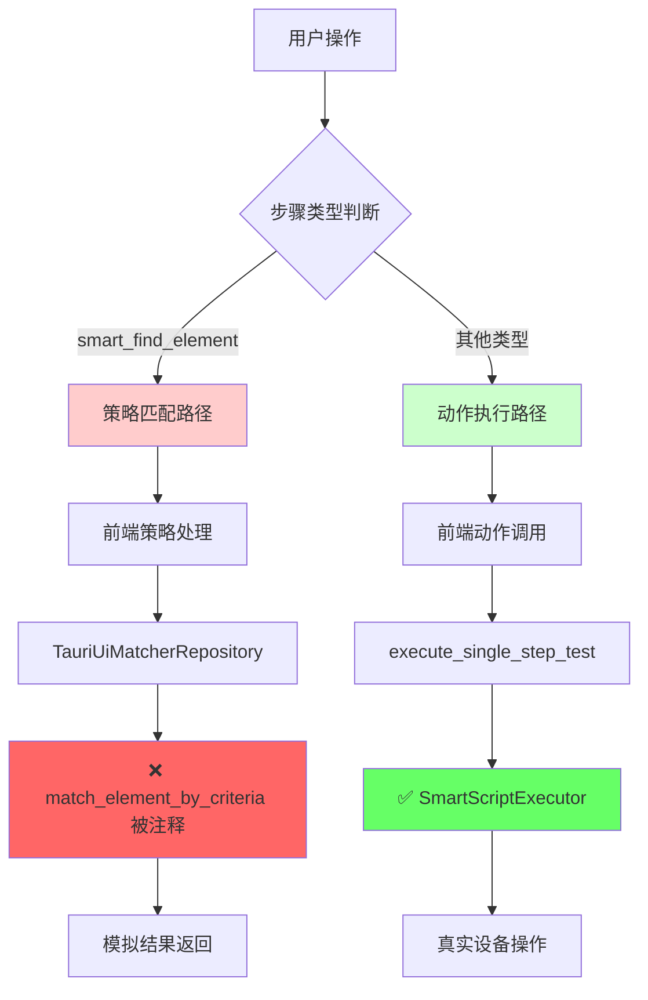
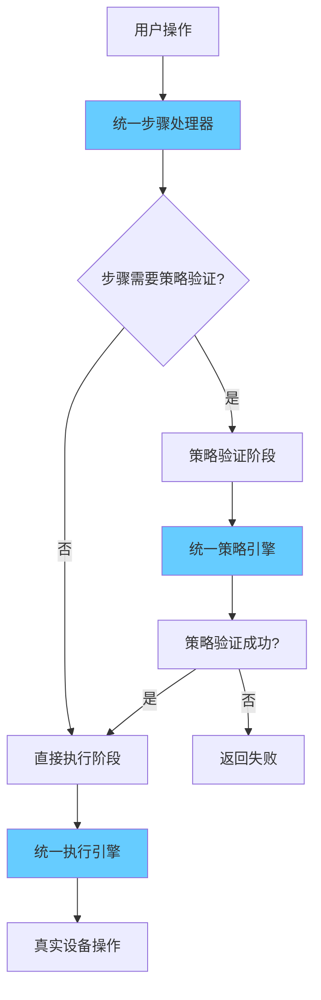

# 🏗️ 架构分裂问题深度分析

## 🚨 为什么说当前架构不是统一的？

### 📊 问题概览

当前系统存在 **双重执行路径**，导致架构严重分裂：



## 🔄 架构分裂的具体表现

### 1. **双重执行引擎**

#### 路径A：策略匹配引擎（断裂）
```typescript
// 前端路径：src/hooks/useSingleStepTest.ts
if (isSmartFindElementType(step.step_type)) {
  // 走策略匹配路径
  const strategyResult = await executeStrategyTest(step, deviceId);
  // ↓
  // useAdb().matchElementByCriteria()
  // ↓ 
  // TauriUiMatcherRepository.matchByCriteria()
  // ↓
  // invoke('match_element_by_criteria') ❌ 命令不存在
  // ↓
  // 返回模拟结果 🎭
}
```

#### 路径B：动作执行引擎（正常）
```typescript
else {
  // 走动作执行路径
  return executeActionOnce(step, deviceId);
  // ↓
  // invoke('execute_single_step_test')
  // ↓
  // SmartScriptExecutor.execute_single_step() ✅ 真实执行
}
```

### 2. **策略处理系统孤立**

#### 前端策略生成（孤立）
```typescript
// src/modules/enhanced-matching/integration/EnhancedMatchingHelper.ts
export class EnhancedMatchingHelper {
  buildEnhancedMatching(element: ElementLike): BuiltMatchingResult {
    // 生成完整的策略配置
    if (isHiddenElement) {
      return {
        strategy: 'hidden-element-parent',
        fields: ['text', 'content-desc', 'resource-id', 'class'],
        values: { ... },
        hiddenElementParentConfig: { ... }
      };
    }
    // 但这些策略配置无法真正执行！
  }
}
```

#### 后端策略处理器（孤立）
```rust
// src-tauri/src/services/execution/matching/strategies/mod.rs
pub fn create_strategy_processor(strategy: &str) -> Box<dyn StrategyProcessor + Send + Sync> {
    match strategy {
        "standard" => Box::new(StandardStrategyProcessor::new()),
        "hidden-element-parent" => Box::new(HiddenElementParentStrategyProcessor::new()),
        // 完整的策略处理器系统存在
        // 但前端无法调用到！
    }
}
```

### 3. **数据格式不兼容**

#### 前端策略格式
```typescript
// 前端生成的策略格式
interface MatchCriteriaDTO {
  strategy: 'standard' | 'hidden-element-parent' | ...;
  fields: string[];
  values: Record<string, string>;
  includes?: Record<string, string[]>;
  excludes?: Record<string, string[]>;
}
```

#### 后端期望格式
```rust
// 后端策略处理器期望的格式
pub struct MatchingContext {
    pub device_id: String,
    pub xml_content: String,
    pub criteria: MatchCriteriaDTO, // 但这个结构可能不匹配
    pub additional_config: Option<Value>,
}
```

## 🎭 架构分裂的现实影响

### 现象1：虚假的成功
```typescript
// 用户看到的"成功"实际上是这样的：
async matchByCriteria(deviceId: string, criteria: MatchCriteriaDTO) {
  if (criteria.strategy === 'hidden-element-parent') {
    // 🎭 返回硬编码的模拟结果
    return {
      ok: true,
      message: '✅ 隐藏元素父查找策略测试成功（模拟结果）',
      preview: {
        text: '模拟隐藏元素父容器',
        bounds: '[100,200][500,400]'  // 假的bounds！
      }
    };
  }
}
```

### 现象2：策略无法验证
```typescript
// 用户以为策略在工作，实际上：
const step = {
  step_type: "smart_find_element",
  parameters: {
    matching: {
      strategy: "hidden-element-parent",
      // 这些复杂的策略配置完全没有被使用！
      hiddenElementParentConfig: {
        targetText: "返回",
        maxTraversalDepth: 5,
        clickableIndicators: ["Button", "ImageButton"]
      }
    }
  }
};

// 无论策略多么复杂，最终都是：
return { ok: true, message: "模拟成功" };
```

### 现象3：脚本执行时策略失效
```rust
// 在批量脚本执行时，SmartScriptExecutor 这样处理：
impl SmartScriptExecutor {
    async fn execute_single_step(&self, step: &SmartScriptStep) -> Result<SmartExecutionLog> {
        match step.step_type {
            SmartActionType::SmartFindElement => {
                // 即使参数中有复杂的策略配置
                // 也只能使用简化的匹配逻辑
                self.execute_smart_find_element(step).await
            }
            SmartActionType::Tap => self.execute_basic_tap(step).await,
            // 策略系统完全被绕过！
        }
    }
}
```

## 🔍 架构分裂的根本原因

### 1. **历史演进问题**
```
时间线：
1. 最初：简单的动作执行系统 ✅
2. 后来：添加了策略匹配功能 🟡
3. 再后来：策略匹配命令被注释 ❌
4. 现在：两套系统并存但不互通 💔
```

### 2. **命令注册不一致**
```rust
// src-tauri/src/main.rs
.invoke_handler(tauri::generate_handler![
    // 动作执行命令 - 启用
    execute_single_step_test,        ✅
    execute_smart_automation_script, ✅
    
    // 策略匹配命令 - 被注释
    // match_element_by_criteria,    ❌ 关键命令缺失！
])
```

### 3. **接口设计不统一**
```typescript
// 不统一的调用方式：

// 策略匹配 - 走 useAdb()
const { matchElementByCriteria } = useAdb();
await matchElementByCriteria(deviceId, criteria);

// 动作执行 - 直接调用
await invoke('execute_single_step_test', { deviceId, step });

// 应该统一为一个接口！
```

## 🏗️ 统一架构应该是什么样的？

### 理想的统一流程


### 统一接口设计
```typescript
// 理想的统一接口
interface UnifiedStepExecutor {
  async executeStep(step: SmartScriptStep, deviceId: string): Promise<StepResult> {
    // 1. 策略预处理（如果需要）
    if (step.parameters.matching) {
      const validated = await this.validateStrategy(step, deviceId);
      if (!validated.success) return validated;
    }
    
    // 2. 统一执行
    return await this.executeAction(step, deviceId);
  }
}
```

## 💡 总结：为什么架构不统一

1. **执行路径分裂**：策略匹配和动作执行走完全不同的路径
2. **命令系统断裂**：关键的策略匹配命令被注释，导致功能缺失
3. **前后端脱节**：前端能生成策略，后端能处理策略，但无法连通
4. **接口不一致**：不同类型的步骤使用不同的调用方式
5. **数据流混乱**：模拟数据掩盖了真实的架构问题

**结果就是**：用户以为系统在正常工作，实际上策略功能完全是假的，只有基础动作能真正执行。这就是典型的"非统一架构"问题。