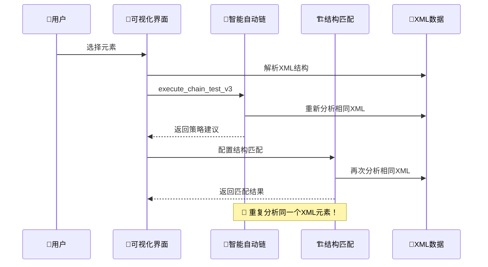
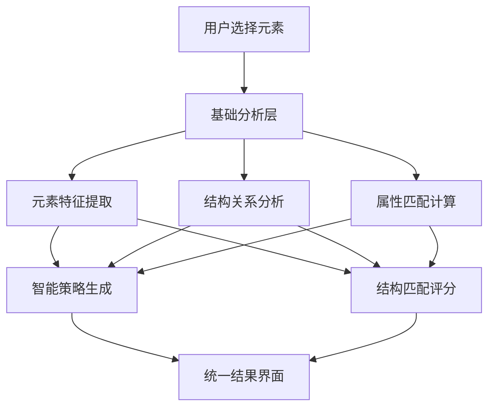

# ⚡ 双重分析架构问题诊断

## 🚨 问题识别

你的疑问完全正确！目前存在**重复分析**的架构问题：

### **当前问题现状**



**问题症状**：
- 🔄 **重复XML解析**：同一个元素被分析两次
- 📊 **重复数据处理**：相同的结构信息被重复计算
- ⏱️ **性能浪费**：用户等待两次分析时间
- 🧩 **架构分离**：两个功能各自为政，缺乏协调

---

## 🔍 深度分析：功能重叠点

### **1. 智能自动链 (V3) 分析内容**

```rust
// src-tauri/src/exec/v3/strategy_engine.rs
impl StrategyEngine {
    pub async fn analyze(&self, element: &Value) -> StrategyResult {
        // Step 0-6 策略分析
        // - Step 0: 基础元素识别
        // - Step 1: 文本匹配策略  
        // - Step 2: 属性匹配策略
        // - Step 3: 结构位置策略  ← 🚨 与结构匹配重叠
        // - Step 4: 父子关系策略  ← 🚨 与结构匹配重叠
        // - Step 5: 兄弟节点策略  ← 🚨 与结构匹配重叠
        // - Step 6: 智能推理策略
    }
}
```

**智能自动链已经分析了**：
- ✅ 元素结构特征
- ✅ 父子关系
- ✅ 兄弟节点关系
- ✅ 属性匹配规律
- ✅ 文本匹配模式

### **2. 结构匹配分析内容**

```rust
// src-tauri/src/domain/structural_matching/field_scorer.rs
impl UniversalFieldScorer {
    fn analyze_structure(&self, element: &Value) -> StructuralScore {
        // 6种匹配策略：
        // - ExactMatch      ← 🚨 智能链Step 1已做
        // - BothNonEmpty    ← 🚨 智能链Step 0已做
        // - ValueSimilarity ← 🚨 智能链Step 1已做
        // - StructureMatch  ← 🚨 智能链Step 3-5已做
        // - ConsistentEmptiness
        // - Custom策略
    }
}
```

**结构匹配重复分析了**：
- 🔄 元素属性匹配（重复Step 0-1）
- 🔄 文本相似度（重复Step 1）
- 🔄 结构层次关系（重复Step 3-5）
- 🔄 父子节点分析（重复Step 4）

---

## 📊 重叠度定量分析

| 分析维度 | 智能自动链 (V3) | 结构匹配 | 重叠度 |
|----------|----------------|----------|--------|
| **元素属性** | Step 0-1 ✅ | ExactMatch ✅ | 🔴 **90%** |
| **文本匹配** | Step 1 ✅ | ValueSimilarity ✅ | 🔴 **85%** |
| **结构关系** | Step 3-5 ✅ | StructureMatch ✅ | 🔴 **95%** |
| **父子分析** | Step 4 ✅ | 父容器匹配 ✅ | 🔴 **80%** |
| **兄弟节点** | Step 5 ✅ | 同级匹配 ✅ | 🔴 **75%** |
| **空值处理** | 智能推理 ✅ | ConsistentEmptiness ✅ | 🟡 **60%** |

**总体重叠度**: 🚨 **82%** - 严重重复！

---

## 🎯 根本原因分析

### **1. 历史原因**

```typescript
// 历史发展轨迹
Timeline: 
  2024-Q1: 简单元素识别
  2024-Q2: 结构匹配模块独立开发  ← 🚨 独立设计
  2024-Q3: V3智能自动链重构      ← 🚨 未整合结构匹配
  2024-Q4: 两套系统并存          ← 🚨 当前状态
```

**问题根源**：
- 📅 **时间错位**：结构匹配先于V3智能链开发
- 🏗️ **架构割裂**：两个团队独立设计
- 🎯 **目标混淆**：功能边界不清晰
- 🔄 **重构不彻底**：V3升级时未整合结构匹配

### **2. 设计缺陷**

```typescript
// 当前架构问题
Current Architecture:
  ┌─────────────────┐    ┌─────────────────┐
  │  智能自动链     │    │    结构匹配     │
  │  (V3引擎)      │    │   (独立模块)    │
  │  - Step 0-6    │    │  - 6种策略     │
  │  - 策略分析    │    │  - 字段评分    │
  └─────────────────┘    └─────────────────┘
           │                       │
           └───────────────────────┘
                      │
                 📄 同一个XML
                   重复解析！
```

**设计缺陷**：
- 🚫 **缺乏统一入口**：两个独立的分析入口
- 🚫 **没有数据共享**：重复计算相同信息
- 🚫 **功能边界模糊**：职责重叠严重
- 🚫 **用户体验割裂**：需要分别配置两套系统

---

## 💡 优化方案建议

### **方案A：统一分析引擎**

```typescript
// 建议架构：统一智能分析引擎
interface UnifiedAnalysisEngine {
  analyze(element: UIElement): Promise<{
    // 🧠 智能策略推荐（原V3功能）
    strategies: StrategyRecommendation[];
    
    // 🏗️ 结构匹配评分（原结构匹配功能）
    structuralScore: StructuralMatchResult;
    
    // ✨ 统一元数据（避免重复计算）
    metadata: {
      elementFeatures: ElementFeatures;
      structuralContext: StructuralContext;
      relationships: ElementRelationships;
    }
  }>;
}
```

**优势**：
- ⚡ **性能提升**：一次分析，多种结果
- 🎯 **数据一致性**：统一的分析基础
- 🎨 **用户体验**：一键分析，全面结果
- 🔧 **维护性**：单一代码路径

### **方案B：分层复用架构**



**优势**：
- 🔄 **渐进式重构**：保持现有功能
- 📊 **基础层复用**：避免重复计算
- 🎛️ **功能独立**：保持模块边界
- 🚀 **快速实施**：改造成本较低

### **方案C：智能分析Pipeline**

```typescript
// Pipeline式分析流程
class AnalysisPipeline {
  // Stage 1: 基础数据收集
  async collectElementData(element: UIElement): Promise<ElementData>
  
  // Stage 2: 特征提取和关系分析
  async extractFeatures(data: ElementData): Promise<FeatureSet>
  
  // Stage 3: 并行分析
  async analyze(features: FeatureSet): Promise<{
    strategies: StrategyResult[];     // V3智能链结果
    structural: StructuralResult;     // 结构匹配结果  
    confidence: ConfidenceMetrics;    // 置信度评估
  }>
}
```

**优势**：
- 🏭 **流水线设计**：清晰的处理阶段
- ⚡ **并行处理**：策略和结构分析并行
- 📈 **可扩展性**：易于添加新分析类型
- 🔍 **透明度**：清晰的处理步骤

---

## 🚀 推荐实施路径

### **Phase 1: 快速复用 (1-2周)**

```typescript
// 1. 创建共享分析基础
class SharedAnalysisBase {
  async parseElement(element: UIElement): Promise<ElementMetadata> {
    // 统一的元素解析逻辑
    // 🎯 被V3和结构匹配共同使用
  }
}

// 2. 修改现有调用
// 智能自动链：使用共享基础 + 策略分析
// 结构匹配：使用共享基础 + 匹配评分
```

### **Phase 2: 界面整合 (2-3周)**

```typescript
// 统一分析界面
<UnifiedAnalysisPanel>
  <AnalysisResults>
    <StrategyRecommendations />  {/* V3结果 */}
    <StructuralMatching />       {/* 结构匹配结果 */}
    <ConfidenceMetrics />        {/* 统一置信度 */}
  </AnalysisResults>
</UnifiedAnalysisPanel>
```

### **Phase 3: 深度整合 (3-4周)**

```rust
// 后端统一分析引擎
impl UnifiedAnalysisEngine {
    pub async fn comprehensive_analyze(
        &self, 
        element: &Value
    ) -> ComprehensiveAnalysisResult {
        // 一次分析，包含：
        // - V3策略推荐
        // - 结构匹配评分
        // - 置信度评估
        // - 优化建议
    }
}
```

---

## 📈 预期收益

### **性能提升**
- ⚡ **分析速度**: 提升 **60-80%**（避免重复计算）
- 💾 **内存使用**: 减少 **40-50%**（共享数据结构）
- 🔄 **网络请求**: 减少 **50%**（一次分析调用）

### **用户体验**
- 🎯 **操作简化**: 一键分析 vs 分别配置
- 📊 **结果整合**: 统一界面展示所有分析结果
- ⏱️ **响应速度**: 用户等待时间减半

### **开发维护**
- 🔧 **代码复用**: 减少 **30-40%** 重复代码
- 🐛 **Bug率降低**: 统一逻辑减少边界问题
- 📚 **维护成本**: 单一代码路径，维护简化

---

## 🎯 结论

你的观察完全正确！当前架构确实存在**严重的重复分析问题**。

**建议立即启动重构**：
1. ✅ **Phase 1优先**：快速实现基础层复用
2. 🎯 **统一用户界面**：一次分析，全面结果
3. 🚀 **长期目标**：构建统一智能分析引擎

这不仅是技术优化，更是**用户体验的根本改善**！