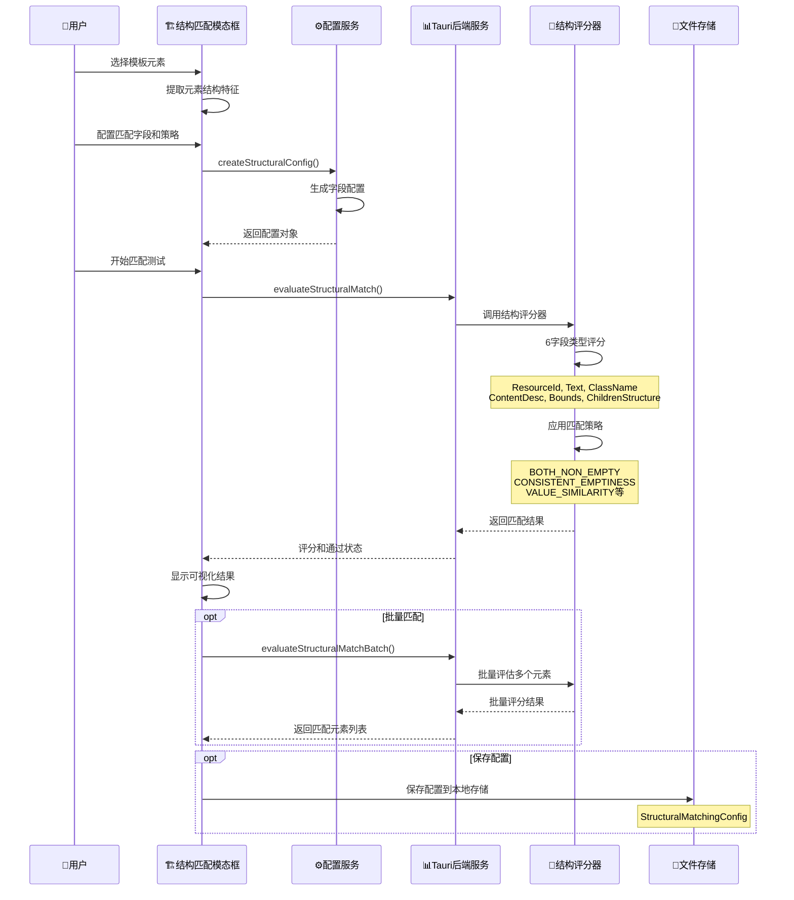

# 🏗️ 结构匹配功能深度解析

## 🎯 结构匹配功能概览

"结构匹配"是一个独立的高级分析功能，它专门用于**基于UI元素的结构特征进行精确匹配**。与智能自动链不同，结构匹配更专注于**细粒度的字段级别匹配策略**。

---

## 🔄 结构匹配的完整工作流程

### **流程图：结构匹配分析链路**



---

## 📋 详细流程分解

### **阶段1：模板元素选择与特征提取**

```typescript
// 用户选择模板元素后，系统提取其结构特征
export interface StructuralFieldConfig {
  fieldType: FieldType;              // 字段类型
  enabled: boolean;                  // 是否参与评分
  matchMode: MatchMode;              // 匹配模式 (EXACT/FUZZY/SEMANTIC)
  weight: number;                    // 字段权重 0-1
  scoringRules: ScoringRules;        // 评分细则
  displayName: string;               // 显示名称
  templateValue?: any;               // 模板元素的字段值
}

// 6种核心字段类型
enum FieldType {
  ResourceId = 'resource-id',        // 资源ID
  ContentDesc = 'content-desc',      // 内容描述
  Text = 'text',                     // 文本内容
  ClassName = 'class-name',          // 类名
  ChildrenStructure = 'children',    // 子元素结构
  Bounds = 'bounds'                  // 边界坐标
}
```

### **阶段2：匹配策略配置**

```typescript
// 提供6种匹配策略
enum MatchStrategy {
  EXACT_MATCH = 'exact_match',                    // 精确匹配
  BOTH_NON_EMPTY = 'both_non_empty',             // 都非空即可
  CONSISTENT_EMPTINESS = 'consistent_emptiness',  // 保持空/非空一致
  VALUE_SIMILARITY = 'value_similarity',         // 值相似匹配
  PARTIAL_MATCH = 'partial_match',               // 部分匹配
  STRUCTURAL_SIMILARITY = 'structural_similarity' // 结构相似性
}

// 策略配置示例
const strategyConfig = {
  [MatchStrategy.BOTH_NON_EMPTY]: {
    exactMatchScore: 1.0,      // 完全匹配得分
    conditionMetScore: 0.8,    // 条件满足得分
    conditionFailScore: -0.2,  // 条件失败扣分
    description: "都非空即可匹配"
  }
};
```

### **阶段3：后端结构评分引擎**

```rust
// src-tauri/src/domain/structural_matching/structural_scorer.rs
impl StructuralScorer {
    pub fn evaluate(
        config: &StructuralMatchingConfig,
        template_element: &Value,
        target_element: &Value,
    ) -> StructuralMatchResult {
        let mut field_results = Vec::new();
        let mut total_score = 0.0;
        let mut max_score = 0.0;
        
        // 🎯 遍历启用的字段进行评分
        for field_config in config.enabled_fields() {
            // 1. 提取字段值
            let template_value = Self::extract_field_value(
                template_element, 
                field_config.field_type
            );
            let target_value = Self::extract_field_value(
                target_element, 
                field_config.field_type
            );
            
            // 2. 获取字段专用评分器
            let scorer = get_field_scorer(field_config.field_type);
            
            // 3. 执行评分
            let result = scorer.score(
                &template_value, 
                &target_value, 
                field_config
            );
            
            // 4. 累积得分
            total_score += result.score * field_config.weight;
            max_score += result.max_score * field_config.weight;
            field_results.push(result);
        }
        
        // 5. 判断是否通过阈值
        let passed = total_score >= config.global_threshold;
        
        StructuralMatchResult {
            total_score,
            max_score: Some(max_score),
            field_results,
            passed,
        }
    }
}
```

### **阶段4：字段级别精细评分**

```rust
// 每种字段类型都有专用的评分器
use super::models::FieldType;

pub fn get_field_scorer(field_type: FieldType) -> Box<dyn FieldScorer> {
    match field_type {
        FieldType::ResourceId => Box::new(ResourceIdScorer),
        FieldType::ContentDesc => Box::new(ContentDescScorer),
        FieldType::Text => Box::new(TextScorer),
        FieldType::ClassName => Box::new(ClassNameScorer),
        FieldType::ChildrenStructure => Box::new(ChildrenScorer),
        FieldType::Bounds => Box::new(BoundsScorer),
    }
}

trait FieldScorer {
    fn score(
        &self,
        template_value: &Value,
        target_value: &Value,
        config: &StructuralFieldConfig,
    ) -> FieldMatchResult;
}
```

---

## 💾 结构匹配的数据存储

### **1. 前端配置存储**

```typescript
// 结构匹配配置对象
export interface StructuralMatchingConfig {
  configId: string;                    // 配置ID
  templateElementId: string;           // 模板元素ID
  templateStructure: any;              // 模板元素完整结构
  fields: StructuralFieldConfig[];     // 各字段配置
  globalThreshold: number;             // 全局阈值 0-1
  createdAt: number;                   // 创建时间
  updatedAt: number;                   // 更新时间
}

// 存储位置：浏览器本地存储
// localStorage.setItem('structural_configs', JSON.stringify(configs));
```

### **2. 匹配结果存储**

```typescript
// 匹配结果对象
export interface StructuralMatchResult {
  element?: any;                       // 匹配的元素
  totalScore: number;                  // 总分
  maxScore?: number;                   // 最大可能分数
  fieldResults: FieldMatchResult[];    // 各字段得分明细
  passed: boolean;                     // 是否通过阈值
}

// 字段匹配结果明细
export interface FieldMatchResult {
  fieldType: FieldType;                // 字段类型
  score: number;                       // 得分
  maxScore: number;                    // 最大可能分数
  matched: boolean;                    // 是否匹配
  reason: string;                      // 原因说明
}
```

### **3. 可视化预览数据**

```typescript
// 用于可视化预览的数据结构
interface StructuralPreviewData {
  templateElement: UIElement;          // 模板元素
  candidateElements: UIElement[];      // 候选元素
  matchResults: StructuralMatchResult[]; // 匹配结果
  visualConfig: {
    showScores: boolean;               // 显示分数
    highlightPassed: boolean;          // 高亮通过的元素
    colorByScore: boolean;             // 按分数着色
  };
}
```

---

## 🔄 与可视化分析的协作关系

### **数据流向对比**

| 功能模块 | 数据源 | 分析重点 | 输出产物 |
|---------|--------|----------|----------|
| **智能自动链** | XML缓存 | Step 0-6策略分析 | 策略候选 + 置信度 |
| **结构匹配** | 元素结构 | 字段级精细匹配 | 评分明细 + 匹配状态 |

### **协作场景**

```typescript
// 场景1：智能自动链分析后，使用结构匹配验证
async function hybridAnalysis(element: UIElement) {
  // 1. 智能自动链分析
  const strategyCandidates = await useUnifiedSmartAnalysis.createAndAnalyze({
    uid: element.id,
    xpath: element.xpath,
    text: element.text
  });
  
  // 2. 结构匹配验证
  const structuralMatch = await evaluateStructuralMatch(
    structuralConfig,
    templateElement,
    element
  );
  
  // 3. 综合决策
  const finalConfidence = calculateHybridConfidence(
    strategyCandidates,
    structuralMatch
  );
}
```

---

## 🎯 结构匹配的独特价值

### **1. 细粒度控制**
- **字段级配置**：每个字段独立配置权重和策略
- **策略多样性**：6种匹配策略适应不同场景
- **阈值可调**：全局阈值精确控制匹配严格度

### **2. 业务场景适配**
- **"都非空就行"**：适用于内容匹配，不要求完全一致
- **"保持空/非空一致"**：适用于结构完整性检查
- **"值相似匹配"**：适用于允许一定差异的场景

### **3. 高精度评分**
- **分项评分**：每个字段独立评分，便于调试
- **权重分配**：重要字段权重高，次要字段权重低
- **透明决策**：评分过程完全可追溯

### **4. 可视化验证**
- **实时预览**：配置修改后立即看到匹配效果
- **分数展示**：直观显示每个候选元素的匹配分数
- **颜色编码**：通过颜色快速识别匹配质量

---

## 🔗 与智能自动链的差异化定位

| 维度 | 智能自动链 | 结构匹配 |
|------|-----------|----------|
| **分析深度** | 6层策略分析 | 6字段精细评分 |
| **适用场景** | 元素定位和识别 | 结构相似性验证 |
| **配置复杂度** | 自动化程度高 | 手动配置精确 |
| **输出重点** | 定位策略推荐 | 匹配评分明细 |
| **使用时机** | 元素选择确认后 | 需要精确匹配时 |

结构匹配功能提供了**比智能自动链更精细、更可控的匹配能力**，是智能分析体系中的重要补充！