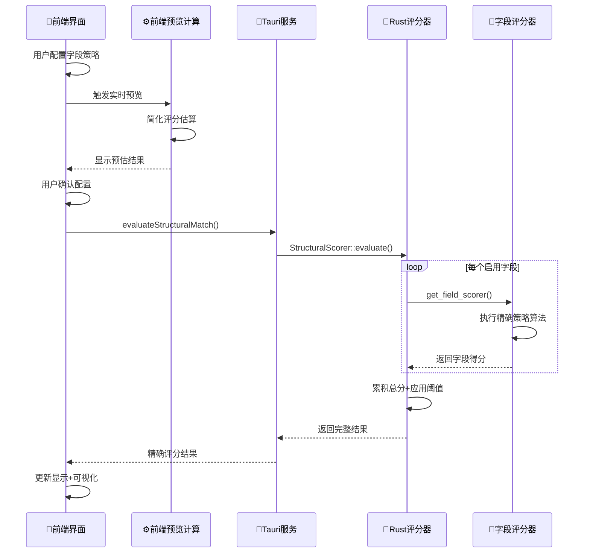

# 🔧 结构匹配：前后端分工详解

## 🎯 核心分工原则

结构匹配功能采用**前端配置 + 后端计算**的混合架构：

- **前端负责**：配置界面、预览计算、数据准备
- **后端负责**：精确评分、策略执行、复杂计算

---

## 📋 详细前后端职责分工

### **前端 (TypeScript) 职责**

#### **1. 配置管理与界面交互**

```typescript
// src/modules/structural-matching/hooks/use-structural-preview.ts
export function useStructuralPreview({
  config,
  selectedElement,
}: UseStructuralPreviewProps) {
  
  // 🎨 前端：简化预览计算
  const fieldResults = useMemo((): FieldMatchResult[] => {
    return config.fields.map(field => {
      // ⚡ 前端快速估算，用于实时预览
      switch (field.fieldType) {
        case FieldType.RESOURCE_ID:
          if (selectedElement['resource-id']) {
            score = field.scoringRules.bothNonEmpty * field.weight;
            reason = '有resource-id，预计得分';
          }
          break;
        // ... 其他字段类型的简化计算
      }
    });
  }, [config.fields, selectedElement]);
}
```

**前端特性**：
- 🎨 **实时预览**：用户调整配置时立即显示预估效果
- ⚡ **快速估算**：简化的评分逻辑，响应速度快
- 🎛️ **配置界面**：字段权重、策略选择、阈值调节
- 📊 **可视化**：分数展示、颜色编码、匹配状态

#### **2. 数据准备与服务调用**

```typescript
// src/modules/structural-matching/services/structural-matching-service.ts
export async function evaluateStructuralMatch(
  config: StructuralMatchingConfig,
  templateElement: any,
  targetElement: any,
): Promise<StructuralMatchResult> {
  
  // 🔗 前端：准备数据并调用后端
  const result = await invoke<StructuralMatchResult>('evaluate_structural_match', {
    config,           // 前端配置的字段策略
    templateElement,  // 模板元素数据
    targetElement,    // 目标元素数据
  });
  
  return result;
}
```

**前端数据准备**：
- 📝 **配置对象**：用户在界面中配置的字段策略
- 🎯 **元素数据**：从可视化界面选择的元素结构
- 🔄 **批量处理**：准备多个候选元素的数据

---

### **后端 (Rust) 职责**

#### **1. 精确评分引擎**

```rust
// src-tauri/src/domain/structural_matching/structural_scorer.rs
impl StructuralScorer {
    pub fn evaluate(
        config: &StructuralMatchingConfig,
        template_element: &Value,
        target_element: &Value,
    ) -> StructuralMatchResult {
        
        // 🎯 后端：精确评分计算
        for field_config in config.enabled_fields() {
            // 1. 提取字段值
            let template_value = Self::extract_field_value(template_element, field_config.field_type);
            let target_value = Self::extract_field_value(target_element, field_config.field_type);
            
            // 2. 获取专用评分器
            let scorer = get_field_scorer(field_config.field_type);
            
            // 3. 执行精确评分
            let result = scorer.score(&template_value, &target_value, field_config);
            
            // 4. 应用权重和策略
            total_score += result.score * field_config.weight;
        }
    }
}
```

#### **2. 字段专用评分器**

```rust
// src-tauri/src/domain/structural_matching/field_scorer.rs
impl UniversalFieldScorer {
    fn calculate_score_by_strategy(
        &self,
        template_str: &str,
        target_str: &str,
        strategy: MatchStrategy,
        scoring_rules: &ScoringRules,
        field_type: FieldType,
    ) -> (f64, bool, String) {
        
        // 🧠 后端：复杂策略算法
        match strategy {
            MatchStrategy::ExactMatch => self.exact_match_strategy(template_str, target_str, scoring_rules),
            MatchStrategy::BothNonEmpty => self.both_non_empty_strategy(template_str, target_str, scoring_rules),
            MatchStrategy::ConsistentEmptiness => self.consistent_emptiness_strategy(template_str, target_str, scoring_rules),
            MatchStrategy::ValueSimilarity => self.value_similarity_strategy(template_str, target_str, scoring_rules),
            MatchStrategy::StructureMatch => self.structure_match_strategy(template_str, target_str, scoring_rules),
        }
    }
}
```

**后端算法特性**：
- 🎯 **精确计算**：复杂的匹配策略算法
- 🔬 **细粒度分析**：每个字段类型的专用处理逻辑
- ⚖️ **权重应用**：精确的权重计算和得分累积
- 🏗️ **结构分析**：子元素结构的深度比较

#### **3. Tauri 命令接口**

```rust
// src-tauri/src/commands/structural_matching.rs
#[command]
pub async fn evaluate_structural_match(
    config: StructuralMatchingConfig,
    template_element: Value,
    target_element: Value,
) -> Result<StructuralMatchResult, String> {
    
    // 🚀 后端：命令入口
    let result = StructuralScorer::evaluate(&config, &template_element, &target_element);
    
    println!("✅ [StructuralMatching] 评估完成，得分: {:.2} / {:.2}, 通过: {}",
        result.total_score, result.max_score.unwrap_or(0.0), result.passed);
    
    Ok(result)
}
```

---

## 🔄 前后端协作流程

### **数据流向图**



### **性能优化策略**

1. **前端预览**：快速响应，用于配置调试
2. **后端精确计算**：复杂算法，用于最终结果
3. **批量处理**：后端支持批量评估，减少IPC调用
4. **缓存机制**：前端缓存配置，避免重复计算

---

## 🎯 关键设计优势

### **1. 职责分离清晰**

| 层面 | 前端 TypeScript | 后端 Rust |
|------|---------------|-----------|
| **速度** | 快速预览 | 精确计算 |
| **复杂度** | 简化逻辑 | 完整算法 |
| **用途** | 配置调试 | 最终评分 |
| **数据** | 界面状态 | 核心业务逻辑 |

### **2. 用户体验优化**

```typescript
// 前端：即时反馈
const displayInfo = useMemo(() => {
  return {
    percentage: percentage.toFixed(1),           // 实时百分比
    scoreText: `${totalScore} / ${maxScore}`,    // 实时分数
    statusText: passed ? '预计通过' : '预计不通过', // 实时状态
    statusColor: passed ? '#52c41a' : '#ff4d4f'   // 实时颜色
  };
}, [totalResult]);

// 后端：精确结果
let result = StructuralMatchResult {
  total_score: 87.5,          // 精确分数
  max_score: Some(100.0),     // 最大分数  
  passed: true,               // 确切状态
  field_results: [            // 详细分析
    { field_type: Text, score: 0.8, reason: "值完全匹配" },
    { field_type: ResourceId, score: 0.6, reason: "都非空通过" }
  ]
};
```

### **3. 算法复杂度分层**

```rust
// 后端：复杂策略实现
fn both_non_empty_strategy(&self, template: &str, target: &str, rules: &ScoringRules) -> (f64, bool, String) {
    match (template.is_empty(), target.is_empty()) {
        (false, false) => (rules.both_non_empty, true, "都非空通过".to_string()),
        (true, true) => (rules.both_empty * 0.5, false, "都为空，不符合非空要求".to_string()),
        _ => (rules.mismatch_penalty, false, "只有一个非空".to_string()),
    }
}
```

```typescript
// 前端：简化预览逻辑
if (selectedElement['resource-id']) {
  score = field.scoringRules.bothNonEmpty * field.weight;
  reason = '有resource-id，预计得分';
  matched = true;
} else {
  score = field.scoringRules.bothEmpty * field.weight;
  reason = '无resource-id，空匹配得分';
  matched = true;
}
```

---

## 📊 性能对比

| 指标 | 前端预览 | 后端精确计算 |
|------|----------|------------|
| **响应速度** | <50ms | 100-300ms |
| **计算精度** | 预估值 | 精确值 |
| **策略支持** | 简化版 | 完整版 |
| **批量处理** | 不支持 | 支持 |
| **复杂结构** | 基础分析 | 深度分析 |

---

## 🎉 总结

结构匹配功能采用了**智能的前后端混合架构**：

✅ **前端专注体验**：快速预览、实时反馈、配置界面  
✅ **后端专注精度**：复杂算法、精确计算、策略执行  
✅ **性能最优化**：预览用前端，结果用后端  
✅ **职责清晰**：界面逻辑和业务逻辑完全分离  

这种设计既保证了**用户体验的流畅性**，又确保了**计算结果的准确性**！