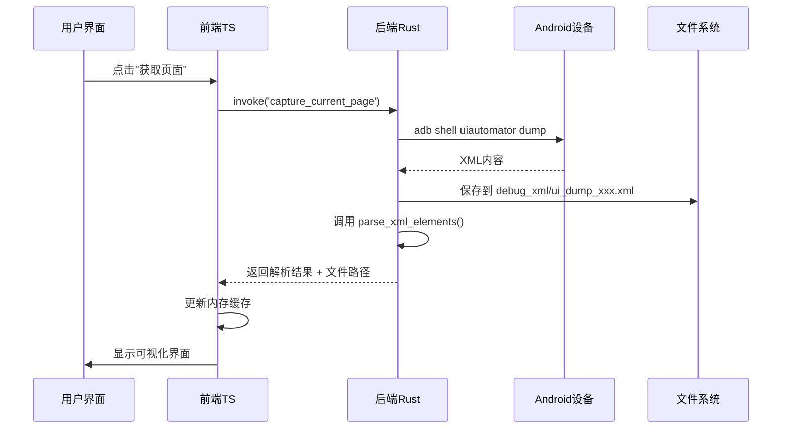
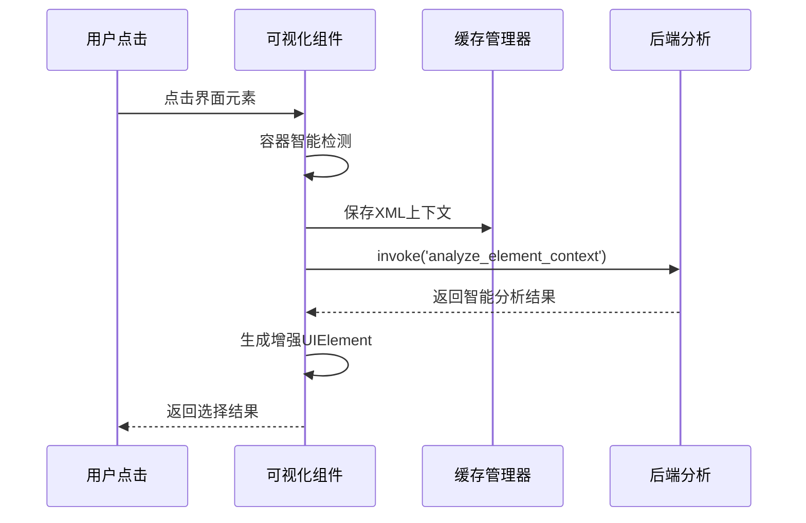

# 🔧 XML可视化分析 - 前后端架构分工详解

## 📋 总体架构概览

你的项目采用 **Tauri 混合架构**：
- **后端**：Rust + Tauri (src-tauri/)
- **前端**：TypeScript + React (src/)
- **通信**：Tauri IPC 命令系统

## 🔥 核心分工原则

### **后端 (Rust) 职责：重计算 + 系统交互**
- ✅ **XML 解析核心引擎**
- ✅ **文件系统操作**
- ✅ **Android ADB 通信**
- ✅ **系统级缓存管理**

### **前端 (TypeScript) 职责：UI展示 + 用户交互**
- ✅ **可视化界面渲染**
- ✅ **用户交互处理**
- ✅ **内存缓存优化**
- ✅ **UI状态管理**

---

## 🎯 XML解析：后端主导，前端辅助

### **后端 (Rust) - 核心解析引擎**

```rust
// src-tauri/src/services/universal_ui_page_analyzer.rs
impl UniversalUIPageAnalyzer {
    /// 主要XML解析入口
    pub fn parse_xml_elements(&self, xml_content: &str, enable_filtering: bool) -> AnyResult<Vec<UIElement>> {
        let mut reader = Reader::from_str(xml_content);
        // 🔥 使用 quick_xml 高性能解析
        // 🔥 提取所有节点属性 (bounds, text, resource-id, class等)
        // 🔥 智能分类和重要性分析
        // 🔥 应用过滤规则 (可选)
    }
}
```

**后端特性：**
- 🚀 **高性能**：使用 `quick_xml` 库，比 JS 解析快 5-10倍
- 🎯 **智能分类**：基于 Android UI 模式的分类算法
- 🔧 **灵活过滤**：可选启用/禁用元素过滤
- 📊 **统计分析**：元素数量、可点击元素统计

### **前端 (TypeScript) - 轻量级解析辅助**

```typescript
// src/components/universal-ui/xml-parser/XmlParser.ts
export class XmlParser {
  static parseXML(xmlString: string): XmlParseResult {
    // 🎨 主要用于可视化界面的快速解析
    // 🎨 提供用户友好的分类和命名
    // 🎨 不进行重计算，复用后端解析结果
  }
}
```

**前端特性：**
- 🎨 **可视化优化**：专注于界面显示需求
- ⚡ **轻量级**：避免重复计算
- 🔄 **状态管理**：维护 UI 显示状态

---

## 💾 缓存管理：双层架构

### **后端 (Rust) - 系统级缓存**

```rust
// src-tauri/src/commands/xml_cache.rs

#[tauri::command]
pub async fn list_xml_cache_files() -> Result<Vec<String>, String> {
    // 🗂️ 扫描 debug_xml/ 目录的 .xml 文件
}

#[tauri::command] 
pub async fn read_xml_cache_file(file_name: String) -> Result<String, String> {
    // 📖 从文件系统读取 XML 内容
}

#[tauri::command]
pub async fn parse_cached_xml_to_elements(xml_content: Option<String>) -> Result<serde_json::Value, String> {
    // 🔄 调用解析引擎 + 返回结构化数据
}
```

**后端缓存职责：**
- 📁 **文件系统管理**：读写 `debug_xml/` 目录
- 🔒 **持久化存储**：XML文件永久保存
- 🗑️ **生命周期管理**：清理过期文件
- 🚀 **跨会话共享**：应用重启后数据仍可用

### **前端 (TypeScript) - 内存缓存**

```typescript
// src/services/xml-cache-manager.ts
class XmlCacheManager {
  private cache: Map<string, XmlCacheEntry> = new Map();
  private hashIndex: Map<string, XmlCacheEntry> = new Map();
  
  putXml(cacheId: string, xmlContent: string, xmlHash?: string): void {
    // 💨 内存快速存储
    // 🔗 建立哈希索引用于快速查找
  }
  
  async restoreFromPersistentStorage(): Promise<void> {
    // 🔄 从 IndexedDB 恢复数据 (页面刷新不丢失)
  }
}
```

**前端缓存职责：**
- ⚡ **内存快速访问**：用户交互无延迟
- 🔄 **IndexedDB持久化**：页面刷新后恢复
- 🔍 **哈希索引**：重复XML内容去重
- 🎯 **上下文关联**：步骤与XML的映射关系

---

## 🎨 可视化渲染：纯前端

### **完全前端实现**

```typescript
// src/components/universal-ui/views/visual-view/VisualPagePreview.tsx
export const VisualPagePreview: React.FC = ({
  elements, categories, onElementClick
}) => {
  // 🎨 Canvas 缩放计算
  const canvasData = calculateCanvasScale(elements, 380, containerHeight);
  
  // 🖼️ 设备外框渲染
  // 📱 1:1 设备界面模拟
  // 🎯 元素高亮和交互
  // 🎭 悬停和点击动画
};
```

**前端可视化特性：**
- 🖼️ **设备模拟**：iPhone/Android 样式外框
- 📏 **智能缩放**：自适应容器大小
- 🎨 **元素高亮**：不同颜色代表不同功能
- 🎭 **交互动画**：悬停放大、点击反馈
- 🔍 **实时过滤**：搜索、分类、可点击性过滤

---

## 🔗 数据流向详解

### **XML获取与解析流程**



### **元素选择与分析流程**



---

## 🎯 关键优势

### **性能优化**
- 🚀 **Rust解析速度**：比纯JS快5-10倍
- ⚡ **前端缓存**：重复查询无延迟
- 🔄 **增量更新**：只重新解析变化的部分

### **用户体验**
- 🎨 **实时预览**：所见即所得的元素选择
- 🎭 **流畅交互**：悬停、点击、动画效果
- 🔍 **智能过滤**：快速找到目标元素

### **数据一致性**
- 🔗 **统一格式**：前后端使用相同的UIElement结构
- 💾 **持久化**：多层缓存确保数据不丢失
- 🎯 **精确匹配**：element-id在前后端保持一致

---

## 📝 总结

| 功能模块 | 主要实现 | 辅助实现 | 核心优势 |
|---------|---------|---------|----------|
| **XML解析** | 后端Rust | 前端分类 | 高性能+智能分析 |
| **文件缓存** | 后端Rust | - | 系统级持久化 |
| **内存缓存** | 前端TS | - | 快速访问 |
| **可视化** | 前端TS | - | 用户体验 |
| **元素分析** | 后端Rust | 前端上下文 | AI增强分析 |

这种架构设计充分发挥了 **Rust的性能优势** 和 **TypeScript的开发效率**，实现了高性能的XML处理与流畅的用户交互体验。