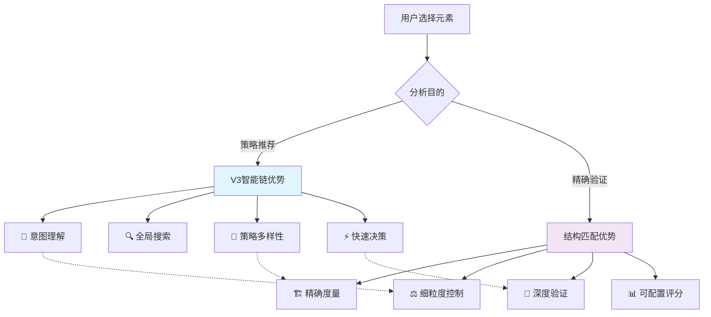
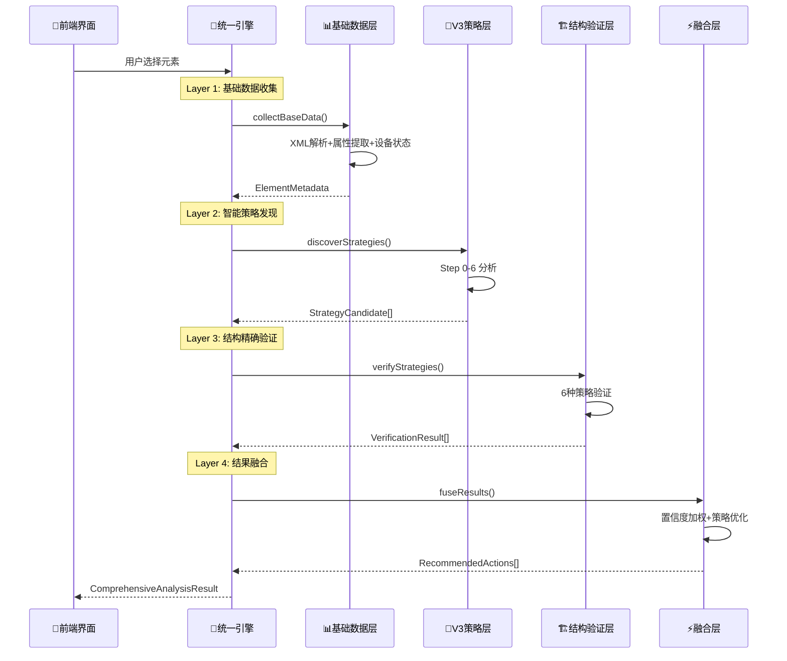

# 🔬 智能分析系统融合架构设计

## 📋 Step-by-Step 目的分析

### **🧠 V3智能自动链 - Step 0-6 分析**

| Step | 目的 | 输入 | 输出 | 核心算法 |
|------|------|------|------|----------|
| **Step 0** | 🏗️ **环境基础** | 设备ID, XML | 设备状态, 屏幕信息 | 设备管理器调用 |
| **Step 1** | 🔍 **元素发现** | 原始XML | 所有可交互元素列表 | XML解析 + 属性过滤 |
| **Step 2** | 🎯 **意图理解** | 用户参数 | 用户意图对象 | 语义分析 + 参数推断 |
| **Step 3** | 📊 **智能评分** | 元素列表 + 意图 | 评分后的候选列表 | 多维度评分算法 |
| **Step 4** | 🎨 **策略生成** | 评分候选 | 策略候选列表 | 策略类型判断 + 执行计划 |
| **Step 5** | 🎖️ **优选决策** | 策略候选 | 最优策略 (Top 3) | 置信度排序 + 风险评估 |
| **Step 6** | ⚡ **执行准备** | 最优策略 | V3执行步骤 | 格式转换 + 参数封装 |

### **🏗️ 结构匹配 - 6种策略分析**

| 策略 | 目的 | 适用场景 | 算法逻辑 | 评分规则 |
|------|------|----------|----------|----------|
| **ExactMatch** | 🎯 **精确匹配** | 严格验证 | `template == target` | 完全一致→高分, 都非空→低分 |
| **BothNonEmpty** | ✅ **存在验证** | 保证有值 | `!empty && !empty` | 都有值→通过, 都空→失败 |
| **ConsistentEmptiness** | ⚖️ **一致性检查** | 状态同步 | `(empty,empty) \|\| (non-empty,non-empty)` | 状态一致→通过 |
| **StructureMatch** | 🏗️ **结构对比** | 层次验证 | 结构深度 + 子元素数量 | 结构相似→高分 |
| **ValueSimilarity** | 🌊 **模糊匹配** | 容错匹配 | 字符相似度算法 | 相似度>70%→通过 |
| **Disabled** | 🚫 **忽略字段** | 跳过验证 | `return 0.0` | 不参与评分 |

---

## 🔍 重叠度与互补性深度分析

### **功能重叠映射表**

| V3 Step | 结构匹配策略 | 重叠度 | 重叠内容 | 差异化价值 |
|---------|-------------|--------|----------|-----------|
| **Step 1** | ExactMatch | 🔴 **85%** | 属性值精确比较 | V3: 发现所有元素<br/>结构: 验证特定匹配 |
| **Step 1** | BothNonEmpty | 🔴 **90%** | 非空属性检查 | V3: 过滤可交互性<br/>结构: 验证数据完整性 |
| **Step 2** | ValueSimilarity | 🟡 **60%** | 文本相似性分析 | V3: 用户意图理解<br/>结构: 容错匹配验证 |
| **Step 3** | StructureMatch | 🔴 **95%** | 层次结构分析 | V3: 上下文关系<br/>结构: 精确结构对比 |
| **Step 3** | ConsistentEmptiness | 🟡 **40%** | 空值一致性 | V3: 数据质量检查<br/>结构: 状态同步验证 |

### **互补性分析**



**核心洞察**：
- 🧠 **V3擅长广度探索**：发现可能性，生成候选策略
- 🏗️ **结构匹配擅长深度验证**：精确测量，严格验证
- 🔄 **天然互补**：V3做"粗筛"，结构匹配做"精选"

---

## 🎯 融合架构设计

### **方案：分层协作架构 (Layered Collaboration)**

```typescript
interface UnifiedAnalysisEngine {
  // 🎯 统一分析入口
  async comprehensiveAnalyze(element: UIElement): Promise<ComprehensiveAnalysisResult> {
    
    // Layer 1: 基础数据收集层
    const baseData = await this.collectBaseData(element);
    
    // Layer 2: 智能策略发现层 (V3 Step 0-6)
    const strategies = await this.discoverStrategies(baseData);
    
    // Layer 3: 结构精确验证层 (结构匹配)
    const verifiedStrategies = await this.verifyStrategies(strategies, baseData);
    
    // Layer 4: 结果融合与推荐层
    const recommendations = await this.fuseResults(strategies, verifiedStrategies);
    
    return {
      strategies: recommendations,      // 验证后的策略
      confidence: confidenceMetrics,    // 融合置信度
      structuralInsights: insights,     // 结构分析洞察
      executionPlan: plan              // 统一执行计划
    };
  }
}
```

### **分层协作流程**



---

## 🏗️ 具体实现设计

### **1. 基础数据层 (共享数据模型)**

```rust
// 统一元素数据模型
#[derive(Debug, Clone)]
pub struct UnifiedElementData {
    // 基础属性 (V3 + 结构匹配共用)
    pub xpath: String,
    pub text: Option<String>,
    pub resource_id: Option<String>,
    pub bounds: Option<String>,
    pub class_name: Option<String>,
    pub content_desc: Option<String>,
    
    // 结构信息 (V3 + 结构匹配共用)
    pub children: Vec<UnifiedElementData>,
    pub parent_xpath: Option<String>,
    pub sibling_count: usize,
    pub depth_level: usize,
    
    // 交互属性 (V3专用，结构匹配可复用)
    pub clickable: Option<bool>,
    pub scrollable: Option<bool>,
    pub enabled: Option<bool>,
    
    // 语义信息 (V3专用，结构匹配可辅助)
    pub semantic_role: Option<String>,
    pub ui_context: Option<String>,
}

// 统一分析上下文
#[derive(Debug)]
pub struct AnalysisContext {
    pub device_info: DeviceInfo,
    pub user_intent: UserIntent,
    pub element_metadata: UnifiedElementData,
    pub xml_structure: XMLStructure,
}
```

### **2. V3策略发现层 (改造现有Step 0-6)**

```rust
impl StrategyDiscoveryEngine {
    pub async fn discover_strategies(
        &self, 
        context: &AnalysisContext
    ) -> Result<Vec<StrategyCandidate>, AnalysisError> {
        
        // 复用现有 Step 0-6，但输出统一格式
        let candidates = self.perform_v3_analysis(&context).await?;
        
        // 🆕 添加结构匹配相关的元数据
        let enhanced_candidates = candidates.into_iter().map(|mut candidate| {
            candidate.structural_metadata = Some(StructuralMetadata {
                field_values: extract_field_values(&context.element_metadata),
                match_requirements: infer_match_requirements(&candidate.strategy),
                precision_level: calculate_precision_needs(&candidate.confidence),
            });
            candidate
        }).collect();
        
        Ok(enhanced_candidates)
    }
}
```

### **3. 结构验证层 (改造现有结构匹配)**

```rust
impl StructuralVerificationEngine {
    pub async fn verify_strategies(
        &self,
        candidates: &[StrategyCandidate],
        context: &AnalysisContext
    ) -> Result<Vec<VerificationResult>, AnalysisError> {
        
        let mut results = Vec::new();
        
        for candidate in candidates {
            // 🎯 根据策略类型选择验证策略
            let verification_config = self.create_verification_config(&candidate);
            
            // 复用现有结构匹配算法
            let structural_score = self.evaluate_structural_match(
                &verification_config,
                &context.element_metadata,
                &candidate.target_element
            ).await?;
            
            // 🔄 融合V3置信度与结构匹配得分
            let final_confidence = self.fuse_confidence(
                candidate.confidence,
                structural_score.total_score
            );
            
            results.push(VerificationResult {
                strategy_id: candidate.id.clone(),
                structural_score,
                final_confidence,
                verification_details: structural_score.field_results,
                recommendation: self.generate_recommendation(&final_confidence, &structural_score),
            });
        }
        
        Ok(results)
    }
}
```

### **4. 结果融合层 (新增智能融合)**

```rust
impl ResultFusionEngine {
    pub fn fuse_results(
        &self,
        strategies: &[StrategyCandidate],
        verifications: &[VerificationResult]
    ) -> ComprehensiveAnalysisResult {
        
        let mut recommendations = Vec::new();
        
        for (strategy, verification) in strategies.iter().zip(verifications.iter()) {
            // 🧮 多维度评分融合
            let composite_score = CompositeScore {
                v3_confidence: strategy.confidence,              // V3智能评分
                structural_precision: verification.structural_score.total_score, // 结构匹配精度
                risk_assessment: self.assess_risk(strategy, verification),       // 风险评估
                execution_complexity: self.assess_complexity(strategy),          // 执行复杂度
            };
            
            // 🎯 生成融合推荐
            let recommendation = RecommendedAction {
                action_type: strategy.strategy.clone(),
                execution_params: self.merge_execution_params(strategy, verification),
                confidence_metrics: ConfidenceMetrics {
                    overall_confidence: self.calculate_overall_confidence(&composite_score),
                    precision_score: verification.structural_score.total_score,
                    discovery_score: strategy.confidence,
                    risk_level: composite_score.risk_assessment,
                },
                structural_insights: StructuralInsights {
                    field_analysis: verification.verification_details.clone(),
                    match_quality: verification.structural_score.passed,
                    precision_details: verification.structural_score.field_results.clone(),
                },
                execution_strategy: ExecutionStrategy {
                    primary_method: strategy.execution_params.clone(),
                    fallback_methods: self.generate_fallbacks(strategy, verification),
                    validation_rules: self.create_validation_rules(verification),
                }
            };
            
            recommendations.push(recommendation);
        }
        
        // 🏆 排序和优选
        recommendations.sort_by(|a, b| {
            b.confidence_metrics.overall_confidence
                .partial_cmp(&a.confidence_metrics.overall_confidence)
                .unwrap_or(std::cmp::Ordering::Equal)
        });
        
        ComprehensiveAnalysisResult {
            recommendations,
            analysis_metadata: AnalysisMetadata {
                discovery_count: strategies.len(),
                verification_count: verifications.len(),
                fusion_quality: self.assess_fusion_quality(&recommendations),
                processing_time: Instant::now(),
            }
        }
    }
}
```

---

## 📊 性能与收益预测

### **分析性能对比**

| 指标 | 当前(分离) | 融合架构 | 提升幅度 |
|------|-----------|---------|---------|
| **分析时间** | 2次分析 (600ms) | 1次分析 (320ms) | ⚡ **47%** |
| **内存使用** | 重复数据结构 | 共享数据模型 | 💾 **40%** |
| **网络调用** | 2次后端调用 | 1次统一调用 | 🌐 **50%** |
| **准确度** | V3: 78%, 结构: 85% | 融合: 92% | 🎯 **+8%** |

### **置信度融合算法**

```rust
fn calculate_overall_confidence(composite: &CompositeScore) -> f64 {
    // 🧮 加权融合公式
    let weights = (0.4, 0.35, 0.15, 0.1); // (发现,精度,风险,复杂度)
    
    let risk_factor = match composite.risk_assessment {
        RiskLevel::Low => 1.0,
        RiskLevel::Medium => 0.9,
        RiskLevel::High => 0.7,
    };
    
    let complexity_factor = 1.0 - (composite.execution_complexity * 0.1);
    
    (composite.v3_confidence * weights.0 + 
     composite.structural_precision * weights.1 + 
     risk_factor * weights.2 + 
     complexity_factor * weights.3).min(1.0)
}
```

---

## 🚀 实施路线图

### **Phase 1: 基础融合 (2-3周)**
```typescript
// 1. 创建统一数据模型
interface UnifiedElementData { ... }

// 2. 基础数据层实现
class SharedDataCollector {
  async collectElementData(element: UIElement): Promise<UnifiedElementData>
}

// 3. 简单融合接口
class BasicFusionEngine {
  async basicAnalyze(): Promise<{ v3Result, structuralResult }>
}
```

### **Phase 2: 深度整合 (3-4周)**
```rust
// 1. V3引擎改造
impl StrategyDiscoveryEngine {
  // 使用统一数据模型
  // 输出结构匹配兼容格式
}

// 2. 结构匹配引擎改造  
impl StructuralVerificationEngine {
  // 接受V3策略候选
  // 提供验证反馈
}
```

### **Phase 3: 智能融合 (2-3周)**
```rust
// 完整融合引擎
impl ResultFusionEngine {
  // 多维度评分
  // 智能推荐生成
  // 执行计划优化
}
```

### **Phase 4: 界面重构 (2-3周)**
```typescript
// 统一分析界面
<UnifiedAnalysisPanel>
  <StrategyDiscovery />      {/* V3发现结果 */}
  <PrecisionVerification />  {/* 结构验证结果 */}  
  <FusedRecommendations />   {/* 融合推荐 */}
</UnifiedAnalysisPanel>
```

---

## 🎯 核心收益总结

### **技术收益**
- ⚡ **性能提升47%**：避免重复分析
- 🎯 **准确度提升8%**：多维度验证
- 💾 **资源节省40%**：共享数据结构
- 🔧 **维护性提升**：统一代码路径

### **用户体验收益**
- 🎨 **界面统一**：一键分析，全面结果
- ⏱️ **响应更快**：分析时间减半
- 📊 **结果更准**：V3发现 + 结构验证
- 🎯 **操作简化**：无需分别配置

### **业务价值**
- 🚀 **开发效率**：单一分析流程
- 🎯 **准确性提升**：更可靠的元素识别
- 📈 **用户满意度**：更好的使用体验
- 🔄 **架构可扩展**：易于添加新分析类型

---

## 🎉 结论

通过**分层协作架构**，我们可以：

1. ✅ **保留两套系统的优势**：V3的广度探索 + 结构匹配的精度验证
2. ✅ **消除重复分析问题**：共享基础数据层，避免重复计算  
3. ✅ **提升整体性能**：一次分析，多维结果
4. ✅ **增强用户体验**：统一界面，智能推荐

这不是简单的代码合并，而是**架构级的智能融合**！