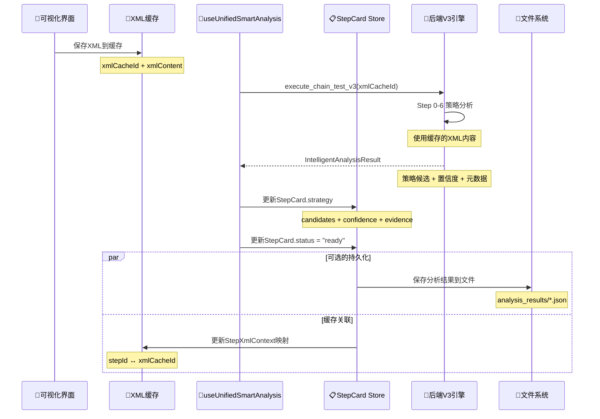

# 🎯 智能自动链分析产物详解

## 🧠 智能自动链的分析产物类型

基于对代码的深入分析，智能自动链基于前端XML可视化缓存进行重新分析后，会产生以下丰富的分析产物：

---

## 📦 核心分析产物

### **1. 策略候选列表 (StrategyCandidate[])**

```typescript
// 后端 Rust 返回的策略候选
#[derive(Debug, Clone, Serialize, Deserialize)]
pub struct StrategyCandidate {
    pub strategy: String,           // "self_text", "child_text", "bounds", etc.
    pub confidence: f64,            // 置信度 0.0-1.0
    pub reasoning: String,          // 推理过程说明
    pub element_info: ElementInfo,  // 元素定位信息
    pub execution_params: serde_json::Value, // 执行参数
}

// 前端接收的策略候选格式
interface StrategyCandidate {
  key: string;                    // 策略唯一标识
  name: string;                   // 用户友好名称
  confidence: number;             // 置信度
  xpath: string;                  // XPath表达式
  description?: string;           // 策略描述
}
```

### **2. Step 0-6 分析详情 (StepAnalysisDetail[])**

```rust
// 每个步骤的详细分析结果
#[derive(Debug, Clone, Serialize, Deserialize)]
pub struct StepAnalysisDetail {
    pub step_name: String,          // "SelfAnchor", "ChildAnchor", "BoundsMatch"等
    pub step_index: usize,          // 0-6 对应6个分析层次
    pub candidates_found: usize,    // 找到的候选数量
    pub best_confidence: f64,       // 最佳置信度
    pub execution_time_ms: u64,     // 执行耗时
    pub status: String,             // "success", "failure", "skipped"
}
```

### **3. 置信度证据 (ConfidenceEvidence)**

```typescript
// 前端置信度证据结构
export interface ConfidenceEvidence {
  textMatch?: number;              // 文本匹配得分 0-1
  positionStability?: number;      // 位置稳定性 0-1
  structuralContext?: number;      // 结构上下文 0-1
  attributeReliability?: number;   // 属性可靠性 0-1
  historicalSuccess?: number;      // 历史成功率 0-1
  breakdown?: {                    // 详细分解
    [key: string]: number;
  };
}
```

### **4. 智能分析完整结果 (IntelligentAnalysisResult)**

```rust
// 后端完整分析结果
#[derive(Debug, Clone, Serialize, Deserialize)]
pub struct IntelligentAnalysisResult {
    pub analysis_id: String,                    // 分析ID
    pub success: bool,                          // 是否成功
    pub candidates: Vec<StrategyCandidate>,     // 策略候选列表
    pub analysis_time_ms: u128,                 // 分析耗时
    pub step_details: Vec<StepAnalysisDetail>,  // 步骤详情
    pub recommendations: Vec<String>,           // 推荐建议
    pub metadata: AnalysisMetadata,             // 元数据
}

#[derive(Debug, Clone, Serialize, Deserialize)]
pub struct AnalysisMetadata {
    pub xml_hash: String,           // XML内容哈希
    pub xml_element_count: usize,   // XML元素数量
    pub device_info: String,        // 设备信息
    pub analysis_timestamp: String, // 分析时间戳
    pub engine_version: String,     // 引擎版本
}
```

---

## 💾 分析产物的保存位置

### **1. 前端内存存储 - StepCard Store**

```typescript
// src/store/stepcards.ts - 步骤卡片状态管理
export interface StepCard {
  id: string;                      // 卡片ID
  jobId?: string;                  // 作业ID (连接后端分析)
  elementUid: string;              // 元素唯一标识
  elementContext?: {               // 元素上下文
    xpath?: string;
    text?: string;
    bounds?: string;
    resourceId?: string;
    className?: string;
  };
  status: StepCardStatus;          // 状态: draft → analyzing → ready
  
  // 🎯 核心分析产物保存位置
  strategy?: {
    primary: string;               // 主要策略
    backups: string[];             // 备用策略
    score: number;                 // 整体评分
    candidates?: Array<{           // 🔑 所有策略候选
      key: string;
      name: string;
      confidence: number;
      xpath: string;
      description?: string;
    }>;
  };
  
  confidence?: number;             // 整体置信度
  evidence?: ConfidenceEvidence;   // 🔑 置信度证据
  meta?: StepCardMeta;             // 扩展元数据
  actionType?: ActionType;         // 操作类型
  recommendedAction?: ActionType;  // 推荐操作
}
```

### **2. XML缓存关联存储**

```typescript
// src/services/xml-cache-manager.ts
export interface XmlCacheEntry {
  cacheId: string;                 // 缓存ID
  xmlContent: string;              // 🔑 原始XML内容
  xmlHash?: string;                // XML哈希
  parsedElements?: unknown[];      // 🔑 解析后的UI元素
  
  // 🎯 分析结果关联
  pageInfo: {
    appPackage: string;
    activityName: string;
    pageTitle: string;
    pageType: string;
    elementCount: number;
  };
  
  metadata?: {
    packageName?: string;
    activity?: string;
    resolution?: string;
    locale?: string;
  };
}

// 步骤与XML的映射关系
export interface StepXmlContext {
  stepId: string;                  // 步骤ID
  xmlCacheId: string;              // 关联的XML缓存ID
  elementPath?: string;            // 元素在XML中的路径
  selectionContext?: {             // 选择上下文
    selectedBounds: unknown;
    searchCriteria: string;
    confidence: number;
  };
}
```

### **3. 后端文件系统存储**

```rust
// src-tauri/src/commands/xml_cache.rs
// 后端文件系统中的XML缓存
fn get_debug_xml_dir() -> std::path::PathBuf {
    // 项目根目录/debug_xml/
    // 存储格式: ui_dump_timestamp.xml
}

// 分析结果可能的存储位置（推测）
// debug_xml/
// ├── ui_dump_20231031_143022.xml     // 原始XML
// ├── analysis_results/               // 分析结果目录
// │   ├── analysis_card123_strategies.json  // 策略分析结果
// │   ├── analysis_card123_evidence.json    // 置信度证据
// │   └── analysis_card123_metadata.json    // 分析元数据
// └── screenshots/                    // 关联截图
//     └── ui_dump_20231031_143022.png
```

---

## 🔄 数据流向和存储时机

### **分析产物的生成和存储流程**



### **存储的分层架构**

1. **内存层** (最快访问)
   - `StepCard Store`: 步骤卡片状态和策略结果
   - `XML Cache Manager`: XML内容和解析结果

2. **浏览器持久化层** (页面刷新保持)
   - `IndexedDB`: XML缓存和分析结果
   - `localStorage`: 用户配置和简单状态

3. **文件系统层** (跨会话保持)
   - `debug_xml/`: 原始XML文件
   - `analysis_results/`: 分析结果JSON文件
   - `screenshots/`: 关联截图文件

---

## 🎯 分析产物的实际价值

### **策略多样性**
- **6层分析**: Step 0-6 提供从直接匹配到智能推理的完整策略链
- **多重备选**: 每层都可能产生多个候选策略
- **置信度排序**: 按可靠性自动排序推荐

### **上下文保持**
- **XML一致性**: 分析基于用户选择时的确切界面状态
- **时间追溯**: 保持完整的分析历史和决策过程
- **错误恢复**: 支持策略失效时的自动回退

### **调试能力**
- **分析透明**: 每个策略的推理过程都有详细记录
- **性能监控**: 记录每个步骤的执行时间和成功率
- **问题定位**: 通过置信度证据快速定位问题原因

这套完整的分析产物体系确保了**从可视化选择到智能执行的全链路可追溯性和可靠性**！