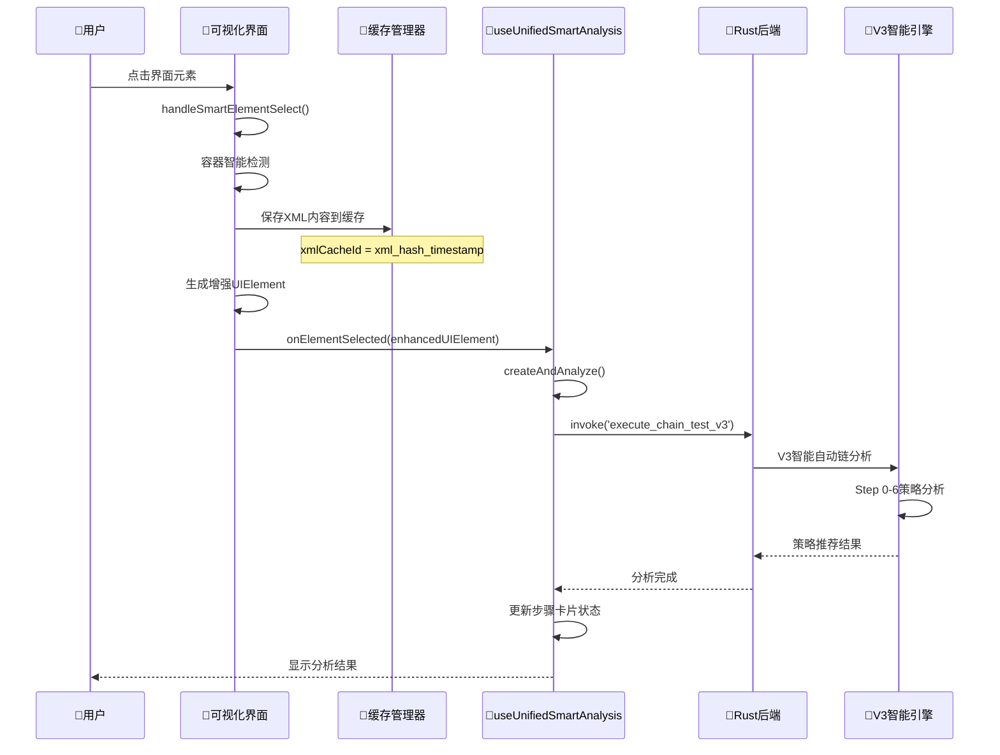

# 🧠 智能自动链分析流程详解

## 🎯 用户点击元素确认后的完整流程

基于对项目代码的深入分析，我来详细说明用户在可视化页面点击元素确认后，"智能自动链"的完整工作过程。

---

## 🔄 完整数据流向图



---

## 📋 详细流程分解

### **阶段1：可视化界面交互** 

```typescript
// VisualPageAnalyzerContent.tsx - handleSmartElementSelect()
const handleSmartElementSelect = (element: VisualUIElement) => {
  // 🎯 1. 容器智能检测
  if (isContainerClass && hasNoText && hasNoContentDesc) {
    // 查找最精确的可点击子元素
    const clickableChildren = elements.filter(child => {
      return isInContainer && inClickPosition;
    });
    targetElement = findSmallestMatchingElement(clickableChildren);
  }

  // 🔧 2. 生成XML缓存ID
  const xmlHash = generateXmlHash(xmlContent);
  const xmlCacheId = `xml_${xmlHash.substring(0, 16)}_${Date.now()}`;
  
  // 💾 3. 保存完整XML内容到缓存
  xmlCacheManager.putXml(xmlCacheId, xmlContent, `sha256:${xmlHash}`);

  // 📦 4. 生成增强UIElement
  const enhancedUIElement = {
    ...uiElement,
    isEnhanced: true,
    xmlCacheId: xmlCacheId,          // 🔑 关键：缓存ID
    xmlContent: xmlContent,          // 📄 完整XML内容
    xmlHash: xmlHash,               // #️⃣ XML哈希
    smartAnalysis: analysis,        // 🧠 初步分析结果
    smartDescription: smartDescription
  };

  // 🚀 5. 传递给智能分析Hook
  onElementSelected(enhancedUIElement);
};
```

### **阶段2：智能分析Hook处理**

```typescript
// useUnifiedSmartAnalysis.ts - createAndAnalyze()
const createAndAnalyze = async (elementData: {
  uid: string;
  xpath?: string;
  text?: string;
  bounds?: string;
  resourceId?: string;
  className?: string;
}): Promise<string> => {

  // 📝 1. 创建步骤卡片
  const cardId = create({
    elementUid: elementData.uid,
    elementContext: {
      xpath: elementData.xpath,
      text: elementData.text,
      bounds: elementData.bounds,
      resourceId: elementData.resourceId,
      className: elementData.className,
    },
    status: 'draft'
  });

  // 🔄 2. 切换到分析状态
  updateStatus(cardId, 'analyzing');

  // 🎯 3. 构建V3智能链调用参数
  const envelope = {
    deviceId: elementData.uid,
    app: {
      package: 'com.xingin.xhs',
      activity: null
    },
    snapshot: {
      analysisId: cardId,
      screenHash: null,
      xmlCacheId: null // 🔑 这里会传递XML缓存信息
    },
    executionMode: 'relaxed'
  };

  const spec = {
    chainId: `unified_analysis_${cardId}`,
    orderedSteps: [{
      ref: null,
      inline: {
        stepId: cardId,
        action: 'smart_find_element',
        params: {
          element_context: {
            snapshot_id: cardId,
            element_path: elementData.xpath || '',
            element_text: elementData.text,
            element_bounds: elementData.bounds,
            element_type: elementData.className,
            key_attributes: {
              'resource-id': elementData.resourceId || '',
              'class': elementData.className || '',
              'text': elementData.text || ''
            }
          }
        }
      }
    }],
    mode: 'dryrun', // 🔑 关键：只分析不执行
    threshold: 0.5
  };

  // 🚀 4. 调用后端V3智能链
  const result = await invoke('execute_chain_test_v3', { envelope, spec });
  
  // 🔗 5. 绑定作业ID用于后续事件路由
  const jobId = String(result?.analysisId || `analysis_${cardId}_${Date.now()}`);
  attachJob(cardId, jobId);

  return cardId;
};
```

### **阶段3：Rust后端V3处理**

```rust
// src-tauri/src/exec/v3/commands.rs - execute_chain_test_v3()
#[tauri::command]
pub async fn execute_chain_test_v3(
    app: AppHandle,
    envelope: ContextEnvelope,
    spec: serde_json::Value,
) -> Result<Value, String> {
    
    // 🔍 1. 解析前端传递的规格
    let parsed_spec: ChainSpecV3 = serde_json::from_value(spec)?;
    
    // 📊 2. 提取分析参数
    let (analysis_id, threshold) = match &parsed_spec {
        ChainSpecV3::ByInline { chain_id, threshold, .. } => 
            (chain_id.clone(), *threshold)
    };
    
    // 🚀 3. 执行V3智能链引擎
    let result = execute_chain(&app, &envelope, &parsed_spec).await?;
    
    serde_json::to_value(&result)
}
```

### **阶段4：V3智能链核心分析**

```rust
// src-tauri/src/exec/v3/chain_engine.rs - execute_chain()
pub async fn execute_chain(
    app: &AppHandle,
    envelope: &ContextEnvelope,
    spec: &ChainSpecV3,
) -> Result<ChainExecutionResult> {
    
    // 🎯 1. 获取XML内容（通过缓存ID或当前屏幕）
    let xml_content = if let Some(xml_cache_id) = &envelope.snapshot.xmlCacheId {
        // 💾 从前端传递的缓存中获取
        get_cached_xml_content(xml_cache_id)?
    } else {
        // 📱 实时获取当前屏幕XML
        capture_current_screen_xml(&envelope.deviceId)?
    };
    
    // 🧠 2. 执行Step 0-6智能策略分析
    let strategies = strategy_engine::analyze_element_strategies(
        &xml_content,
        &element_context,
        spec.threshold
    )?;
    
    // 📊 3. 策略评分和排序
    let ranked_strategies = rank_strategies_by_confidence(strategies);
    
    // 🎯 4. 生成推荐策略
    let recommendations = generate_strategy_recommendations(ranked_strategies);
    
    Ok(ChainExecutionResult {
        success: true,
        strategies: recommendations,
        analysis_id: envelope.snapshot.analysisId,
        confidence_scores: strategy_scores,
    })
}
```

---

## 💾 缓存系统的关键作用

### **1. XML内容缓存机制**

```typescript
// 可视化界面保存XML到缓存
xmlCacheManager.putXml(xmlCacheId, xmlContent, `sha256:${xmlHash}`);

// 智能分析时传递缓存ID
const envelope = {
  snapshot: {
    analysisId: cardId,
    xmlCacheId: xmlCacheId  // 🔑 关键：告诉后端使用哪个XML
  }
};
```

### **2. 后端缓存检索**

```rust
// 后端从缓存获取XML内容
let xml_content = if let Some(xml_cache_id) = &envelope.snapshot.xmlCacheId {
    // 💾 优先使用前端指定的缓存XML
    get_cached_xml_content(xml_cache_id)?
} else {
    // 📱 备选：实时获取当前屏幕
    capture_current_screen_xml(&envelope.deviceId)?
};
```

### **3. 缓存优势**

- ✅ **一致性保证**：分析时使用的XML与用户选择时的界面完全一致
- ✅ **性能优化**：避免重复的ADB调用和XML获取
- ✅ **状态保持**：即使界面发生变化，分析依然基于用户选择时的状态
- ✅ **离线分析**：支持基于历史页面的策略分析

---

## 🎯 Step 0-6 策略分析详解

V3智能自动链执行以下6个层次的策略分析：

### **Step 0: 直接匹配**
- 文本完全匹配
- resource-id精确匹配
- content-desc精确匹配

### **Step 1: 模糊匹配** 
- 文本包含匹配
- 部分属性匹配
- 近似坐标匹配

### **Step 2: 语义分析**
- AI语义理解
- 同义词匹配
- 上下文推理

### **Step 3: 结构分析**
- 父子关系分析
- 兄弟元素分析
- 层次结构推理

### **Step 4: 视觉分析**
- 位置关系分析
- 大小形状分析
- 颜色特征分析

### **Step 5: 行为分析**
- 用户意图推理
- 交互模式识别
- 业务逻辑理解

### **Step 6: 容错兜底**
- 坐标点击
- 区域扫描
- 备选策略

---

## 🎉 最终结果

分析完成后，系统会生成：

1. **📊 策略推荐列表**：按置信度排序的多种定位策略
2. **🎯 最佳策略**：置信度最高的推荐策略
3. **📝 步骤描述**：用户友好的操作描述
4. **🔧 执行参数**：具体的执行配置
5. **⚠️ 风险评估**：策略的稳定性和风险评级

这整个流程确保了**从用户可视化选择到智能策略生成的无缝衔接**，充分利用了XML缓存保证分析的准确性和一致性！