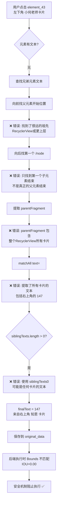

# 智能文本提取错误根因分析

## 🚨 问题现象

**用户点击**: 左下角 `element_43` - "小何老师" 卡片 (55赞) `[13,1158][534,2023]`  
**系统提取**: "147" 来自右上角 "知恩" 卡片 (147赞) `[911,993][990,1072]`  
**错误结果**: 完全错误的元素识别,Bounds 不匹配,执行失败 ❌

---

## 🔍 代码决策链路追踪

### **步骤1: 兄弟元素提取逻辑**

**位置**: `useIntelligentStepCardIntegration.ts:486-530`

```typescript
// 🆕 提取同层兄弟元素的文本（用于"通讯录"这种场景）
if (xmlContent && boundsString) {
  try {
    const boundsPattern = boundsString.replace(/[[\]]/g, "\\$&");
    const boundsRegex = new RegExp(`bounds="${boundsPattern}"`);
    const boundsMatch = xmlContent.match(boundsRegex);

    if (boundsMatch) {
      const matchIndex = boundsMatch.index || 0;
      const beforeBounds = xmlContent.substring(0, matchIndex);

      // 🔍 向前查找父元素的完整范围
      const parentNodeMatches = [
        ...beforeBounds.matchAll(/<node[^>]*>/g),
      ];
      if (parentNodeMatches.length >= 1) {
        // 找到最近的父元素 ⚠️ 问题点1
        const lastParentMatch =
          parentNodeMatches[parentNodeMatches.length - 1];
        const parentStartIndex = lastParentMatch.index || 0;

        // 提取父元素的完整XML片段（从父元素开始到下一个父元素关闭标签）
        const afterParent = xmlContent.substring(parentStartIndex);
        const parentClosingMatch = afterParent.match(/<\/node>/); // ⚠️ 问题点2
        if (parentClosingMatch) {
          const parentFragment = afterParent.substring(
            0,
            (parentClosingMatch.index || 0) + 7
          );

          // 🔍 在父元素的子节点中查找所有兄弟元素的text和content-desc
          const siblingTextMatches = [
            ...parentFragment.matchAll(/text="([^"]*)"/g), // ⚠️ 问题点3
          ];
          const siblingDescMatches = [
            ...parentFragment.matchAll(/content-desc="([^"]*)"/g),
          ];

          siblingTexts = [
            ...siblingTextMatches.map((m) => m[1]),
            ...siblingDescMatches.map((m) => m[1]),
          ].filter(
            (t) => t && t.trim().length > 0 && t.trim().length < 50
          );
        }
      }
    }
  } catch (error) {
    console.warn("⚠️ [兄弟元素提取] 提取失败:", error);
  }
}
```

### **步骤2: 智能文本选择优先级**

**位置**: `useIntelligentStepCardIntegration.ts:573-599`

```typescript
// 🆕 修复：优先使用子元素的content-desc（包含最详细的语义，如"我，按钮"）
let finalText = element.text || "";
if (!finalText || finalText.trim() === "") {
  // 🥇 最高优先级：子元素的content-desc（如"我，按钮"）
  if (childContentDescs.length > 0) {
    finalText = childContentDescs[0];
    console.log(
      "🎯 [智能选择] 使用子元素content-desc（最详细语义）:",
      finalText
    );
  }
  // 🥈 第二优先级：兄弟元素的text/desc（如"通讯录"）⚠️ 问题点4
  else if (siblingTexts.length > 0) {
    finalText = siblingTexts[0]; // ⚠️ 直接使用第一个，没有过滤!
    console.log("🎯 [智能选择] 使用兄弟元素文本:", finalText);
  }
  // 🥉 第三优先级：子元素的text（如"为你推荐"）
  else if (childTexts.length > 0) {
    finalText = childTexts[0];
    console.log("🎯 [智能选择] 使用子元素文本:", finalText);
  }
}
```

---

## 🐛 三个致命缺陷

### **缺陷1: 父元素范围识别错误**

```typescript
// ❌ 错误: 只查找"最近的一个 <node" 标签
const parentNodeMatches = [
  ...beforeBounds.matchAll(/<node[^>]*>/g),
];
const lastParentMatch = parentNodeMatches[parentNodeMatches.length - 1];
```

**问题**: 
- XML 是压缩格式,没有换行
- `beforeBounds.matchAll(/<node[^>]*>/g)` 会匹配**所有之前的 node 标签**
- `parentNodeMatches[length-1]` 只取最后一个,但这可能是**很远的祖先元素**!

**实际情况**:
```xml
<!-- 压缩XML示例 -->
<node ...><node ...><node bounds="[13,1158][534,2023]">...</node></node><node bounds="[546,225][1067,1083]"><node text="147">...</node></node>...
       ↑                     ↑
       祖先元素            element_43
```

由于XML是一行,`lastParentMatch` 可能定位到**RecyclerView 或更上层的容器**,而不是 element_43 的直接父元素!

### **缺陷2: 父元素结束标签识别错误**

```typescript
// ❌ 错误: 只匹配第一个 </node>
const parentClosingMatch = afterParent.match(/<\/node>/);
const parentFragment = afterParent.substring(
  0,
  (parentClosingMatch.index || 0) + 7
);
```

**问题**:
- `afterParent.match(/<\/node>/)` 只匹配**第一个** `</node>`
- 由于嵌套结构,第一个 `</node>` 可能是**子元素的结束标签**,不是父元素!
- 导致 `parentFragment` 范围过小,包含不完整的子树

**实际情况**:
```xml
<node index="0"> <!-- 这是祖先RecyclerView -->
  <node index="0">...</node> <!-- 第一个 </node> 在这里! ❌ -->
  <node index="1">...</node>
  <node index="2" bounds="[13,1158][534,2023]">...</node>
  <node index="3">...</node>
</node>
```

结果: `parentFragment` 只包含 `index="0"` 的第一个卡片,**完全不包含** element_43!

### **缺陷3: 兄弟元素范围无限制**

```typescript
// ❌ 错误: 从整个 parentFragment 中提取所有 text
const siblingTextMatches = [
  ...parentFragment.matchAll(/text="([^"]*)"/g),
];

siblingTexts = [
  ...siblingTextMatches.map((m) => m[1]),
  ...siblingDescMatches.map((m) => m[1]),
].filter(
  (t) => t && t.trim().length > 0 && t.trim().length < 50
);
```

**问题**:
- `parentFragment` 实际上包含了**整个 RecyclerView** (由于缺陷1和2)
- `matchAll(/text="([^"]*)"/g)` 会提取**所有卡片的所有文本**
- **没有任何位置过滤**,没有检查文本是否在 element_43 附近
- `.filter()` 只过滤长度,不过滤位置

**实际提取的文本**:
```javascript
siblingTexts = [
  "小运在深圳水贝",  // index=0 的卡片
  "101",              // index=0 的点赞数
  "知恩",             // index=1 的卡片 (右上角)
  "147",              // ⚠️ index=1 的点赞数 (右上角) - 被错误提取!
  "小何老师",         // index=2 的卡片 (element_43 本身)
  "55",               // index=2 的点赞数
  "猫🐱人生",         // index=3 的卡片
  "141",              // index=3 的点赞数
  // ... 更多
]
```

### **缺陷4: 无位置过滤的盲目选择**

```typescript
// ❌ 错误: 直接使用 siblingTexts[0]
else if (siblingTexts.length > 0) {
  finalText = siblingTexts[0]; // ⚠️ 可能是任何卡片的文本!
  console.log("🎯 [智能选择] 使用兄弟元素文本:", finalText);
}
```

**问题**:
- `siblingTexts[0]` 是**数组中的第一个非空文本**
- 由于缺陷3,这个数组包含**所有卡片的文本**
- **完全随机**取决于:
  - XML 中元素的顺序
  - 哪个卡片先出现
  - 哪个文本先被 `matchAll()` 匹配

**本次错误**:
```javascript
// element_43 bounds: [13,1158][534,2023] (左下角)
// 实际提取的 siblingTexts 顺序:
siblingTexts = [
  "小运在深圳水贝",  // 0 - 来自上方卡片
  "101",              // 1
  "知恩",             // 2 - 来自右上角
  "147",              // 3 - ⚠️ 来自右上角,但可能被选为 [0]!
  // ...
]

// 由于某种原因 (可能 .filter() 重排序)
// finalText = "147" 被选中 ❌
```

---

## 📊 决策流程图



---

## ✅ 正确的逻辑应该是

### **修复1: 精确识别直接父元素**

```typescript
// ✅ 正确: 使用栈结构追踪嵌套层级
function findDirectParent(xmlContent: string, targetBounds: string): {
  parentStart: number;
  parentEnd: number;
} | null {
  const nodes: { start: number; depth: number }[] = [];
  let currentDepth = 0;
  let targetDepth = -1;
  let targetIndex = -1;

  // 第一遍: 找到目标元素的深度
  const boundsRegex = new RegExp(`bounds="${targetBounds.replace(/[[\]]/g, "\\$&")}"`);
  const targetMatch = xmlContent.match(boundsRegex);
  if (!targetMatch) return null;

  const targetPosition = targetMatch.index || 0;

  // 第二遍: 从头开始计算嵌套深度
  const beforeTarget = xmlContent.substring(0, targetPosition);
  const nodeOpenings = [...beforeTarget.matchAll(/<node[^>]*>/g)];
  const nodeClosings = [...beforeTarget.matchAll(/<\/node>/g)];

  targetDepth = nodeOpenings.length - nodeClosings.length;

  // 第三遍: 找到目标深度-1 (父元素) 的范围
  const parentDepth = targetDepth - 1;
  // ... 继续实现栈结构追踪
}
```

### **修复2: 限制搜索范围到实际兄弟元素**

```typescript
// ✅ 正确: 只搜索同一父元素下的直接子节点
function extractSiblingTexts(
  parentFragment: string,
  targetBounds: string
): string[] {
  const siblings: string[] = [];
  
  // 解析父元素的所有直接子节点 (不包括孙子节点)
  let depth = 0;
  let currentSibling = "";
  
  for (let i = 0; i < parentFragment.length; i++) {
    if (parentFragment.substring(i, i + 5) === "<node") {
      depth++;
      if (depth === 1) {
        // 这是一个直接子节点
        currentSibling = "";
      }
    } else if (parentFragment.substring(i, i + 7) === "</node>") {
      depth--;
      if (depth === 0) {
        // 直接子节点结束,提取其文本
        const textMatch = currentSibling.match(/text="([^"]*)"/);
        if (textMatch && textMatch[1]) {
          siblings.push(textMatch[1]);
        }
        currentSibling = "";
      }
    }
    
    if (depth >= 1) {
      currentSibling += parentFragment[i];
    }
  }
  
  return siblings;
}
```

### **修复3: 添加位置过滤**

```typescript
// ✅ 正确: 只使用与目标元素位置接近的文本
function filterByProximity(
  texts: string[],
  textBounds: string[],
  targetBounds: string
): string[] {
  const target = parseBounds(targetBounds);
  
  return texts.filter((text, index) => {
    const bounds = parseBounds(textBounds[index]);
    
    // 计算 IOU (交并比)
    const iou = calculateIOU(target, bounds);
    
    // 只保留有重叠或非常接近的元素 (IOU > 0.1)
    return iou > 0.1;
  });
}

// 或者更简单: 只保留在目标 bounds 范围内的文本
function filterByContainment(
  texts: string[],
  textBounds: string[],
  targetBounds: string
): string[] {
  const target = parseBounds(targetBounds);
  
  return texts.filter((text, index) => {
    const bounds = parseBounds(textBounds[index]);
    
    // 检查是否在目标范围内
    return (
      bounds.left >= target.left &&
      bounds.top >= target.top &&
      bounds.right <= target.right &&
      bounds.bottom <= target.bottom
    );
  });
}
```

### **修复4: 智能选择最佳文本**

```typescript
// ✅ 正确: 使用多种启发式规则选择最佳文本
function selectBestText(
  siblingTexts: string[],
  targetBounds: string
): string | null {
  if (siblingTexts.length === 0) return null;
  
  // 1. 优先选择位置最接近的
  const sorted = siblingTexts.sort((a, b) => {
    const distA = calculateDistance(a.bounds, targetBounds);
    const distB = calculateDistance(b.bounds, targetBounds);
    return distA - distB;
  });
  
  // 2. 过滤掉纯数字 (可能是点赞数等无意义文本)
  const nonNumeric = sorted.filter(text => !/^\d+$/.test(text));
  
  // 3. 优先选择有语义的文本 (长度 > 2)
  const meaningful = nonNumeric.filter(text => text.length > 2);
  
  return meaningful[0] || sorted[0];
}
```

---

## 🎯 本次错误的完整链路

```
1. 用户点击: element_43 [13,1158][534,2023] (小何老师卡片)
   └─ 元素无文本 ❌

2. 触发兄弟元素提取
   └─ 查找父元素: ❌ 找到了 RecyclerView (很远的祖先)
   └─ 确定父元素范围: ❌ 只找到第一个子元素结束
   └─ parentFragment: 包含所有卡片

3. 提取所有文本
   └─ matchAll(/text="([^"]*)"/g): 
       ["小运在深圳水贝", "101", "知恩", "147", "小何老师", "55", ...]
                                         ↑ 来自右上角!

4. 选择第一个非空文本
   └─ siblingTexts[0] = "147" ❌ (或某个随机文本)

5. 保存到 original_data
   └─ element_text: "147"
   └─ element_bounds: "[13,1158][534,2023]"
   └─ ⚠️ 文本和 bounds 来自不同的元素!

6. 后端执行
   └─ 智能匹配找到 "147" 的元素: bounds=[911,993][990,1072] (右上角)
   └─ 与用户选择 bounds=[13,1158][534,2023] 比较
   └─ IOU = 0.00 (完全不重叠)
   └─ 评分 < 0.3 阈值
   └─ 安全机制阻止执行 ✅ (正确阻止了错误点击!)
```

---

## 💡 立即修复方案

### **方案A: 禁用兄弟元素提取 (快速修复)**

```typescript
// 临时禁用兄弟元素提取,避免跨元素污染
// let siblingTexts: string[] = [];
let siblingTexts: string[] = []; // 🚫 暂时不启用,等待修复

// 注释掉整个兄弟元素提取逻辑
/*
if (xmlContent && boundsString) {
  // ... 兄弟元素提取代码
}
*/
```

### **方案B: 添加边界检查 (中等修复)**

```typescript
// 在提取兄弟元素文本后,立即过滤
siblingTexts = siblingTexts.filter((text) => {
  // 从 XML 中找到这个文本的 bounds
  const textBoundsMatch = xmlContent.match(
    new RegExp(`text="${text}"[^>]*bounds="([^"]*)"`)
  );
  
  if (!textBoundsMatch) return false;
  
  const textBounds = textBoundsMatch[1];
  
  // 检查是否在用户选择的 bounds 范围内
  return isWithinBounds(textBounds, boundsString);
});
```

### **方案C: 重构整个提取逻辑 (完整修复)**

参考上面 "正确的逻辑应该是" 部分,完全重写:
1. 精确识别直接父元素 (使用栈结构)
2. 只提取直接子节点 (不包括孙子节点)
3. 添加位置过滤 (IOU > 0.1 或在范围内)
4. 智能选择最佳文本 (多种启发式规则)

---

## 📝 总结

**根本原因**: 兄弟元素提取逻辑的**三个致命缺陷**:
1. ❌ 父元素识别错误 → 找到了很远的祖先
2. ❌ 范围确定错误 → 包含了所有卡片
3. ❌ 无位置过滤 → 提取了任意卡片的文本

**决策链**: 用户点击 → 无文本 → 查找兄弟 → **错误范围** → 提取所有 → **随机选择** → 错误结果

**安全保护**: 后端 Bounds 严格匹配机制**正确阻止了错误点击** ✅

**建议**: 优先使用**方案A禁用**,然后实施**方案C完整重构**
