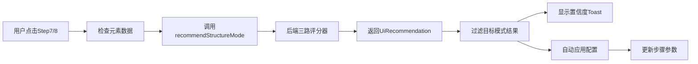

# 三路评分器集成到智能单步

## 📋 功能概述

将**三路评分器**（CardSubtree、LeafContext、TextExact）集成到**智能单步**菜单中，用户可以直接在步骤卡片上调用智能推荐功能。

---

## 🎯 新增功能

### 1. **新增菜单项**

在"智能·单步"下拉菜单中新增两个选项：

| 步骤 | 名称 | 功能 | 对应模式 |
|------|------|------|----------|
| Step7 | 卡片子树评分 | 基于卡片容器结构的智能匹配评分 | CardSubtree |
| Step8 | 叶子上下文评分 | 基于叶子节点上下文的精确匹配评分 | LeafContext |

### 2. **自动调用三路评分API**

点击这两个选项后，系统会自动：

1. **检查元素选择状态**
   - 验证是否已选择目标元素
   - 检查必要的节点数据（clicked、container、cardRoot等）

2. **调用后端评分服务**
   ```typescript
   const recommendation = await recommendStructureMode({
     clicked_node: unifiedElementData.clicked.id,
     container_node: unifiedElementData.container.id,
     card_root_node: unifiedElementData.cardRoot?.id,
     clickable_parent_node: unifiedElementData.clickableParent?.id,
   });
   ```

3. **显示评分结果**
   - 置信度百分比（0-100%）
   - 是否通过闸门（✅/⚠️）
   - 评分解释文本

4. **自动应用配置**
   - 将推荐的 plan/config/intent 自动回填到步骤卡片
   - 附加评分元数据供后续参考

---

## 💻 使用方式

### 场景1：快速评分

1. 在元素详情面板选择目标元素
2. 点击步骤卡片的"智能·单步"按钮
3. 选择"Step7 - 卡片子树评分"或"Step8 - 叶子上下文评分"
4. 系统自动完成评分并应用配置

### 场景2：对比评分

1. 可以分别点击 Step7 和 Step8
2. 对比两种模式的置信度
3. 选择更优的方案

---

## 🔧 技术实现

### 文件修改清单

| 文件 | 修改内容 |
|------|----------|
| `src/components/strategy-selector/CompactStrategyMenu.tsx` | 添加 step7/step8 配置和点击处理 |
| `src/types/strategySelector.ts` | 扩展 SmartStep 类型定义 |

### 核心代码片段

```typescript
// SMART_STEPS 配置扩展
const SMART_STEPS = [
  // ... 原有步骤 ...
  { step: "step7", label: "Step7 - 卡片子树评分", candidateKey: "card_subtree_scoring" },
  { step: "step8", label: "Step8 - 叶子上下文评分", candidateKey: "leaf_context_scoring" },
];

// 点击处理逻辑
onClick: async () => {
  if (step === 'step7' || step === 'step8') {
    // 调用三路评分
    const recommendation = await recommendStructureMode({...});
    
    // 过滤对应模式的结果
    const targetMode = step === 'step7' ? 'CardSubtree' : 'LeafContext';
    const targetOutcome = recommendation.outcomes.find(o => o.mode === targetMode);
    
    // 应用配置
    onUpdateStepParameters(stepId, stepPatch);
  }
  
  // 正常策略切换
  events.onStrategyChange({ type: "smart-single", stepName: step });
}
```

---

## 📊 数据流转



---

## 🎨 UI展示

### 下拉菜单效果

```
智能·单步 ▼
  ├─ Step1 - 自锚定策略        [88%] 荐
  ├─ Step2 - 子元素驱动        [68%]
  ├─ Step3 - 区域约束          [53%]
  ├─ Step4 - XPath兜底         [55%]
  ├─ Step5 - 索引兜底
  ├─ Step6 - 应急兜底
  ├─ Step7 - 卡片子树评分      🆕
  └─ Step8 - 叶子上下文评分    🆕
```

### Toast提示示例

```
✅ 卡片子树评分: 87% - 基于容器节点 #1234 的子树结构匹配
⚠️ 叶子上下文评分: 62% - 未通过闸门，但可用作兜底策略
```

---

## ⚙️ 配置说明

### 返回的配置结构

```typescript
{
  strategy: { selected: "structure_match" },
  plan: {
    mode: "CardSubtree",  // 或 "LeafContext"
    // 其他plan参数
  },
  config: {
    // 后端生成的结构匹配配置
  },
  intent: {
    // 意图信息
  },
  _scoreMetadata: {
    mode: "CardSubtree",
    confidence: 0.87,
    passedGate: true,
    explanation: "基于容器节点 #1234 的子树结构匹配"
  }
}
```

---

## 🚨 注意事项

### 使用前提

1. **必须先选择元素**
   - 需要有 clicked 和 container 节点数据
   - 否则会提示"请先选择元素再使用三路评分功能"

2. **依赖统一数据服务**
   - 需要 `useStructuralMatchingData` Hook 提供的数据
   - 确保 unifiedElementData 状态正常

### 错误处理

- ❌ 元素数据缺失 → 显示警告提示
- ❌ API调用失败 → 显示错误Toast
- ❌ 未找到目标模式 → 提示评分结果异常

---

## 🔄 后续优化方向

1. **增加TextExact评分选项**
   - 新增 Step9 用于文本精确匹配评分

2. **批量评分对比**
   - 同时显示三种模式的评分
   - 提供可视化对比图表

3. **历史评分记录**
   - 保存每次评分结果
   - 支持回溯查看

4. **智能推荐优先级**
   - 根据三路评分自动排序推荐
   - 高置信度模式优先展示

---

## 📚 相关文档

- [三路评分器算法设计](./三路评分器算法.md)
- [结构匹配决策流](./结构匹配决策流/README.md)
- [智能推荐模态框](../../../components/modals/StructureRecommendModal.tsx)

---

## ✅ 测试验证

### 测试步骤

1. 启动应用并加载XML
2. 在Grid视图选择一个卡片元素
3. 点击步骤卡片的策略选择器
4. 选择"智能·单步" → "Step7 - 卡片子树评分"
5. 验证：
   - ✓ Toast显示评分结果
   - ✓ 步骤参数自动更新
   - ✓ 控制台输出评分详情

6. 重复测试 Step8

### 预期结果

- 评分置信度正常显示（0-100%）
- 配置正确应用到步骤
- 无控制台错误
- UI交互流畅

---

**最后更新**: 2025-01-11  
**实现状态**: ✅ 已完成
