# 批量执行方向控制实现报告

## 📋 背景

**问题**：批量全部模式执行顺序是从最后往前（从下到上），与用户预期的从上到下不符。

**原因**：
- `multi_candidate_evaluator.rs` 中设置了 `prefer_last: true`
- 设计意图是避免选错列表第一项（如标题）
- 但在批量模式下，每次都选最后一个，导致逆序执行

**解决方案**：新增用户可配置的"匹配方向"参数，让用户选择正向/反向执行。

---

## 🎯 实现方案

### 1. 数据结构扩展

#### 后端 Rust (`batch_executor.rs`)
```rust
pub struct BatchExecutionConfig {
    pub max_count: usize,
    pub interval_ms: u64,
    pub continue_on_error: bool,
    pub show_progress: bool,
    pub match_direction: String,  // 🆕 "forward" | "backward"
    pub target_text: String,
    pub step_id: String,
}
```

**解析逻辑**：
- 支持蛇形命名：`match_direction`
- 兼容驼峰命名：`matchDirection`
- 默认值：`"forward"`（正向）

#### 前端 TypeScript (`CompactStrategyMenu.tsx`)
```typescript
interface BatchConfig {
  interval_ms: number;
  max_count?: number;
  jitter_ms?: number;
  continue_on_error: boolean;
  show_progress: boolean;
  match_direction?: 'forward' | 'backward';  // 🆕
}
```

---

### 2. 核心逻辑修改 (`step_executor.rs`)

#### 函数签名变更
```rust
// 修改前
fn evaluate_best_candidate<'a>(
    candidate_elements: Vec<&'a UIElement>,
    params: &serde_json::Value,
    ui_xml: &str,
    is_batch_mode: bool,  // ❌ 布尔值不够灵活
) -> Result<Option<&'a UIElement>, String>

// 修改后
fn evaluate_best_candidate<'a>(
    candidate_elements: Vec<&'a UIElement>,
    params: &serde_json::Value,
    ui_xml: &str,
    match_direction: Option<&str>,  // ✅ 支持 None/forward/backward
) -> Result<Option<&'a UIElement>, String>
```

#### prefer_last 决策逻辑
```rust
prefer_last: match match_direction {
    Some("forward") => false,   // 正向：从第一个开始
    Some("backward") => true,   // 反向：从最后一个开始
    _ => true,                  // 单步模式：优先选择最后一个（避免列表标题）
},
```

#### 调用点更新
1. **单步模式**：
```rust
evaluate_best_candidate(candidates, params, ui_xml, None)
// match_direction = None → prefer_last = true
```

2. **批量模式**：
```rust
evaluate_best_candidate(candidates, params, ui_xml, Some(&config.match_direction))
// match_direction = Some("forward") → prefer_last = false
// match_direction = Some("backward") → prefer_last = true
```

---

### 3. UI 组件实现

#### 选择器位置
批量配置面板中，放在"显示进度"后面：

```tsx
{/* 🆕 匹配方向 */}
<div style={{ display: "flex", alignItems: "center", gap: "6px" }}>
  <span style={{ fontSize: "11px", color: "#94A3B8" }}>方向:</span>
  <select
    value={batchConfig.match_direction || 'forward'}
    onChange={async (e) => {
      const newDirection = e.target.value as 'forward' | 'backward';
      setBatchConfig({
        ...batchConfig,
        match_direction: newDirection
      });
      // 🔥 立即保存配置
      if (selectionMode === 'all') {
        console.log('🔧 [匹配方向修改] 保存配置:', newDirection);
        await autoSaveConfig('all');
      }
    }}
    style={{
      height: "24px",
      fontSize: "11px",
      padding: "0 4px",
      border: "1px solid rgba(110, 139, 255, 0.3)",
      borderRadius: "3px",
      background: "rgba(0, 0, 0, 0.2)",
      color: "#F8FAFC",
      cursor: "pointer"
    }}
  >
    <option value="forward">↓ 正向</option>
    <option value="backward">↑ 反向</option>
  </select>
  <Tooltip title="正向:从上到下执行 | 反向:从下到上执行" placement="top">
    <span style={{ fontSize: "11px", color: "#6E8BFF", cursor: "help" }}>?</span>
  </Tooltip>
</div>
```

#### 自动保存
- 选择改变时立即调用 `autoSaveConfig('all')`
- 配置保存到 `STEP_STRATEGY_STORE`
- 执行时从 Store 读取配置

---

## 🔄 完整数据流

```mermaid
graph LR
    A[用户选择方向] --> B[CompactStrategyMenu.tsx]
    B --> C[autoSaveConfig]
    C --> D[save_smart_selection_config]
    D --> E[STEP_STRATEGY_STORE]
    
    F[用户点击执行] --> G[StepExecutionGateway]
    G --> H[get_step_strategy]
    H --> E
    E --> I[返回配置]
    I --> J[execute_chain_test_v3]
    J --> K[step_executor.rs]
    K --> L[BatchExecutionConfig::from_params]
    L --> M[match_direction: forward/backward]
    M --> N[evaluate_best_candidate]
    N --> O{match_direction?}
    O -->|forward| P[prefer_last = false]
    O -->|backward| Q[prefer_last = true]
    O -->|None| Q
    P --> R[从第一个开始]
    Q --> S[从最后一个开始]
```



---

## ✅ 测试建议

### 正向模式（forward）
1. 设置"方向: ↓ 正向"
2. 执行批量全部
3. **预期**：从上到下依次点击（第1、2、3...）
4. **日志验证**：
```
[批量执行 1/10] 找到目标: bounds=[754,348][943,422]
[批量执行 2/10] 找到目标: bounds=[754,564][943,638]
[批量执行 3/10] 找到目标: bounds=[754,789][943,863]
```

### 反向模式（backward）
1. 设置"方向: ↑ 反向"
2. 执行批量全部
3. **预期**：从下到上依次点击（第10、9、8...）
4. **日志验证**：
```
[批量执行 1/10] 找到目标: bounds=[754,2319][943,2393]
[批量执行 2/10] 找到目标: bounds=[754,2103][943,2177]
[批量执行 3/10] 找到目标: bounds=[754,1878][943,1952]
```

---

## 🎨 UI 效果

### 批量配置面板
```
📋 批量执行配置

间隔: [2000] ms  最大: [10]  ☑ 遇错继续  ☑ 显示进度  方向: [↓ 正向 ▼] ?
```

### Tooltip 提示
```
正向: 从上到下执行
反向: 从下到上执行
```

---

## 🏗️ 模块化设计

### 遵循项目规范
✅ **层次分离**：
- 前端 UI 层：`CompactStrategyMenu.tsx`
- 前端基础设施：`StepExecutionGateway.ts`
- 后端应用层：`step_executor.rs`
- 后端辅助层：`batch_executor.rs`

✅ **命名规范**：
- 前端使用 `match_direction`（蛇形）
- 后端兼容 `match_direction` 和 `matchDirection`

✅ **向后兼容**：
- 旧版本配置没有 `match_direction` 时，默认使用 `"forward"`
- 单步模式不受影响（`match_direction = None`）

---

## 📊 影响范围

### 修改的文件
- `src-tauri/src/exec/v3/helpers/batch_executor.rs` - 添加字段和解析
- `src-tauri/src/exec/v3/helpers/step_executor.rs` - 修改逻辑
- `src/components/strategy-selector/CompactStrategyMenu.tsx` - 添加 UI 控件

### 不影响的功能
- ✅ 单步模式执行
- ✅ 批量第一个模式
- ✅ 智能分析和策略生成
- ✅ 配置保存和读取
- ✅ 其他批量参数（间隔、数量、遇错继续等）

---

## 🎯 用户价值

1. **灵活性**：用户可根据实际场景选择执行顺序
2. **直观性**：UI 清晰显示"正向/反向"，带 Tooltip 说明
3. **持久化**：配置自动保存，下次使用无需重新设置
4. **向后兼容**：旧版本数据自动补充默认值
5. **模块化**：代码结构清晰，易于维护和扩展

---

## 🔮 后续优化方向

1. **可视化预览**：在 UI 中显示执行顺序的箭头指示
2. **智能推荐**：根据元素类型（如关注按钮）自动推荐方向
3. **快捷键**：提供快捷键切换正向/反向
4. **执行动画**：执行时高亮显示当前处理的元素

---

**实现日期**：2025-10-29  
**实现者**：AI Assistant  
**版本**：v1.0
