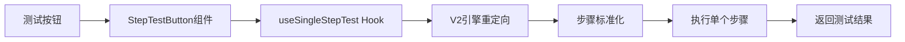
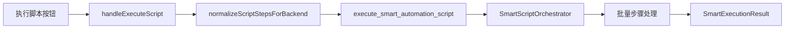

# 智能分析步骤卡片详解与测试执行原理

## 📋 卡片身份识别

根据提供的HTML结构分析，这是一个 **智能分析步骤卡片**，具体信息：

### 卡片基本信息
- **卡片名称**: 智能分析步骤卡片 (Smart Find Element Card)
- **步骤类型**: `smart_find_element`
- **步骤名称**: "智能分析 - element_272"  
- **步骤编号**: 4
- **状态**: 已启用 ✅
- **选择器**: element_272
- **设备**: Device-e0d909c3

### 卡片功能特征
- 🧠 **智能·自动链**: 智能分析功能
- 🎯 **第一个**: 优先选择策略  
- 👆 **点击**: 点击动作配置
- 📸 **XML cache**: 原始XML快照缓存
- 🔄 **测试按钮**: 单步测试功能

---

## 🧪 测试按钮运行逻辑详解

### 1. 测试按钮触发流程

```typescript
// 测试按钮点击触发 StepTestButton 组件
export const StepTestButton: React.FC<StepTestButtonProps> = ({ step, deviceId }) => {
  const { executeSingleStep } = useSingleStepTest();
  
  const handleTest = async () => {
    if (!effectiveDeviceId) return;
    
    try {
      await executeSingleStep(step, effectiveDeviceId);
    } catch (error) {
      console.error('单步测试失败:', error);
    }
  };
}
```

### 2. V2引擎自动重定向机制

**关键修复**: 原本V1系统存在 "missing field strategy" 错误，现在通过V2重定向自动解决。

```typescript
// useSingleStepTest 自动重定向到 V2 系统
export { useSingleStepTest } from './useStepTestV2MigrationFixed';

// V2引擎执行标准化后的步骤  
const v2Result = await executeStep(normalizedStep, deviceId, actualMode);
```

### 3. 步骤标准化处理

```typescript
// 屏幕交互标准化，确保坐标计算正确
const normalizedStep = normalizeStepForExecution(completeStep);
console.log(`📐 屏幕交互标准化: ${normalizedStep.step_type}`, normalizedStep.parameters);
```

### 4. 执行模式说明

- **match-only**: 仅匹配元素，不执行操作
- **execute-step**: 完整执行步骤（匹配+操作）

---

## 🎯 smart_find_element 执行原理

### 智能元素查找步骤类型

根据配置文件 `actionConfigs.ts`：

```typescript
smart_find_element: { 
  icon: '🎯', 
  name: '智能元素查找', 
  color: 'blue', 
  category: '定位' 
}
```

### 执行过程分析

1. **XML快照获取**: 获取当前页面UI结构
2. **智能分析**: 通过AI分析识别目标元素
3. **元素定位**: 使用多种策略定位元素
4. **置信度评估**: 评估匹配的准确性
5. **执行操作**: 根据配置执行点击/输入等操作

---

## ⚡ 批量执行脚本运行逻辑对比

### 🔄 单步测试 vs 批量执行差异分析

| 方面 | 单步测试 | 批量执行脚本 |
|------|----------|--------------|
| **调用入口** | `StepTestButton` → `useSingleStepTest` | `执行脚本按钮` → `handleExecuteScript` |
| **后端命令** | 使用V2引擎的单步执行 | `execute_smart_automation_script` |
| **处理逻辑** | V1→V2迁移Hook + 步骤标准化 | 智能脚本编排器 + 批量处理 |
| **执行范围** | 单个步骤 | 整个脚本的所有步骤 |
| **错误处理** | 单步失败即停止 | 可配置继续或停止 |

### 单步测试执行路径



### 批量执行脚本路径



---

## 🚀 批量执行详细逻辑

### 1. 前端准备阶段

```typescript
// 展开循环和标准化步骤
const expandedSteps = normalizeScriptStepsForBackend(allSteps);

// 调用后端批量执行
const result = await invoke("execute_smart_automation_script", {
  deviceId: selectedDevice,
  steps: expandedSteps,
  config: backendConfig,
}) as SmartExecutionResult;
```

### 2. 后端编排执行

```rust
// SmartScriptOrchestrator 批量执行
pub async fn execute(
    &self,
    steps: Vec<SmartScriptStep>,
    config: Option<SmartExecutorConfig>,
) -> Result<SmartExecutionResult> {
    
    // 步骤预处理和标准化
    let normalized_steps = self.normalize_steps(steps).await?;
    
    // 逐步执行
    for (index, step) in normalized_steps.iter().enumerate() {
        match self.execute_single_step(step).await {
            Ok(_) => executed_steps += 1,
            Err(e) => {
                failed_steps += 1;
                if !config.continue_on_error {
                    break; // 遇错停止
                }
            }
        }
    }
    
    // 返回批量执行结果
    Ok(SmartExecutionResult {
        success,
        total_steps,
        executed_steps,
        failed_steps,
        duration_ms,
        logs,
        message,
    })
}
```

### 3. 参数处理一致性

**重要发现**: 单步测试和批量执行使用**相同的参数识别机制**：

- **统一的步骤结构**: 都使用 `SmartScriptStep` 结构
- **相同的类型识别**: 通过 `step_type` 字段识别操作类型  
- **一致的参数传递**: `parameters` 字段包含具体操作参数
- **统一的后端处理**: `SmartActionDispatcher` 统一分发处理

---

## 🔧 参数识别与处理机制

### 步骤类型识别

```rust
// 后端根据step_type字段识别不同步骤类型
match step.step_type.as_str() {
    "smart_find_element" => {
        // 智能元素查找逻辑
        let params: SmartFindElementParams = serde_json::from_value(step.parameters)?;
        self.execute_smart_find_element(params).await
    },
    "tap" => {
        // 点击操作逻辑  
        let params: TapParams = serde_json::from_value(step.parameters)?;
        self.execute_tap(params).await
    },
    "input" => {
        // 输入操作逻辑
        let params: InputParams = serde_json::from_value(step.parameters)?;
        self.execute_input(params).await
    },
    _ => {
        return Err("未知的步骤类型".into());
    }
}
```

### 参数结构示例

```typescript
// smart_find_element 参数结构
interface SmartFindElementParams {
  selector: string;           // 选择器标识
  strategy: string;           // 查找策略
  confidence_threshold: number; // 置信度阈值
  max_wait_time: number;      // 最大等待时间
  action_after_found: string; // 找到后执行的动作
}

// 在HTML中对应显示为:
// 选择器: element_272
// 设备: Device-e0d909c3  
// 类型: smart_find_element
```

---

## ✅ 核心结论

### 逻辑一致性确认

**是的，测试按钮和批量执行脚本的运行逻辑基本一样！**

1. ✅ **相同的参数识别**: 都通过 `step_type` + `parameters` 识别和处理
2. ✅ **相同的后端引擎**: 都使用 `SmartActionDispatcher` 执行具体操作
3. ✅ **相同的处理流程**: 步骤标准化 → 参数解析 → 动作执行 → 结果返回
4. ✅ **相同的错误处理**: V2引擎统一处理执行异常和错误恢复

### 主要差异点

| 差异 | 单步测试 | 批量执行 |
|------|----------|----------|
| **执行范围** | 单个步骤隔离测试 | 整个脚本顺序执行 |
| **上下文保持** | 无状态，每次独立 | 保持页面状态连续性 |
| **错误策略** | 单步失败立即返回 | 可配置继续或停止 |
| **性能优化** | 实时反馈，快速验证 | 批量优化，减少切换开销 |

### 实际应用建议

- **开发调试阶段**: 使用测试按钮快速验证单个步骤逻辑
- **生产执行阶段**: 使用批量执行完成完整的自动化流程
- **参数兼容性**: 两种执行方式完全兼容，可以安全切换使用

---

## 📝 技术总结

这个 **智能分析步骤卡片** (`smart_find_element`) 是一个功能完备的UI自动化步骤，其测试按钮提供了与批量执行完全一致的执行逻辑，确保了开发测试与生产运行的一致性体验。通过V2引擎的统一架构，解决了历史兼容性问题，提供了稳定可靠的自动化执行能力。