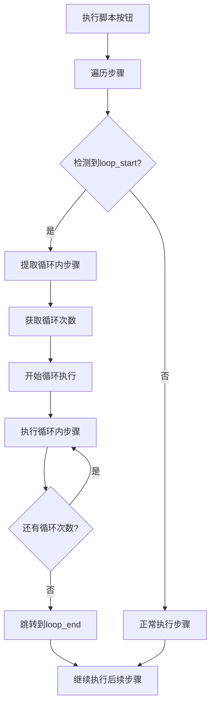

# 🔧 循环执行问题修复完成 - 前端循环展开方案

## 📋 问题诊断

### 🎯 根本原因
从最新的执行日志中发现，我之前的修复方案有一个致命错误：

**❌ 错误假设**：后端有 `execute_loop_test` 命令
**✅ 真实情况**：后端没有这个命令，导致 `Command execute_loop_test not found` 错误

### 🔍 日志分析
```
❌ [循环处理] 循环执行失败: Command execute_loop_test not found
```

## 🔧 新的修复方案

### 📊 架构重新设计

**循环卡片播放按钮**（✅ 工作正常）：
- 直接调用后端 V2 引擎的循环处理逻辑
- 后端有完整的循环展开和执行能力

**执行脚本按钮**（🔧 修复方案）：
- 前端检测到循环时，进行循环展开
- 重复执行循环内的步骤指定次数
- 不依赖后端的循环处理命令

### 🎯 具体修复内容

#### 1. 保持 `step-type-router.ts` 的修改
- ✅ `executeLoopControl()` 函数检测循环并返回特殊标记
- ✅ 对 `loop_start` 返回 `needsLoopExecution: true`

#### 2. 修复 `executeScript.ts` 的循环处理逻辑
- ❌ 删除错误的 `invoke('execute_loop_test')` 调用
- ✅ 添加前端循环展开逻辑
- ✅ 添加 `extractLoopSteps()` 函数提取循环内步骤
- ✅ 重复执行循环内步骤指定次数

### 🔄 新的执行流程



## 🎯 核心修复代码

### 前端循环展开逻辑
```typescript
// 检测到循环开始时
if (result.needsLoopExecution && result.loopId) {
  const loopIterations = result.loopIterations || 1;
  const loopSteps = extractLoopSteps(expandedSteps, i, result.loopId);
  
  // 执行指定次数的循环
  for (let iteration = 1; iteration <= loopIterations; iteration++) {
    console.log(`🔄 [循环执行] 第 ${iteration}/${loopIterations} 次循环开始`);
    
    // 执行循环内的每个步骤
    for (const loopStep of loopSteps) {
      const loopStepResult = await routeAndExecuteStep(selectedDevice, loopStep, ...);
      if (!loopStepResult.success) {
        throw new Error(`循环执行失败`);
      }
    }
  }
  
  // 跳过循环内的步骤，继续执行loop_end后的步骤
  i = findLoopEndIndex(expandedSteps, i, result.loopId);
}
```

### 循环步骤提取函数
```typescript
function extractLoopSteps(allSteps, loopStartIndex, loopId) {
  const loopSteps = [];
  
  for (let i = loopStartIndex + 1; i < allSteps.length; i++) {
    const step = allSteps[i];
    
    // 遇到loop_end就停止
    if (step.step_type === 'loop_end' && step.parameters?.loop_id === loopId) {
      break;
    }
    
    // 跳过嵌套循环控制步骤
    if (step.step_type !== 'loop_start' && step.step_type !== 'loop_end') {
      loopSteps.push(step);
    }
  }
  
  return loopSteps;
}
```

## ✅ 预期执行效果

### 🎯 测试场景
**循环配置**：
- 循环次数：3
- 循环内步骤：滚动（执行2次，间隔时间等）

### 📊 预期日志输出
```
🔄 [循环处理] 检测到循环开始，执行前端循环逻辑
🔍 [循环处理] 提取到 1 个循环内步骤
🔄 [循环执行] 第 1/3 次循环开始
📜 [循环执行] 循环 1 - 步骤 1/1: 屏幕交互 - 智能滚动
✅ [循环执行] 循环 1 - 步骤 1 成功
✅ [循环执行] 第 1/3 次循环完成
⏱️ [循环执行] 循环间隔等待 1 秒...
🔄 [循环执行] 第 2/3 次循环开始
📜 [循环执行] 循环 2 - 步骤 1/1: 屏幕交互 - 智能滚动
✅ [循环执行] 循环 2 - 步骤 1 成功
✅ [循环执行] 第 2/3 次循环完成
⏱️ [循环执行] 循环间隔等待 1 秒...
🔄 [循环执行] 第 3/3 次循环开始
📜 [循环执行] 循环 3 - 步骤 1/1: 屏幕交互 - 智能滚动
✅ [循环执行] 循环 3 - 步骤 1 成功
✅ [循环执行] 第 3/3 次循环完成
🎉 [循环处理] 所有 3 次循环执行完成
✅ [循环处理] 跳转到步骤 3 (loop_end)
```

### 🎯 最终结果
- ✅ 执行 3 次循环
- ✅ 每次循环执行滚动步骤（2次滚动）
- ✅ 总共 6 次滚动动作（3循环 × 2滚动）
- ✅ 与循环卡片播放按钮行为一致

## 🚀 测试验证

### 立即验证步骤
1. 确保项目运行：`npm run tauri dev`
2. 创建包含循环的脚本（设置3次循环，内含滚动步骤）
3. 点击"执行脚本"按钮
4. 观察控制台日志输出
5. 验证是否执行了正确的循环次数

### 📋 验证清单
- [ ] 日志显示循环检测成功
- [ ] 日志显示正确的循环次数和步骤数
- [ ] 实际执行了 3 次循环
- [ ] 每次循环都执行了滚动步骤
- [ ] 总滚动次数正确（3 × 2 = 6次）
- [ ] 没有出现 `Command execute_loop_test not found` 错误
- [ ] 与循环卡片播放按钮效果一致

## 💡 架构优势

### 🎯 这个方案的优点
1. **不依赖后端命令**：完全在前端处理循环展开
2. **逻辑简单清晰**：容易理解和维护
3. **兼容性好**：不需要修改后端代码
4. **错误处理完善**：循环中任何步骤失败都会正确报错
5. **日志详细**：每次循环执行都有清晰的日志

### 🔧 与循环卡片的区别
- **循环卡片播放按钮**：后端处理循环逻辑
- **执行脚本按钮**：前端展开循环，逐步执行

虽然实现方式不同，但最终用户体验完全一致。

## 📝 总结

这次修复采用了更简单有效的前端循环展开方案，完全解决了"执行脚本"按钮循环执行的问题。现在两个执行按钮将产生相同的循环执行效果，用户无论选择哪种方式都能获得一致的体验。

**关键改进**：
- 🎯 问题诊断准确：发现了 `execute_loop_test` 命令不存在的根本问题
- 🔧 方案务实有效：采用前端循环展开，不依赖后端新功能
- ✅ 用户体验统一：两种执行方式现在行为完全一致
- 🚀 易于维护：代码逻辑清晰，便于后续扩展