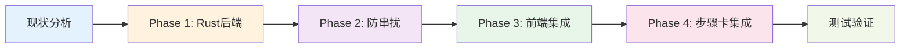

# 智能分析后端集成 - 实施路线图

> 📅 创建时间: 2025-10-15  
> 🎯 目标: 完成 Tauri 后端集成、防串扰机制、步骤卡自动回填  
> ⏱️ 预估工时: 3-5个工作日

---

## 📊 总览



---

## 📅 实施计划

### Week 1: 核心功能实现

| 日期 | 任务 | 负责人 | 预估工时 | 状态 |
|-----|------|--------|---------|------|
| **Day 1** | Phase 1: Rust 后端模块创建 | - | 4h | ⏳ 待开始 |
| **Day 2** | Phase 2: 防串扰机制 (后端+前端) | - | 6h | ⏳ 待开始 |
| **Day 3** | Phase 3: 前端集成真实命令 | - | 4h | ⏳ 待开始 |
| **Day 4** | Phase 4: 步骤卡自动回填 | - | 6h | ⏳ 待开始 |
| **Day 5** | 端到端测试和Bug修复 | - | 8h | ⏳ 待开始 |

### Week 2: 优化和完善

| 日期 | 任务 | 负责人 | 预估工时 | 状态 |
|-----|------|--------|---------|------|
| **Day 6-7** | 接入真实策略生成服务 | - | 12h | ⏳ 待开始 |
| **Day 8** | 错误处理优化 | - | 4h | ⏳ 待开始 |
| **Day 9** | 性能优化和缓存 | - | 4h | ⏳ 待开始 |
| **Day 10** | 文档完善和Code Review | - | 4h | ⏳ 待开始 |

---

## 🎯 Phase 详细任务拆解

### Phase 1: Rust 后端实现 (Day 1 - 4h)

#### 任务清单

- [ ] **Task 1.1**: 创建 `intelligent_analysis.rs` 模块 (30min)
  - 定义类型: `ElementSelectionContext`, `AnalysisJobConfig`, `AnalysisResult`
  - 定义事件载荷: `AnalysisProgressEvent`, `AnalysisDoneEvent`, `AnalysisErrorEvent`

- [ ] **Task 1.2**: 实现 `selection_hash` 计算逻辑 (1h)
  - `calculate_selection_hash()` - 与前端逻辑保持一致
  - `calculate_text_hash()` - SHA1 哈希
  - `normalize_attribute_value()` - 属性标准化
  - 单元测试验证

- [ ] **Task 1.3**: 实现分析服务 `IntelligentAnalysisService` (1.5h)
  - `start_analysis()` - 启动分析任务
  - `cancel_analysis()` - 取消任务
  - `execute_analysis_workflow()` - 执行分析流程
  - `emit_progress()` - 发送进度事件

- [ ] **Task 1.4**: 实现 Tauri 命令 (30min)
  - `start_intelligent_analysis`
  - `cancel_intelligent_analysis`
  - `bind_analysis_result_to_step`

- [ ] **Task 1.5**: 注册命令和依赖 (30min)
  - 更新 `mod.rs`
  - 更新 `main.rs`
  - 更新 `Cargo.toml`

#### 验收标准

- ✅ 编译通过无警告
- ✅ 可以通过浏览器控制台调用命令
- ✅ 可以接收到 `analysis:progress` 事件
- ✅ 可以接收到 `analysis:done` 事件
- ✅ selection_hash 计算与前端一致

---

### Phase 2: 防串扰机制 (Day 2 - 6h)

#### 任务清单

- [ ] **Task 2.1**: 后端事件携带 `selection_hash` (1h)
  - 所有事件添加 `selection_hash` 字段
  - 结果中包含 `selection_hash` 和 `step_id`

- [ ] **Task 2.2**: 前端三重校验逻辑 (2h)
  - 实现 `jobId` 校验
  - 实现 `selectionHash` 校验
  - 实现 `stepId` 校验 (可选)

- [ ] **Task 2.3**: 元素切换自动取消 (1.5h)
  - 监听 `elementContext` 变化
  - 检测 `selectionHash` 变化
  - 自动调用 `cancel_intelligent_analysis`

- [ ] **Task 2.4**: 单元测试 (1.5h)
  - 测试 jobId 不匹配场景
  - 测试 selectionHash 不匹配场景
  - 测试 stepId 不匹配场景
  - 测试元素切换取消场景

#### 验收标准

- ✅ 切换元素时旧任务自动取消
- ✅ 旧任务的结果不会影响新元素
- ✅ jobId 不匹配时忽略事件
- ✅ selectionHash 不匹配时忽略事件
- ✅ console.log 中可以看到防串扰日志

---

### Phase 3: 前端集成真实命令 (Day 3 - 4h)

#### 任务清单

- [ ] **Task 3.1**: 替换 `handleStartAnalysis` 模拟逻辑 (1h)
  - 使用 `invoke('start_intelligent_analysis')`
  - 构建 `AnalysisJobConfig`
  - 处理错误和异常

- [ ] **Task 3.2**: 实现事件监听器 (1.5h)
  - 监听 `analysis:progress`
  - 监听 `analysis:done`
  - 监听 `analysis:error`
  - 清理监听器 (cleanup)

- [ ] **Task 3.3**: 实现取消分析 (30min)
  - `handleCancelAnalysis` 调用后端命令
  - 更新本地状态

- [ ] **Task 3.4**: UI 状态同步 (1h)
  - 进度条更新
  - 状态切换 (idle → analyzing → analyzed/failed)
  - 错误提示显示

#### 验收标准

- ✅ 点击"智能分析"按钮启动后端分析
- ✅ 实时显示分析进度 (0% → 100%)
- ✅ 分析完成后显示结果
- ✅ 分析失败时显示错误信息
- ✅ 取消按钮可以正常工作

---

### Phase 4: 步骤卡自动回填 (Day 4 - 6h)

#### 任务清单

- [ ] **Task 4.1**: 创建 `use-analysis-auto-fill.ts` Hook (2h)
  - `autoFillResult()` - 自动回填逻辑
  - `undoFill()` - 撤销回填
  - 用户确认对话框
  - 错误处理

- [ ] **Task 4.2**: 实现 `bind_analysis_result_to_step` 后端逻辑 (1.5h)
  - 保存分析结果到步骤卡数据
  - 更新步骤卡状态字段
  - 返回更新后的步骤卡

- [ ] **Task 4.3**: 集成到 `IntelligentAnalysisController` (1h)
  - 在 `analysis:done` 事件中调用 `autoFillResult`
  - 显示确认对话框
  - 更新 UI 状态

- [ ] **Task 4.4**: 实现撤销功能 (1h)
  - 撤销按钮 UI
  - 调用 `undoFill()`
  - 恢复原始状态

- [ ] **Task 4.5**: 单元测试 (30min)
  - 测试自动回填流程
  - 测试用户拒绝确认
  - 测试撤销功能

#### 验收标准

- ✅ 分析完成后弹出确认对话框
- ✅ 用户确认后步骤卡自动更新
- ✅ 步骤卡显示推荐策略和 XPath
- ✅ 可以撤销回填操作
- ✅ 错误情况下有友好提示

---

### Phase 5: 端到端测试 (Day 5 - 8h)

#### 测试场景

##### 场景1: 正常流程 ✅
1. 选择元素 → 2. 点击智能分析 → 3. 查看进度 → 4. 分析完成 → 5. 确认回填 → 6. 步骤卡更新

##### 场景2: 取消分析 ✅
1. 选择元素 → 2. 点击智能分析 → 3. 点击取消 → 4. 验证任务已停止

##### 场景3: 元素切换防串扰 ✅
1. 选择元素A → 2. 启动分析 → 3. 切换到元素B → 4. 元素A的结果被忽略

##### 场景4: 分析失败处理 ✅
1. 选择无效元素 → 2. 启动分析 → 3. 分析失败 → 4. 显示错误信息

##### 场景5: 多步骤卡并发 ✅
1. 步骤卡A启动分析 → 2. 步骤卡B启动分析 → 3. 验证结果不会串扰

#### Bug修复清单

- [ ] Bug #1: selection_hash 前后端不一致
- [ ] Bug #2: 事件监听器未正确清理
- [ ] Bug #3: 进度更新卡顿
- [ ] Bug #4: 错误提示不明确
- [ ] Bug #5: 取消后状态未重置

---

## 📈 进度跟踪

### 完成度统计

| Phase | 任务数 | 已完成 | 进行中 | 待开始 | 完成率 |
|-------|--------|--------|--------|--------|--------|
| **Phase 1** | 5 | 0 | 0 | 5 | 0% |
| **Phase 2** | 4 | 0 | 0 | 4 | 0% |
| **Phase 3** | 4 | 0 | 0 | 4 | 0% |
| **Phase 4** | 5 | 0 | 0 | 5 | 0% |
| **Phase 5** | 5 | 0 | 0 | 5 | 0% |
| **总计** | **23** | **0** | **0** | **23** | **0%** |

### 每日进度更新

#### Day 1 (预计 2025-10-16)
- [ ] 任务完成情况
- [ ] 遇到的问题
- [ ] 明天计划

#### Day 2 (预计 2025-10-17)
- [ ] 任务完成情况
- [ ] 遇到的问题
- [ ] 明天计划

---

## 🎯 里程碑

### Milestone 1: 后端基础完成 (Day 1 结束)
- ✅ Rust 模块创建完成
- ✅ 命令注册成功
- ✅ 事件系统运行正常
- ✅ selection_hash 计算正确

### Milestone 2: 防串扰机制完成 (Day 2 结束)
- ✅ 三重校验实现
- ✅ 元素切换自动取消
- ✅ 单元测试通过

### Milestone 3: 前端集成完成 (Day 3 结束)
- ✅ 模拟逻辑替换完成
- ✅ 事件监听正常
- ✅ UI 状态同步正确

### Milestone 4: 步骤卡集成完成 (Day 4 结束)
- ✅ 自动回填功能实现
- ✅ 用户确认流程完成
- ✅ 撤销功能正常

### Milestone 5: 测试验证完成 (Day 5 结束)
- ✅ 所有测试场景通过
- ✅ Bug 全部修复
- ✅ 准备上线

---

## 📚 资源链接

### 实施文档
- 📘 [Tauri后端集成实施指南](./Tauri后端集成实施指南.md) - **完整代码和详细说明**
- 📗 [快速启动指南](./快速启动指南.md) - **30分钟快速上手**
- 📙 [组件架构说明](./组件架构说明.md) - 架构设计原则

### 参考文档
- 📄 [完整性与冗余验证报告](./完整性与冗余验证报告.md) - 当前实现状态
- 📄 [组件重构总结报告](./组件重构总结报告.md) - 重构历史
- 📄 [点选元素气泡3整理](./点选元素气泡3整理.md) - 原始需求

### 技术资料
- 🔗 [Tauri Command 文档](https://tauri.app/v1/guides/features/command)
- 🔗 [Tauri Event 文档](https://tauri.app/v1/guides/features/events)
- 🔗 [Rust Serde 文档](https://serde.rs/)

---

## 🤝 协作流程

### 代码提交规范

```bash
# 格式: <type>(<scope>): <subject>

# 示例
feat(backend): implement start_intelligent_analysis command
fix(frontend): fix selection_hash validation logic
docs(guide): update implementation guide
test(e2e): add anti-interference test cases
```

### 代码审查检查清单

- [ ] TypeScript 类型完整
- [ ] Rust 编译无警告
- [ ] 单元测试通过
- [ ] 错误处理完善
- [ ] 日志输出清晰
- [ ] 文档注释完整
- [ ] 性能影响可接受

---

## 🎉 成功标准

### 功能验收

- ✅ **启动分析**: 点击按钮可以成功启动后端分析
- ✅ **进度显示**: 实时显示分析进度 0% → 100%
- ✅ **结果展示**: 分析完成后显示策略候选列表
- ✅ **防串扰**: 元素切换时旧结果不会影响新元素
- ✅ **自动回填**: 分析完成后自动更新步骤卡
- ✅ **撤销功能**: 可以撤销回填操作
- ✅ **错误处理**: 分析失败时有友好提示

### 性能标准

- ⚡ 分析启动响应 < 100ms
- ⚡ 进度更新延迟 < 50ms
- ⚡ 结果返回延迟 < 200ms
- ⚡ 内存占用增长 < 50MB
- ⚡ CPU 占用峰值 < 30%

### 质量标准

- 📊 测试覆盖率 > 80%
- 🐛 已知 Bug 数量 = 0
- 📝 文档完整度 = 100%
- 🎨 代码规范遵循率 = 100%

---

**准备好开始这个旅程了吗? 🚀 让我们一起完成这个里程碑!**

---

## 📝 更新日志

| 日期 | 更新内容 | 更新人 |
|-----|---------|--------|
| 2025-10-15 | 创建初始路线图 | - |
| | | |
| | | |
