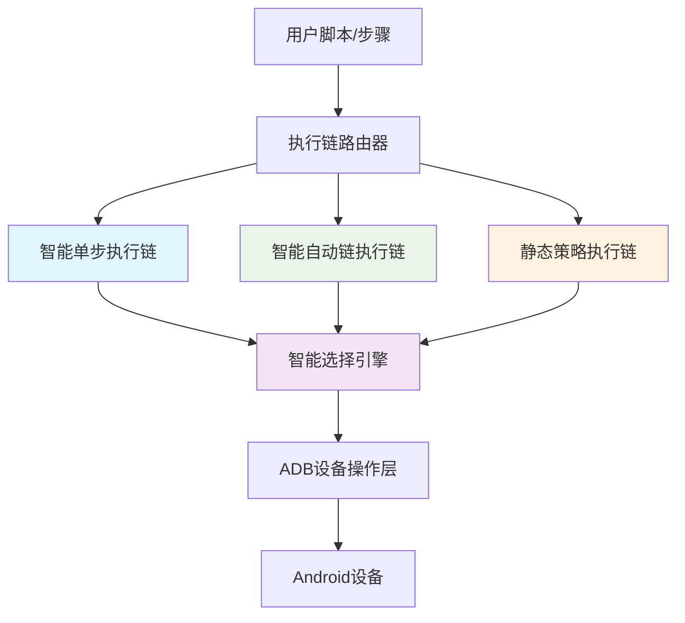
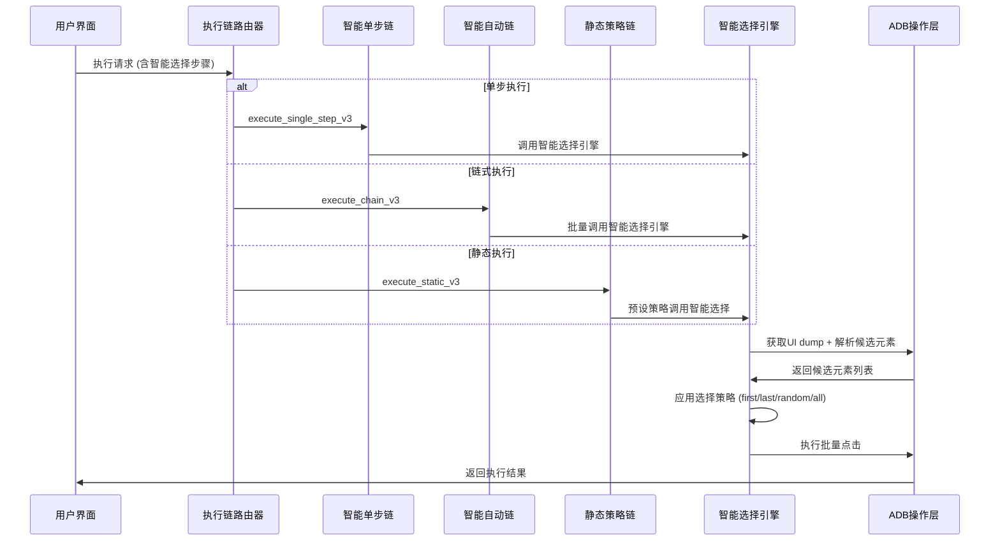

# 🔗 三条执行链与智能选择联动架构详解

## 🎯 执行链架构概述

本项目构建了一个**三层式执行架构**，每层都支持智能选择功能，形成了完整的自动化执行生态：



## 🚀 三条执行链详解

### 1️⃣ 智能单步执行链 (`execute_single_step_test_v3`)

**特点**: 步进式执行，精确控制
**适用场景**: 调试、验证、精确操作

```rust
// 命令入口
#[tauri::command]
pub async fn execute_single_step_test_v3(
    step: SingleStepSpecV3,
) -> Result<Value, String>

// 支持的动作类型
enum SingleStepAction {
    Tap,
    SmartTap,
    SmartFindElement,
    // ⚠️ TODO: 需要添加 SmartSelection
}
```

**与智能选择的联动**:
```typescript
// 前端调用示例
const singleStepResult = await invoke('execute_single_step_test_v3', {
  envelope: { deviceId: 'device1' },
  step: {
    stepId: 'step-1',
    action: 'SmartSelection',  // 🔥 新增智能选择动作
    params: {
      smartSelection: {
        mode: 'first',
        targetText: '关注',
        minConfidence: 0.8
      }
    }
  }
});
```

### 2️⃣ 智能自动链执行链 (`execute_chain_test_v3`)

**特点**: 全自动批量执行，智能短路
**适用场景**: 完整流程自动化、批量操作

```rust
// 命令入口
#[tauri::command]
pub async fn execute_chain_test_v3(
    spec: ChainSpecV3,
) -> Result<Value, String>

// 链式执行规格
enum ChainSpecV3 {
    ByRef { analysis_id, threshold, mode },  // 从缓存读取
    ByInline { ordered_steps, threshold },   // 内联步骤
}
```

**与智能选择的联动**:
```typescript
// 批量关注场景
const chainResult = await invoke('execute_chain_test_v3', {
  envelope: { deviceId: 'device1' },
  spec: {
    orderedSteps: [
      // 步骤1: 智能选择所有关注按钮
      {
        stepId: 'batch-follow',
        action: 'SmartSelection',
        params: {
          smartSelection: {
            mode: 'all',           // 选择所有匹配元素
            targetText: '关注',
            batchConfig: {
              intervalMs: 2000,    // 批量执行间隔
              maxCount: 10,        // 最多关注10个
              continueOnError: true
            }
          }
        }
      }
    ]
  }
});
```

### 3️⃣ 静态策略执行链 (`execute_static_strategy_test_v3`)

**特点**: 基于预定义规则的快速执行
**适用场景**: 高频固定操作、性能要求高的场景

```rust
// 命令入口
#[tauri::command]
pub async fn execute_static_strategy_test_v3(
    spec: StaticSpecV3,
) -> Result<Value, String>

// 静态策略规格
enum StaticSpecV3 {
    ByRef { script_id, static_step_id },
    ByInline { strategy_actions },
}
```

**与智能选择的联动**:
```typescript
// 预定义智能选择策略
const staticResult = await invoke('execute_static_strategy_test_v3', {
  envelope: { deviceId: 'device1' },
  spec: {
    strategyActions: [
      {
        type: 'SmartSelection',
        preset: 'xiaohongshu-batch-follow',  // 预定义小红书关注策略
        params: {
          mode: 'first-three',              // 预定义选择模式
          safeguards: {
            maxPerSession: 20,              // 每次最多关注20个
            cooldownMs: 5000               // 冷却时间
          }
        }
      }
    ]
  }
});
```

## 🧠 智能选择引擎集成点

### 核心架构
```rust
// 智能选择引擎 - 被三条执行链共享
pub struct SmartSelectionEngine {
    // 候选元素解析与匹配
    parse_xml_and_find_candidates(),
    
    // 四种选择策略实现
    execute_match_original_strategy(),  // 精确指纹匹配
    execute_positional_strategy(),      // 位置选择 (first/last)
    execute_random_strategy(),          // 随机选择
    execute_batch_strategy(),           // 批量操作
}
```

### 集成模式

#### 1. 作为SingleStepAction集成
```rust
// ❗ 当前缺失，需要添加
enum SingleStepAction {
    // ... 现有动作
    SmartSelection,  // 🔥 新增智能选择动作
}
```

#### 2. 作为独立Tauri命令调用
```typescript
// 现有方式：直接调用智能选择命令
const result = await invoke('execute_smart_selection', {
  deviceId,
  protocol: smartSelectionProtocol
});
```

#### 3. 通过执行链间接调用
```typescript
// 推荐方式：通过执行链统一调用
const result = await invoke('execute_single_step_test_v3', {
  envelope: { deviceId },
  step: {
    action: 'SmartSelection',
    params: { smartSelection: protocol }
  }
});
```

## 🔀 联动流程图



## 📊 使用场景对比

| 执行链 | 智能选择使用方式 | 适用场景 | 性能特点 |
|--------|----------------|----------|----------|
| **智能单步** | 精确控制单次智能选择 | 调试验证、精确操作 | 慢但准确 |
| **智能自动链** | 批量智能选择 + 流程自动化 | 完整工作流程 | 平衡效率与准确性 |
| **静态策略** | 预定义智能选择模板 | 高频重复操作 | 快速但固定 |

## 🛠️ 当前架构缺口与改进建议

### ❌ 当前问题

1. **类型定义不一致**
   ```rust
   // 缺失：SingleStepAction 中没有 SmartSelection
   enum SingleStepAction {
       // ... 其他动作
       // ❌ SmartSelection, // 需要添加
   }
   ```

2. **调用路径分裂**
   - 直接调用：`invoke('execute_smart_selection')`  
   - 间接调用：`invoke('execute_single_step_v3')` (不支持SmartSelection动作)

3. **参数格式差异**
   - 智能选择协议：`SmartSelectionProtocol`
   - 步骤参数：`StepAction.params.smartSelection`

### ✅ 改进方案

#### 1. 统一类型定义
```rust
// src-tauri/src/exec/v3/types.rs
enum SingleStepAction {
    // ... 现有动作
    SmartSelection,  // 🆕 添加智能选择动作
}

enum StaticAction {
    // ... 现有动作  
    SmartSelection,  // 🆕 静态策略也支持智能选择
}
```

#### 2. 统一参数格式
```typescript
// 前端类型统一
interface StepAction {
  kind: 'smart_selection';
  params: {
    smartSelection: SmartSelectionProtocol;  // 复用现有协议
  };
}
```

#### 3. 执行链集成
```rust
// 在各执行链中添加智能选择处理
match action {
    SingleStepAction::SmartSelection => {
        let protocol = extract_smart_selection_protocol(params)?;
        let result = smart_selection_engine.execute(device_id, protocol).await?;
        Ok(result)
    }
    // ... 其他动作
}
```

## 🎯 最终联动效果

### 用户体验
```typescript
// 🚀 统一的调用方式
const singleStepResult = await executeSingleStep({
  action: 'SmartSelection',
  params: { mode: 'first', targetText: '关注' }
});

const chainResult = await executeChain({
  steps: [
    { action: 'SmartSelection', params: { mode: 'all', targetText: '关注' }},
    { action: 'Wait', params: { waitMs: 2000 }},
    { action: 'SmartSelection', params: { mode: 'first', targetText: '点赞' }}
  ]
});

const staticResult = await executeStatic({
  preset: 'xiaohongshu-engagement-boost',  // 预定义策略
  params: { intensity: 'moderate' }
});
```

### 开发体验
- ✅ **类型安全**: 统一的TypeScript类型定义
- ✅ **代码复用**: 智能选择引擎被三条链共享
- ✅ **灵活配置**: 支持内联参数和预设策略
- ✅ **统一监控**: 所有执行链共享事件系统

---

## 🚀 总结

**三条执行链 + 智能选择 = 完整自动化生态系统**

- **智能单步链**: 为智能选择提供精确控制能力
- **智能自动链**: 为智能选择提供批量流程化能力  
- **静态策略链**: 为智能选择提供高性能模板化能力
- **智能选择引擎**: 为三条链提供统一的多元素智能匹配能力

这种架构设计实现了**"一个引擎，三种调用方式"**的优雅模式，既保证了代码复用，又满足了不同场景的性能和控制需求！ 🎊