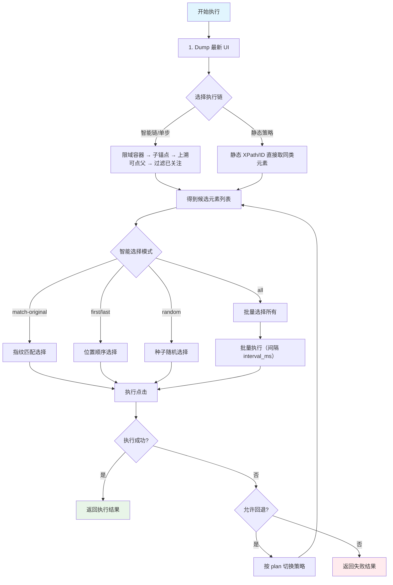

# 三条执行链与智能选择联动 - 核心落地方案

## 🎯 核心原则（一句话）

**执行链负责"把同类候选找出来"，智能选择负责"在候选里选谁/选几个并怎么点"。**

---

## 📊 三条执行链：怎么"找候选"

### 🔗 智能自动链
- **机制**：真机每步重 dump → 先限域到容器（如底部导航/列表）→ 用"子锚点（文本/图标）→ 上溯可点父"找出同类元素
- **特点**：唯一性/轻校验 + 回退链（id → 容器+文本 → 邻居 → 局部索引）
- **适用**：完整工作流程，批量操作

### 🧪 智能单步
- **机制**：和"自动链"的候选生成一致，但只执行当前一步
- **特点**：便于调试/单次执行，精确控制
- **适用**：开发调试，验证逻辑

### ⚡ 静态策略
- **机制**：用绝对 XPath / 静态 resource-id / class 等**直接**取同类候选
- **特点**：不做复杂语义推理，可选轻校验，高性能
- **适用**：高频重复操作，性能敏感场景

---

## 🎯 智能选择：在候选里"怎么选/怎么点"

| 模式 | 说明 | 适用场景 |
|-----|------|----------|
| **match-original** | 用指纹（文本/结构/位置/属性权重）把"当时选的那个"从同类里找回 | 精确复现操作 |
| **first / last** | 按稳定顺序（视觉 y→x 或 DOM 顺序）取第一个/最后一个 | 位置相对稳定的操作 |
| **random** | 按 seed 可复现地随机取 1 个 | 模拟人工随机行为 |
| **all** | 一次 dump，按配置的 `interval_ms` 逐个点击所有候选 | 批量操作 |

---

## 🎮 推荐搭配（3×4 联动心智图）

| 执行链 \ 选择模式 | match-original<br/>（复现同一元素） | first / last<br/>（位置语义） | random<br/>（可复现采样） | all<br/>（批量） |
| -------------- | ------------------------- | ----------------------- | ------------------ | -------------- |
| **智能自动链** | **⭐ 默认**<br/>最稳（指纹+容器限域+回退） | 🔥 常用<br/>（导航/列表首末） | ✅ 支持 | **🚀 强烈推荐**<br/>（一次 dump 批量） |
| **智能单步** | ⚠️ 有指纹时用<br/>否则用 first | **⭐ 默认**<br/>（调试/一次性） | ✅ 支持 | ✅ 支持 |
| **静态策略** | ⚠️ 有指纹才建议<br/>否则别用 | **⭐ 默认**<br/>（最简单直跑） | ✅ 支持 | ✅ 支持（配轻校验） |

> **💡 结论**：**智能自动链 × match-original / all** 是主力；单步默认 **first**；静态策略默认 **first**，有指纹再开 **match-original**。

---

## 📝 步骤卡片配置字段（让"找候选 + 选谁"落地）

### 🔧 最小字段（跨三条链通用）
```typescript
{
  selection: { 
    mode: 'match-original' | 'first' | 'last' | 'random' | 'all',
    interval_ms?: number,  // 批量操作间隔
    seed?: number         // 随机种子
  },
  absolute_xpath: string,      // 兜底/回放
  xml_snapshot?: string,       // 前端离线分析/对账
  constraints: {
    allow_backend_fallback: boolean,
    min_confidence: number,
    time_budget_ms: number
  }
}
```

### 🧠 智能链/单步补充字段
```typescript
{
  container_xpath: string,           // 限域容器
  clickable_parent_xpath: string,    // 当时可点父
  fingerprint: {                     // 用于 match-original
    text_content: string,
    structural_hash: string,
    position_weight: number,
    attribute_signature: string
  },
  i18n_aliases: string[],           // "关注|+关注|Follow|Following…"
  light_assertions: {               // 点击前校验
    expected_text: string,          // 仍是"关注"
    must_be_clickable: boolean,     // 可点击
    exclude_states: string[]        // 排除"已关注"
  },
  plan?: {                          // 回退链
    fallback_strategies: string[]   // 按序小预算尝试
  }
}
```

---

## 🚀 真机执行统一流程（适用于三条链）



### 详细步骤说明

1. **📸 Dump**：获取最新 UI（智能链/单步必做；静态策略也建议做一次）

2. **🔍 找候选**（由执行链负责）：
   - **智能链/单步**：限域容器 → 子锚点（文本/图标）→ 上溯可点父 → 过滤"已关注"
   - **静态策略**：静态 XPath/ID 直接取同类元素（可加轻校验）

3. **🎯 智能选择**：按 `selection.mode` 取 1 个（或 N 个）

4. **⚡ 执行**：
   - **单个**：点击并轻校验
   - **all**：一次 dump 后按 `interval_ms` 逐个点击，每次快速校验，默认不重 dump

5. **🔄 回退**（若允许）：按 `plan` 顺序、小时间片快速切换策略

6. **📊 返回**：本次用到的链/模式、坐标、截图、耗时、每步匹配数与原因

---

## 🎯 "多个关注按钮"的具体表现

### 📋 候选生成（链负责）
在 `container_xpath` 内找到所有"子树含 关注/+关注/Follow"的可点父 → 得到 N 个候选（排除"已关注"）

### 🎯 选择执行（智能选择负责）
```typescript
// 场景示例
const scenarios = {
  // 复现那一个
  match_original: {
    mode: 'match-original',
    description: '靠指纹精确找回之前选中的那个按钮'
  },
  
  // 点第一个/最后一个  
  positional: {
    mode: 'first', // 或 'last'
    description: '按视觉顺序选择第一个或最后一个'
  },
  
  // 随机抽一个
  random_sampling: {
    mode: 'random',
    seed: 12345,
    description: '可复现的随机选择（同种子同结果）'
  },
  
  // 全部批量点击
  batch_all: {
    mode: 'all',
    interval_ms: 2000,
    description: '一次 dump 后批量点击所有关注按钮'
  }
};
```

---

## 💡 一句话记忆

> **链找集合，选择定对象**；默认用 **"智能自动链 × match-original / all"**；没指纹就用 **first/last**；批量就用 **all**，一次 dump 高效安全。

---

## 🎊 实施优先级

### 🔥 P0（立即实施）
- [x] 在 `SingleStepAction` 枚举中添加 `SmartSelection`
- [ ] 在智能单步执行器中添加 SmartSelection 处理逻辑
- [ ] 统一前后端参数格式（StepAction.params.smartSelection）

### ⚡ P1（本周完成）
- [ ] 智能自动链集成 SmartSelection 批量执行
- [ ] 静态策略链支持 SmartSelection 预设模板
- [ ] 完善错误处理和回退机制

### 🚀 P2（下个迭代）
- [ ] 性能优化：大量候选元素的处理
- [ ] 指纹匹配算法优化
- [ ] 跨应用适配扩展

这样的设计确保了**"一个智能选择引擎，三种调用方式"**的优雅架构，既保证代码复用，又满足不同场景需求！ ✨