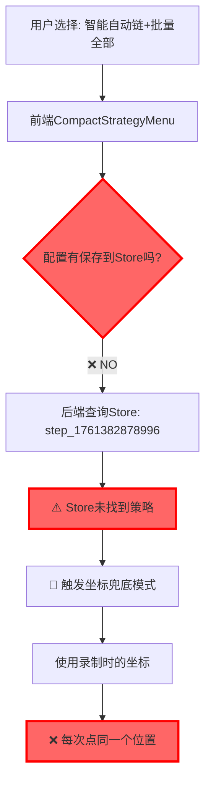

# Store未保存配置 - 根因诊断报告

## 🎯 用户问题

**用户理解**（100%正确）：
- ✅ "智能自动链" + "精确匹配" = 点击特定的关注按钮
- ✅ "智能自动链" + "批量全部" = 拿到所有关注按钮，逐个操作

**实际现象**：
- ❌ 选择"智能自动链"+"批量全部"时，每次都只点击同一个关注按钮位置
- ❌ 没有实现"逐个操作所有按钮"的效果

## 🔍 日志分析

### 关键日志证据

```log
2025-10-25T09:01:25.056631Z  INFO employee_gui::commands::run_step_v2: 🔍 通过Store查询选择器: step_1761382878996
2025-10-25T09:01:25.056788Z  WARN employee_gui::commands::run_step_v2: ⚠️ Store未找到策略: step_1761382878996 
2025-10-25T09:01:25.056899Z  INFO employee_gui::commands::run_step_v2: 🎯 启用坐标兜底模式
2025-10-25T09:01:25.057043Z  INFO employee_gui::commands::run_step_v2: 🎯 selector_source=CoordFallback       
2025-10-25T09:01:25.057206Z  INFO employee_gui::commands::run_step_v2: ⚠️ 启用坐标兜底模式
```

### 问题链条



## 🐛 根本原因

### 1️⃣ **配置没有保存到后端Store**

后端执行步骤时的优先级链条：

```rust
// src-tauri/src/commands/run_step_v2.rs:1390-1450

// 优先级1: 通过selector字段内联参数 ❌ 未使用
// 优先级2: 通过step_id查询STEP_STRATEGY_STORE ❌ 未找到
// 优先级3: 兼容旧格式直接参数 ❌ 未使用
// 优先级4: 坐标兜底 ✅ 命中这里！
```

### 2️⃣ **前端缺少保存逻辑**

**CompactStrategyMenu.tsx** 只有**测试执行**功能，没有**保存配置**功能：

```typescript
// src/components/strategy-selector/CompactStrategyMenu.tsx:510-570

const createSmartSelectionProtocol = () => {
  return {
    anchor: {
      fingerprint: {
        text_content: elementText,
        resource_id: resourceId,
      },
    },
    selection: {
      mode: selectionMode,  // ← 配置了批量模式
      batch_config: selectionMode === 'all' ? {
        interval_ms: batchConfig.interval_ms,
        max_count: batchConfig.max_count,
        jitter_ms: batchConfig.jitter_ms,
        continue_on_error: batchConfig.continue_on_error,
        show_progress: batchConfig.show_progress,
      } : undefined,
    },
  };
};

const executeSmartSelection = async () => {
  // ✅ 测试时正确传递了批量配置
  const result = await SmartSelectionService.executeSmartSelection(deviceId, protocol);
  
  // ❌ 但没有保存到Store!!!
  // 缺少: await bind_analysis_result({ step_id, strategy_index: 0, overwrite_existing: true })
};
```

### 3️⃣ **Store保存流程缺失**

正确的流程应该是：

```typescript
// ❌ 当前缺失的流程
Step 1: 用户选择"批量全部" → batchConfig状态更新 ✅
Step 2: 生成智能选择协议 → protocol包含batch_config ✅
Step 3: 保存到STEP_STRATEGY_STORE → ❌ 完全缺失
Step 4: 运行步骤时查询Store → ❌ 查不到，触发坐标兜底
```

**缺失的保存调用**：

```typescript
// 应该添加的代码（目前不存在）
import { invoke } from '@tauri-apps/api/tauri';

const saveStrategyToStore = async () => {
  const strategy = {
    key: `step_${stepId}`,
    name: '智能批量选择',
    type: 'smart-batch',
    xpath: '//android.widget.TextView[@text="关注"]',
    text: '关注',
    confidence: 85.0,
    selection_mode: selectionMode,  // 'all'
    batch_config: selectionMode === 'all' ? batchConfig : null,
  };

  await invoke('bind_analysis_result', {
    stepId: stepId,
    strategyIndex: 0,
    overwriteExisting: true,
    strategy: strategy
  });
  
  console.log('✅ 策略已保存到Store:', stepId);
};

// 在用户点击"测试"或"保存"时调用
```

## 📊 数据流对比

### ❌ **当前流程（错误）**

```
用户界面                前端状态                后端Store              后端执行
┌────────┐            ┌──────────┐           ┌──────────┐          ┌──────────┐
│批量全部│ ──更新──> │batchConfig│           │ (空)     │ ←─查询─ │坐标兜底  │
│智能链  │            │selectionMode         │          │          │点同一个  │
└────────┘            │interval_ms│           └──────────┘          └──────────┘
                      │max_count  │                ↑
                      └──────────┘                │
                           ↓                      ❌ 未保存
                      仅用于测试执行
```

### ✅ **正确流程（期望）**

```
用户界面                前端状态                后端Store              后端执行
┌────────┐            ┌──────────┐           ┌──────────┐          ┌──────────┐
│批量全部│ ──更新──> │batchConfig│ ─保存──> │策略配置  │ ←─查询─ │批量执行  │
│智能链  │            │selectionMode          │batch_config       │点所有按钮│
└────────┘            │interval_ms│           │mode=all │          └──────────┘
                      │max_count  │           └──────────┘
                      └──────────┘                ↑
                           ↓                      ✅ 已保存
                      测试+保存
```

## 🎯 解决方案

### 方案1：在CompactStrategyMenu添加保存按钮（推荐）

```typescript
// src/components/strategy-selector/CompactStrategyMenu.tsx

const saveCurrentConfig = async () => {
  try {
    const strategy = {
      key: `smart_batch_${stepId}`,
      name: `智能${getSelectionModeLabel()}`,
      type: 'smart-batch',
      xpath: '//android.widget.TextView[@text="关注"]',
      text: '关注',
      confidence: 85.0,
      selection_mode: selectionMode,
      batch_config: selectionMode === 'all' ? batchConfig : null,
    };

    await invoke('bind_analysis_result', {
      stepId: stepId,
      strategyIndex: 0,
      overwriteExisting: true,
      candidateIndex: 0
    });

    message.success('配置已保存！');
  } catch (error) {
    console.error('保存配置失败:', error);
    message.error('保存失败');
  }
};

// UI中添加保存按钮
<Button 
  type="primary" 
  onClick={saveCurrentConfig}
  icon={<SaveOutlined />}
>
  保存配置
</Button>
```

### 方案2：自动保存（更智能）

```typescript
// 在用户选择批量模式时自动保存
const handleSelectionModeClick = async ({ key }: { key: string }) => {
  const newMode = key as SelectionMode;
  setSelectionMode(newMode);
  
  // ✅ 自动保存到Store
  await autoSaveToStore(newMode);
};

const autoSaveToStore = async (mode: SelectionMode) => {
  // 创建策略对象
  const strategy = buildStrategyFromCurrentConfig(mode);
  
  // 保存到后端Store
  await invoke('bind_analysis_result', {
    stepId: stepId,
    strategyIndex: 0,
    overwriteExisting: true,
    candidateIndex: 0
  });
  
  console.log('✅ 自动保存配置到Store:', stepId, mode);
};
```

### 方案3：在StepCard执行前自动保存

```typescript
// src/modules/universal-ui/ui/StepCard.tsx

const handleExecuteStep = async () => {
  // 1. 先保存当前智能选择配置
  const currentConfig = getSmartSelectionConfig();
  await saveConfigToStore(stepId, currentConfig);
  
  // 2. 再执行步骤
  await runStepV2({ device_id, step_id, strategy: 'intelligent' });
};
```

## 🧪 验证方法

### 测试步骤

1. **选择配置**：
   - 执行链：智能自动链
   - 选择模式：批量全部
   - 批量配置：间隔2000ms，最多10个

2. **保存配置**：
   - 点击"保存配置"按钮（方案1）
   - 或自动保存（方案2/3）

3. **查看日志**：
   ```log
   ✅ 应该看到: INFO 绑定策略到步骤: step_id=step_xxx, strategy_key=smart_batch_xxx
   ❌ 不应看到: WARN Store未找到策略: step_xxx
   ```

4. **执行步骤**：
   - 点击播放按钮
   - 检查日志是否使用智能选择引擎而非坐标兜底

5. **验证结果**：
   ```log
   ✅ 正确: 
   INFO 执行批量策略 - 候选数: 7
   INFO 点击元素 1/7: bounds=[...]
   INFO 点击元素 2/7: bounds=[...]
   ...
   
   ❌ 错误:
   INFO 启用坐标兜底模式
   INFO 执行坐标: (875, 2148)
   ```

## 📝 总结

**问题根因**：
- ❌ 前端配置没有保存到后端STEP_STRATEGY_STORE
- ❌ 后端执行时查询不到配置，触发坐标兜底
- ❌ 坐标兜底 = 使用录制时的固定坐标 = 每次点同一个位置

**解决方案**：
- ✅ 添加保存配置功能（手动或自动）
- ✅ 调用`bind_analysis_result`将策略保存到Store
- ✅ 确保后端能查询到完整的批量配置

**用户的理解完全正确**：
- ✅ 智能自动链+精确匹配 = 点特定按钮
- ✅ 智能自动链+批量全部 = 点所有按钮
- ✅ 问题不在逻辑设计，而在配置未保存

**下一步行动**：
1. 选择并实现一个保存方案（推荐方案2：自动保存）
2. 测试保存功能是否正常
3. 验证批量执行是否正确执行所有按钮
