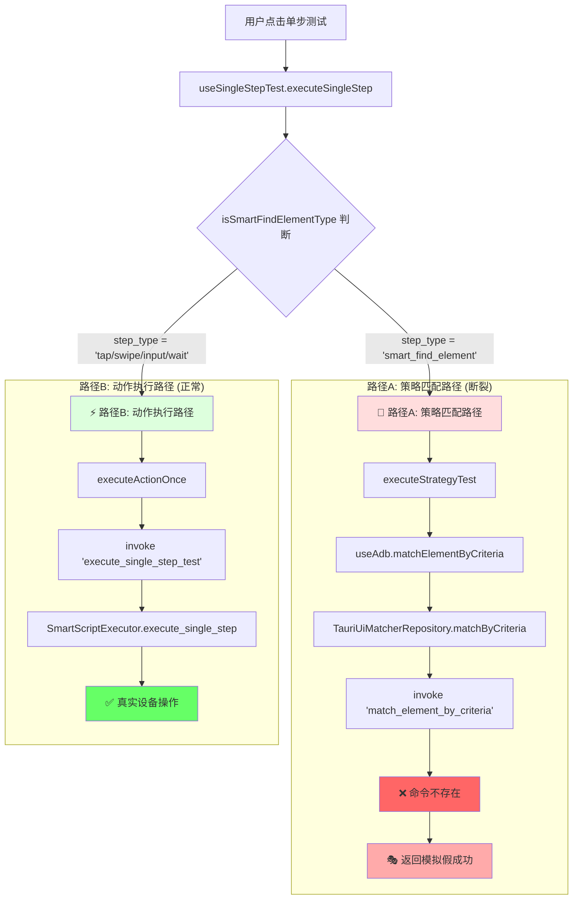
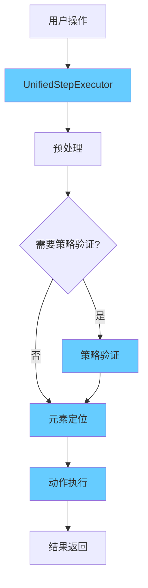

# 🔀 "双路径"架构问题详解

## 🎯 什么是"双路径"？

"双路径"指的是当前系统中存在两套完全独立、互不兼容的步骤执行路径，它们处理不同类型的操作，使用不同的代码逻辑，导致架构分裂。

## 📊 双路径架构图



## 🔍 双路径的具体表现

### 1. **路径判断代码**

在 `useSingleStepTest.ts` 中有一个关键的判断：

```typescript
// src/hooks/useSingleStepTest.ts 第67行
const runOnce = async (): Promise<SingleStepTestResult> => {
  // 🔀 这里是双路径分叉点
  if (isSmartFindElementType(step.step_type)) {
    // 路径A: 策略匹配路径
    console.log('🎯 使用策略匹配模式测试元素查找（单次）');
    const strategyResult = await executeStrategyTest(step, deviceId);
    // ↑ 这个路径得到的是假结果
  } else {
    // 路径B: 动作执行路径  
    return executeActionOnce(step, deviceId);
    // ↑ 这个路径执行真实操作
  }
};
```

### 2. **判断函数**

```typescript
// src/modules/script-builder/utils/smartComponents.ts
function isSmartFindElementType(stepType: string): boolean {
  return stepType === "smart_find_element";
}
```

**这意味着**：
- 如果步骤类型是 `"smart_find_element"` → 走路径A（假的）
- 如果步骤类型是 `"tap"`, `"swipe"`, `"input"`, `"wait"` → 走路径B（真的）

## 🛤️ 路径A：策略匹配路径（断裂的）

### 执行流程
```
用户操作
↓
executeStrategyTest(step, deviceId)
↓  
useAdb().matchElementByCriteria(deviceId, criteria)
↓
TauriUiMatcherRepository.matchByCriteria()
↓
invoke('match_element_by_criteria', { deviceId, criteria })
↓
💥 命令不存在（被注释了）
↓
🎭 返回硬编码的假成功
```

### 具体代码示例

#### 前端调用
```typescript
// src/hooks/useSingleStepTest.ts
if (isSmartFindElementType(step.step_type)) {
  // 走策略匹配路径
  const strategyResult = await executeStrategyTest(step, deviceId);
  // strategyResult.success 总是 true，但是假的
}
```

#### 策略测试函数
```typescript
// src/modules/enhanced-matching/utils/strategyTest.ts
export async function executeStrategyTest(
  step: SmartScriptStep, 
  deviceId: string
): Promise<StrategyTestResult> {
  // 构建策略条件
  const criteria = buildCriteriaFromStep(step);
  
  // 调用策略匹配
  const { matchElementByCriteria } = useAdb();
  const matchResult = await matchElementByCriteria(deviceId, criteria);
  
  // 返回结果（但这个结果是假的）
  return {
    success: matchResult.ok,
    output: matchResult.message,
    matchResult: matchResult,
    criteria: criteria
  };
}
```

#### 虚假的匹配结果
```typescript
// src/infrastructure/repositories/TauriUiMatcherRepository.ts
async matchByCriteria(deviceId: string, criteria: MatchCriteriaDTO): Promise<MatchResult> {
  try {
    // 尝试调用不存在的命令
    const result = await invoke('match_element_by_criteria', { deviceId, criteria });
    return result;
  } catch (error) {
    // 💥 必然走到这里，因为命令被注释了
    
    // 🎭 返回硬编码的假成功
    if (criteria.strategy === 'hidden-element-parent') {
      return {
        ok: true,
        message: '✅ 隐藏元素父查找策略测试成功（模拟结果）',
        preview: {
          text: '模拟隐藏元素父容器',
          bounds: '[100,200][500,400]'  // 完全编造的坐标！
        }
      };
    }
    
    // 其他策略也返回假成功
    return {
      ok: true,
      message: '✅ 策略测试成功（模拟结果）',
      preview: { text: '模拟元素', bounds: '[0,0][100,100]' }
    };
  }
}
```

#### 被注释的命令
```rust
// src-tauri/src/main.rs 第281行
.invoke_handler(tauri::generate_handler![
    // ... 其他命令
    // match_element_by_criteria, // ❌ 关键命令被注释！
    execute_single_step_test,      // ✅ 这个命令存在
    // ...
])
```

## 🛤️ 路径B：动作执行路径（正常的）

### 执行流程
```
用户操作
↓
executeActionOnce(step, deviceId)
↓
invoke('execute_single_step_test', { deviceId, step })
↓
SmartScriptExecutor.execute_single_step()
↓
匹配动作类型 (TAP/SWIPE/INPUT/WAIT)
↓
✅ 真实的 ADB 命令执行
↓
设备上产生实际效果
```

### 具体代码示例

#### 前端调用
```typescript
// src/hooks/useSingleStepTest.ts
else {
  // 非 SmartFindElement → 执行动作
  return executeActionOnce(step, deviceId);
  // 这个会真正执行
}
```

#### 动作执行函数
```typescript
// src/hooks/useSingleStepTest.ts
const executeActionOnce = async (step: SmartScriptStep, deviceId: string): Promise<SingleStepTestResult> => {
  // 调用真实的后端命令
  const result = await invoke('execute_single_step_test', {
    deviceId,
    step
  });
  // result 是真实的执行结果
  return result;
};
```

#### 后端真实执行
```rust
// src-tauri/src/commands/mod.rs
#[tauri::command]
pub async fn execute_single_step_test(
    device_id: String,
    step: SmartScriptStep,
) -> Result<SingleStepTestResult, String> {
    // 创建真实的执行器
    let executor = SmartScriptExecutor::new(device_id);
    
    // 真实执行步骤
    let result = executor.execute_single_step(&step).await?;
    
    // 返回真实结果
    Ok(convert_to_test_result(result))
}
```

#### 真实的动作执行
```rust
// src-tauri/src/services/smart_script_executor_impl.rs
let result = match step.step_type {
    SmartActionType::Tap => self.execute_basic_tap(step).await,        // 真实点击
    SmartActionType::Swipe => self.execute_basic_swipe(step).await,    // 真实滑动
    SmartActionType::Input => self.execute_basic_input(step).await,    // 真实输入
    SmartActionType::Wait => self.execute_basic_wait(step).await,      // 真实等待
    _ => Err(anyhow::anyhow!("不支持的操作类型: {:?}", step.step_type)),
};
```

#### 真实的 ADB 命令
```rust
// 最终执行的真实 ADB 命令
adb -s [设备ID] shell input tap 200 300      // 点击
adb -s [设备ID] shell input swipe 500 800 500 200 1000  // 滑动
adb -s [设备ID] shell input text "Hello%sWorld"  // 输入
```

## 🤔 为什么会有双路径？

### 历史演进过程
```
1. 最初阶段：只有基础动作执行 (路径B)
   ↓
2. 添加策略匹配功能 (路径A)
   ↓  
3. 策略匹配命令被注释掉
   ↓
4. 现在：路径A断裂，路径B正常
```

### 设计意图 vs 现实
```
设计意图：
smart_find_element → 先用策略找到元素 → 再执行动作

现实情况：
smart_find_element → 假的策略匹配 → 返回虚假成功
其他动作 → 真实执行 → 产生实际效果
```

## 📊 双路径对比表

| 维度 | 路径A (策略匹配) | 路径B (动作执行) |
|------|-----------------|-----------------|
| **触发条件** | `step_type === 'smart_find_element'` | `step_type === 'tap/swipe/input/wait'` |
| **前端入口** | `executeStrategyTest()` | `executeActionOnce()` |
| **后端命令** | `match_element_by_criteria` ❌ | `execute_single_step_test` ✅ |
| **命令状态** | 被注释，不存在 | 正常工作 |
| **执行结果** | 虚假的模拟成功 | 真实的设备操作 |
| **用户体验** | 看起来成功，实际无效 | 真正的功能执行 |
| **配置传递** | 策略配置被忽略 | 动作参数完整传递 |
| **错误处理** | 隐藏真实错误 | 真实错误反馈 |

## 🔧 双路径的问题

### 1. **用户体验欺骗**
```
用户看到：✅ 隐藏元素父查找策略测试成功
实际情况：🎭 完全是假的，没有任何真实操作
```

### 2. **功能分裂**
```
策略测试：虚假成功
批量执行：策略配置被忽略，简化处理
```

### 3. **维护负担**
```
开发者需要维护两套完全不同的代码逻辑
bug 修复需要在两个路径中分别处理
```

### 4. **配置传递断裂**
```
前端生成复杂策略配置 → 无法传递到后端 → 配置被浪费
```

## ✅ 统一路径的目标

统一后应该是这样的：



**统一后的特点**：
- ✅ 单一执行路径
- ✅ 策略验证真实有效
- ✅ 配置完整传递
- ✅ 一致的错误处理
- ✅ 透明的执行过程

这就是为什么我们需要统一架构来解决双路径分裂问题。