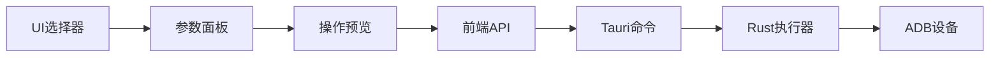

# 操作类型系统 (Action System)

## 概述

操作类型系统是一个完整的前后端集成解决方案，用于管理和执行各种设备操作类型。系统默认使用**点击**操作，支持智能推荐和参数化配置。

## 核心功能

### 🎯 支持的操作类型

- **click** - 点击操作（默认）
- **long_press** - 长按操作
- **input** - 输入文字
- **swipe_up/down/left/right** - 滑动操作
- **scroll_up/down** - 滚动操作
- **wait** - 等待操作

### 🧠 智能推荐

基于UI元素特征自动推荐最适合的操作类型：

- **输入框** → 推荐 `input` 操作
- **按钮** → 推荐 `click` 操作
- **滚动容器** → 推荐 `scroll` 操作
- **列表项** → 推荐 `click` 操作

### 📱 完整执行链条



## 架构设计

### 后端架构 (Rust)

```
src-tauri/src/
├── types/action_types.rs           # 操作类型定义
├── services/action_executor.rs     # 操作执行器
├── services/action_recommender.rs  # 智能推荐器
├── commands/action_execution.rs    # Tauri命令接口
└── exec/v3/single_step.rs         # V3执行系统集成
```

### 前端架构 (TypeScript/React)

```
src/
├── types/action-types.ts                    # 前端类型定义
├── api/action-execution.ts                  # API封装层
├── hooks/
│   ├── useActionExecution.ts               # 执行Hook
│   └── useActionRecommendation.ts          # 推荐Hook
├── components/action-system/
│   ├── ActionSelector.tsx                  # 操作选择器
│   ├── ActionParamsPanel.tsx              # 参数配置面板
│   └── ActionPreview.tsx                   # 操作预览
├── components/enhanced-step-card/
│   └── EnhancedStepCard.tsx               # 增强步骤卡片
└── modules/action-system/
    └── index.ts                           # 统一导出
```

## 使用指南

### 基础使用

```tsx
import { useActionExecution, ActionSelector, ActionParamsPanel } from '@/modules/action-system';

function MyComponent() {
  const { execute, isExecuting, result } = useActionExecution({
    onSuccess: (result) => console.log('执行成功:', result),
    onError: (error) => console.error('执行失败:', error),
  });

  const [selectedAction, setSelectedAction] = useState({
    type: 'click',
    params: { x: 100, y: 200 }
  });

  const handleExecute = async () => {
    try {
      await execute(selectedAction);
    } catch (error) {
      console.error('操作执行失败:', error);
    }
  };

  return (
    <div>
      <ActionSelector 
        value={selectedAction.type}
        onChange={(type) => setSelectedAction(prev => ({ ...prev, type }))}
      />
      <ActionParamsPanel 
        actionType={selectedAction.type}
        params={selectedAction.params}
        onChange={(params) => setSelectedAction(prev => ({ ...prev, params }))}
      />
      <button onClick={handleExecute} disabled={isExecuting}>
        {isExecuting ? '执行中...' : '执行操作'}
      </button>
    </div>
  );
}
```

### 智能推荐使用

```tsx
import { useActionRecommendation } from '@/modules/action-system';

function SmartComponent() {
  const { 
    recommendedAction, 
    confidence, 
    reason, 
    recommend 
  } = useActionRecommendation();

  const handleRecommend = async () => {
    const xmlElement = '<TextView text="登录" clickable="true" />';
    await recommend(xmlElement);
  };

  return (
    <div>
      <button onClick={handleRecommend}>智能推荐</button>
      {recommendedAction && (
        <div>
          <p>推荐操作: {recommendedAction.type}</p>
          <p>置信度: {(confidence * 100).toFixed(1)}%</p>
          <p>理由: {reason}</p>
        </div>
      )}
    </div>
  );
}
```

### 快捷方法使用

```tsx
import { useActionExecution } from '@/modules/action-system';

function QuickActions() {
  const { click, input, swipe, wait } = useActionExecution();

  return (
    <div>
      <button onClick={() => click(100, 200)}>快速点击</button>
      <button onClick={() => input('Hello World')}>快速输入</button>
      <button onClick={() => swipe(100, 100, 200, 200)}>快速滑动</button>
      <button onClick={() => wait(1000)}>等待1秒</button>
    </div>
  );
}
```

## API 参考

### 操作类型定义

```typescript
interface ActionType {
  type: ActionTypeId;
  params: Record<string, any>;
}

type ActionTypeId = 
  | 'click' 
  | 'long_press' 
  | 'input' 
  | 'swipe_up' 
  | 'swipe_down' 
  | 'swipe_left' 
  | 'swipe_right' 
  | 'scroll_up' 
  | 'scroll_down' 
  | 'wait';
```

### 主要Hook

#### `useActionExecution(options?)`

执行操作的核心Hook。

**参数：**
- `onBeforeExecute?: (action: ActionType) => void` - 执行前回调
- `onSuccess?: (result: ActionExecutionResult) => void` - 成功回调
- `onError?: (error: Error) => void` - 失败回调
- `enableLogging?: boolean` - 是否启用日志（默认true）

**返回值：**
- `execute(action: ActionType)` - 执行操作
- `click(x, y)` - 快速点击
- `input(text, x?, y?)` - 快速输入
- `swipe(fromX, fromY, toX, toY, duration?)` - 快速滑动
- `wait(duration)` - 快速等待
- `isExecuting` - 是否正在执行
- `result` - 执行结果
- `error` - 错误信息

#### `useActionRecommendation(options?)`

智能推荐操作类型的Hook。

**参数：**
- `autoRecommend?: boolean` - 是否自动推荐（默认true）
- `onRecommended?: (recommendation) => void` - 推荐成功回调
- `onError?: (error: Error) => void` - 推荐失败回调

**返回值：**
- `recommend(xmlElement: string)` - 推荐操作
- `batchRecommend(xmlElements: string[])` - 批量推荐
- `recommendedAction` - 推荐的操作类型
- `confidence` - 推荐置信度
- `reason` - 推荐理由

### 主要组件

#### `<ActionSelector />`

操作类型选择器组件。

**属性：**
- `value: ActionTypeId` - 当前选中的操作类型
- `onChange: (type: ActionTypeId) => void` - 选择变化回调
- `disabled?: boolean` - 是否禁用
- `size?: 'small' | 'middle' | 'large'` - 组件尺寸

#### `<ActionParamsPanel />`

操作参数配置面板。

**属性：**
- `actionType: ActionTypeId` - 操作类型
- `params: Record<string, any>` - 当前参数
- `onChange: (params: Record<string, any>) => void` - 参数变化回调
- `disabled?: boolean` - 是否禁用

#### `<ActionPreview />`

操作预览组件。

**属性：**
- `action: ActionType` - 要预览的操作
- `showValidation?: boolean` - 是否显示验证结果
- `compact?: boolean` - 是否紧凑模式

## 配置说明

### 操作类型配置

每个操作类型都有对应的配置，定义在 `ACTION_CONFIGS` 中：

```typescript
const ACTION_CONFIGS = {
  click: {
    label: '点击',
    description: '在指定坐标点击一次',
    params: ['x', 'y'],
    icon: '👆',
    defaultParams: { x: 0, y: 0 }
  },
  // ... 其他配置
};
```

### 推荐规则

智能推荐基于以下规则：

1. **输入框检测**：`android.widget.EditText`、`input`、`search` → `input`
2. **按钮检测**：`android.widget.Button`、`clickable="true"` → `click`
3. **滚动容器检测**：`scrollable="true"`、`ListView` → `scroll`
4. **默认规则**：其他情况 → `click`

## 最佳实践

### 1. 错误处理

```typescript
const { execute } = useActionExecution({
  onError: (error) => {
    if (error.message.includes('设备未连接')) {
      message.error('请先连接设备');
    } else {
      message.error(`操作失败: ${error.message}`);
    }
  }
});
```

### 2. 参数验证

```typescript
import { validateActionParams } from '@/modules/action-system';

const action = { type: 'click', params: { x: 100, y: 200 } };
try {
  await validateActionParams(action);
  // 参数有效，继续执行
} catch (error) {
  console.error('参数无效:', error.message);
}
```

### 3. 批量操作

```typescript
const { batchRecommend } = useActionRecommendation();

const xmlElements = [
  '<Button text="登录" />',
  '<EditText hint="用户名" />',
  '<ScrollView scrollable="true" />'
];

const recommendations = await batchRecommend(xmlElements);
recommendations.forEach((rec, index) => {
  console.log(`元素 ${index}: 推荐 ${rec.action.type}, 置信度 ${rec.confidence}`);
});
```

### 4. 性能优化

- 使用 `React.memo` 包装组件减少重渲染
- 合理使用 `useCallback` 和 `useMemo` 优化Hook
- 避免在短时间内频繁调用推荐API

## 故障排除

### 常见问题

1. **执行失败**
   - 检查设备连接状态
   - 验证操作参数是否正确
   - 查看控制台错误日志

2. **推荐不准确**
   - 确保XML元素信息完整
   - 检查元素属性是否包含必要信息
   - 考虑手动指定操作类型

3. **性能问题**
   - 避免频繁调用推荐API
   - 使用批量推荐而非单个推荐
   - 合理设置缓存策略

### 调试技巧

```typescript
// 启用详细日志
const { execute } = useActionExecution({ enableLogging: true });

// 查看执行历史
const { history } = useActionExecution();
console.log('执行历史:', history);

// 检查推荐置信度
const { confidence, reason } = useActionRecommendation();
if (confidence < 0.6) {
  console.warn('推荐置信度较低:', reason);
}
```

## 更新日志

### v1.0.0 (当前版本)
- ✅ 完整的操作类型系统
- ✅ 智能推荐引擎
- ✅ 前后端完整集成
- ✅ 默认点击操作
- ✅ 参数化配置
- ✅ Hook和组件库

## 贡献指南

参考项目根目录的 `CONTRIBUTING.md` 和 `.github/copilot-instructions.md`。

## 许可证

MIT License