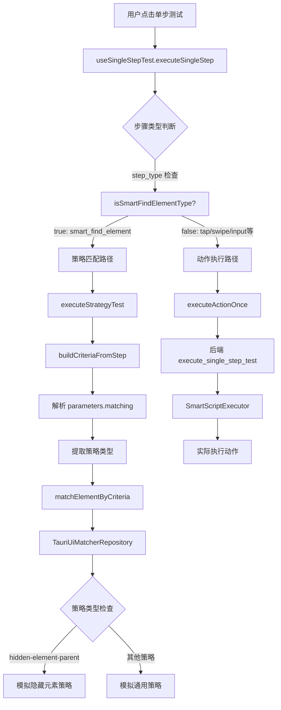

# 🎯 策略分辨和执行机制完整解析

## 📊 策略识别和分发流程



## 🔍 策略参数结构详解

### 1. 步骤数据结构

```typescript
interface SmartScriptStep {
  id: string;
  name: string;
  step_type: string;        // ← 第一层判断：决定执行路径
  parameters: {
    matching?: {            // ← 第二层解析：策略参数（仅智能查找步骤有）
      strategy: string;     // ← 第三层识别：具体策略类型
      fields: string[];
      values: Record<string, string>;
      includes?: Record<string, string[]>;
      excludes?: Record<string, string[]>;
      // 隐藏元素策略专用配置
      hiddenElementParentConfig?: {
        targetText: string;
        maxTraversalDepth: number;
        clickableIndicators: string[];
      };
    };
    // 其他动作参数（x, y, text等）
    x?: number;
    y?: number;
    text?: string;
  };
}
```

### 2. 策略类型映射表

| 策略名称 | 用途 | 特点 | 后端处理器 |
|---------|------|------|-----------|
| `standard` | 标准匹配 | 语义字段匹配，忽略位置 | StandardStrategyProcessor |
| `absolute` | 绝对定位 | 包含bounds精确匹配 | AbsoluteStrategyProcessor |
| `hidden-element-parent` | 隐藏元素父查找 | 查找隐藏元素的可点击父容器 | HiddenElementParentStrategyProcessor |
| `strict` | 严格匹配 | 多字段组合匹配 | StandardStrategyProcessor (复用) |
| `relaxed` | 宽松匹配 | 少字段模糊匹配 | StandardStrategyProcessor (复用) |
| `positionless` | 无位置匹配 | 完全忽略位置信息 | StandardStrategyProcessor (复用) |

## 🎪 实际执行示例

### 示例1：标准匹配策略执行

**步骤生成：**
```typescript
// 在页面分析器中点击某个按钮，选择"标准匹配"预设
const step = {
  id: "step_001",
  name: "点击关注按钮",
  step_type: "smart_find_element",  // ← 触发策略匹配路径
  parameters: {
    matching: {
      strategy: "standard",         // ← 标准匹配策略
      fields: ["resource-id", "text"],
      values: {
        "resource-id": "com.xingin.xhs:id/follow_btn",
        "text": "关注"
      }
    }
  }
}
```

**执行流程：**
1. **前端路由判断**：
   ```typescript
   isSmartFindElementType("smart_find_element") → true
   // 走策略匹配路径
   ```

2. **策略参数解析**：
   ```typescript
   buildCriteriaFromStep(step) → {
     strategy: "standard",
     fields: ["resource-id", "text"],
     values: { "resource-id": "...", "text": "关注" }
   }
   ```

3. **后端策略分发**：
   ```rust
   create_strategy_processor("standard") → StandardStrategyProcessor
   ```

4. **策略处理逻辑**：
   ```rust
   // StandardStrategyProcessor 会：
   // 1. 过滤掉 bounds 等位置字段
   // 2. 只使用语义字段匹配
   // 3. 在 XML 中查找符合条件的元素
   ```

### 示例2：隐藏元素策略执行

**步骤生成：**
```typescript
// 页面分析器检测到 bounds=[0,0][0,0] 的隐藏元素
const step = {
  id: "step_002",
  name: "点击隐藏返回按钮",
  step_type: "smart_find_element",  // ← 触发策略匹配路径
  parameters: {
    matching: {
      strategy: "hidden-element-parent",  // ← 隐藏元素策略
      fields: ["text", "content-desc"],
      values: {
        "text": "返回",
        "content-desc": "返回按钮"
      },
      hiddenElementParentConfig: {    // ← 隐藏元素专用配置
        targetText: "返回",
        maxTraversalDepth: 5,
        clickableIndicators: ["Button", "ImageButton", "LinearLayout"]
      }
    }
  }
}
```

**执行流程：**
1. **策略识别**：系统识别为隐藏元素父查找策略
2. **特殊处理**：在 `TauriUiMatcherRepository` 中被特殊拦截
3. **模拟结果**：返回模拟的成功匹配结果（当前状态）

### 示例3：普通动作执行

**步骤生成：**
```typescript
const step = {
  id: "step_003",
  name: "点击坐标",
  step_type: "tap",           // ← 不是智能查找，走动作路径
  parameters: {
    x: 500,
    y: 800,
    hold_duration_ms: 100
  }
}
```

**执行流程：**
1. **路由判断**：
   ```typescript
   isSmartFindElementType("tap") → false
   // 走动作执行路径
   ```

2. **后端调用**：
   ```typescript
   invoke("execute_single_step_test", { deviceId, step })
   ```

3. **后端处理**：
   ```rust
   SmartScriptExecutor::execute_single_step(step) {
     match step.step_type {
       SmartActionType::Tap => self.execute_basic_tap(step).await,
       // 直接执行点击动作，不涉及策略匹配
     }
   }
   ```

## 🚨 当前架构的关键问题

### 问题1：策略匹配命令缺失
- **问题**：`match_element_by_criteria` 命令在 main.rs 中被注释
- **影响**：所有策略匹配都无法真正执行
- **现状**：通过 `TauriUiMatcherRepository` 的模拟逻辑提供假结果

### 问题2：执行路径分裂
- **策略匹配路径**：前端 → matchElementByCriteria → ❌ 命令缺失
- **动作执行路径**：前端 → execute_single_step_test → ✅ 正常工作

### 问题3：策略处理器孤立
- **后端策略系统**：完整的策略处理器已实现
- **连接状态**：❌ 未连接到前端调用
- **使用状态**：只在批量执行中部分使用

## 🔧 理解策略执行的关键点

1. **步骤类型是第一道门槛**：只有 `smart_find_element` 类型才会进行策略匹配
2. **策略信息在 parameters.matching 中**：包含策略类型、字段、值等完整信息
3. **前后端策略处理是分离的**：前端有策略生成，后端有策略执行，但目前没有连通
4. **模拟逻辑掩盖了真实问题**：用户看到的"成功"实际上是模拟结果

这就是为什么用户看到不同策略表现不一致的原因：它们实际上都没有真正执行，只是模拟逻辑提供了不同的反馈。