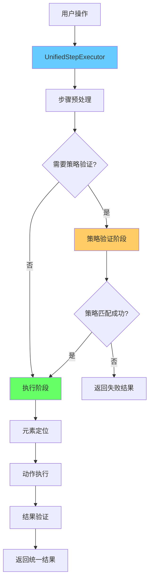

# 🏗️ 统一策略匹配架构设计方案

## 🎯 设计目标

设计一个统一的策略匹配系统，消除当前架构中的双路径分裂问题，实现：

1. **统一执行流程**：所有步骤都走同一个处理管道
2. **策略验证集成**：策略匹配作为执行前的验证阶段
3. **前后端一致**：策略配置能完整传递到后端执行
4. **测试与执行统一**：单步测试和批量执行使用相同逻辑

## 🏗️ 统一架构设计

### 架构流程图



### 核心设计原则

1. **分阶段处理**：预处理 → 策略验证 → 元素定位 → 动作执行
2. **统一接口**：所有步骤使用相同的执行接口
3. **可选策略**：策略验证是可选的，基础动作可以跳过
4. **完整配置传递**：策略配置完整传递到后端

## 💻 前端统一接口设计

### 1. 统一的步骤执行器

```typescript
// src/hooks/useUnifiedStepExecutor.ts
interface UnifiedStepExecutor {
  executeStep(
    step: SmartScriptStep, 
    deviceId: string, 
    mode: 'test' | 'execute'
  ): Promise<UnifiedStepResult>;
}

interface UnifiedStepResult {
  success: boolean;
  step_id: string;
  step_name: string;
  message: string;
  duration_ms: number;
  timestamp: number;
  
  // 分阶段结果
  strategy_validation?: StrategyValidationResult;
  element_location?: ElementLocationResult;
  action_execution?: ActionExecutionResult;
  
  // 统一的元素和数据
  ui_elements: any[];
  extracted_data?: any;
  logs: string[];
  error_details?: string;
}

interface StrategyValidationResult {
  success: boolean;
  strategy: string;
  matched_elements: any[];
  confidence_score: number;
  validation_time_ms: number;
}

interface ElementLocationResult {
  success: boolean;
  target_element: any;
  coordinates: { x: number; y: number };
  bounds: string;
  location_method: 'strategy' | 'direct' | 'fallback';
}

interface ActionExecutionResult {
  success: boolean;
  action_type: string;
  actual_coordinates?: { x: number; y: number };
  execution_time_ms: number;
  ui_changed: boolean;
}
```

### 2. 统一的执行逻辑

```typescript
// src/services/UnifiedStepExecutorService.ts
export class UnifiedStepExecutorService implements UnifiedStepExecutor {
  constructor(
    private adbService: any,
    private strategyMatcher: any
  ) {}

  async executeStep(
    step: SmartScriptStep,
    deviceId: string,
    mode: 'test' | 'execute'
  ): Promise<UnifiedStepResult> {
    const startTime = Date.now();
    const result: UnifiedStepResult = {
      success: false,
      step_id: step.id,
      step_name: step.name,
      message: '',
      duration_ms: 0,
      timestamp: startTime,
      ui_elements: [],
      logs: []
    };

    try {
      // 阶段1: 预处理步骤
      const preprocessed = await this.preprocessStep(step);
      result.logs.push(`✅ 步骤预处理完成: ${preprocessed.step_type}`);

      // 阶段2: 策略验证（如果需要）
      if (this.needsStrategyValidation(preprocessed)) {
        result.logs.push('🎯 开始策略验证...');
        result.strategy_validation = await this.validateStrategy(preprocessed, deviceId);
        
        if (!result.strategy_validation.success) {
          result.success = false;
          result.message = `策略验证失败: ${result.strategy_validation.strategy}`;
          result.duration_ms = Date.now() - startTime;
          return result;
        }
        result.logs.push(`✅ 策略验证成功: ${result.strategy_validation.strategy}`);
      }

      // 阶段3: 元素定位
      result.logs.push('📍 开始元素定位...');
      result.element_location = await this.locateElement(preprocessed, deviceId, result.strategy_validation);
      
      if (!result.element_location.success) {
        result.success = false;
        result.message = '元素定位失败';
        result.duration_ms = Date.now() - startTime;
        return result;
      }
      result.logs.push(`✅ 元素定位成功: (${result.element_location.coordinates.x}, ${result.element_location.coordinates.y})`);

      // 阶段4: 动作执行
      if (mode === 'execute' || this.shouldExecuteInTestMode(preprocessed)) {
        result.logs.push('⚡ 开始动作执行...');
        result.action_execution = await this.executeAction(preprocessed, deviceId, result.element_location);
        
        result.success = result.action_execution.success;
        result.message = result.action_execution.success ? '执行成功' : '执行失败';
        result.logs.push(`${result.action_execution.success ? '✅' : '❌'} 动作执行完成`);
      } else {
        // 测试模式：仅验证不执行
        result.success = true;
        result.message = '策略验证和元素定位成功（测试模式）';
        result.logs.push('🧪 测试模式：跳过实际执行');
      }

      result.duration_ms = Date.now() - startTime;
      return result;

    } catch (error) {
      result.success = false;
      result.message = `执行异常: ${error}`;
      result.error_details = String(error);
      result.duration_ms = Date.now() - startTime;
      result.logs.push(`❌ 执行异常: ${error}`);
      return result;
    }
  }

  private needsStrategyValidation(step: SmartScriptStep): boolean {
    // 检查是否有策略配置
    return !!(step.parameters as any)?.matching?.strategy;
  }

  private shouldExecuteInTestMode(step: SmartScriptStep): boolean {
    // 某些步骤在测试模式下也需要执行（如点击测试）
    return /^点击/.test(step.name || '') || 
           (step.parameters as any)?.test_click_after_match === true;
  }

  private async validateStrategy(
    step: SmartScriptStep,
    deviceId: string
  ): Promise<StrategyValidationResult> {
    const startTime = Date.now();
    const matching = (step.parameters as any)?.matching;
    
    if (!matching?.strategy) {
      throw new Error('缺少策略配置');
    }

    // 调用统一的策略匹配命令
    const result = await this.adbService.validateStrategy(deviceId, {
      strategy: matching.strategy,
      fields: matching.fields || [],
      values: matching.values || {},
      includes: matching.includes,
      excludes: matching.excludes,
      additional_config: matching.hiddenElementParentConfig || matching.customConfig
    });

    return {
      success: result.success,
      strategy: matching.strategy,
      matched_elements: result.matched_elements || [],
      confidence_score: result.confidence_score || 0,
      validation_time_ms: Date.now() - startTime
    };
  }

  private async locateElement(
    step: SmartScriptStep,
    deviceId: string,
    strategyResult?: StrategyValidationResult
  ): Promise<ElementLocationResult> {
    // 优先级: 策略匹配结果 > 直接坐标 > 回退方案
    
    if (strategyResult?.success && strategyResult.matched_elements.length > 0) {
      // 使用策略匹配的结果
      const element = strategyResult.matched_elements[0];
      const bounds = this.parseBounds(element.bounds);
      return {
        success: true,
        target_element: element,
        coordinates: {
          x: Math.floor((bounds.left + bounds.right) / 2),
          y: Math.floor((bounds.top + bounds.bottom) / 2)
        },
        bounds: element.bounds,
        location_method: 'strategy'
      };
    }

    // 使用直接坐标
    const params = step.parameters as any;
    if (params.x !== undefined && params.y !== undefined) {
      return {
        success: true,
        target_element: { type: 'direct_coordinates' },
        coordinates: { x: params.x, y: params.y },
        bounds: `[${params.x},${params.y}][${params.x+1},${params.y+1}]`,
        location_method: 'direct'
      };
    }

    // 解析 bounds
    if (params.bounds) {
      const bounds = this.parseBounds(params.bounds);
      return {
        success: true,
        target_element: { type: 'bounds_based' },
        coordinates: {
          x: Math.floor((bounds.left + bounds.right) / 2),
          y: Math.floor((bounds.top + bounds.bottom) / 2)
        },
        bounds: params.bounds,
        location_method: 'direct'
      };
    }

    return {
      success: false,
      target_element: null,
      coordinates: { x: 0, y: 0 },
      bounds: '',
      location_method: 'fallback'
    };
  }

  private async executeAction(
    step: SmartScriptStep,
    deviceId: string,
    location: ElementLocationResult
  ): Promise<ActionExecutionResult> {
    const startTime = Date.now();
    
    // 构造执行步骤，使用定位结果的坐标
    const executeStep = {
      ...step,
      parameters: {
        ...step.parameters,
        x: location.coordinates.x,
        y: location.coordinates.y,
        bounds: location.bounds
      }
    };

    // 调用统一的执行命令
    const result = await this.adbService.executeUnifiedStep(deviceId, executeStep);

    return {
      success: result.success,
      action_type: step.step_type,
      actual_coordinates: location.coordinates,
      execution_time_ms: Date.now() - startTime,
      ui_changed: result.ui_changed || false
    };
  }

  private parseBounds(boundsStr: string): { left: number; top: number; right: number; bottom: number } {
    // 解析 "[100,200][300,400]" 格式
    const match = boundsStr.match(/\[(\d+),(\d+)\]\[(\d+),(\d+)\]/);
    if (!match) throw new Error(`无效的 bounds 格式: ${boundsStr}`);
    
    return {
      left: parseInt(match[1]),
      top: parseInt(match[2]),
      right: parseInt(match[3]),
      bottom: parseInt(match[4])
    };
  }
}
```

### 3. 统一的 Hook

```typescript
// src/hooks/useUnifiedStepTest.ts
export function useUnifiedStepTest() {
  const { devices, selectedDevice } = useAdb();
  const [testingSteps, setTestingSteps] = useState<Set<string>>(new Set());
  const [testResults, setTestResults] = useState<Map<string, UnifiedStepResult>>(new Map());

  const executor = useMemo(() => {
    return new UnifiedStepExecutorService(
      adbService, // 注入真实的 ADB 服务
      strategyMatcher // 注入策略匹配器
    );
  }, []);

  const executeStep = useCallback(async (
    step: SmartScriptStep,
    deviceId: string,
    mode: 'test' | 'execute' = 'test'
  ) => {
    const stepId = step.id;
    setTestingSteps(prev => new Set(prev).add(stepId));

    try {
      const result = await executor.executeStep(step, deviceId, mode);
      
      setTestResults(prev => new Map(prev).set(stepId, result));
      return result;
    } finally {
      setTestingSteps(prev => {
        const next = new Set(prev);
        next.delete(stepId);
        return next;
      });
    }
  }, [executor]);

  return {
    executeStep,
    testingSteps,
    testResults,
    isTestingStep: (stepId: string) => testingSteps.has(stepId),
    getTestResult: (stepId: string) => testResults.get(stepId)
  };
}
```

## 🦀 后端统一接口设计

### 1. 统一的 Tauri 命令

```rust
// src-tauri/src/commands/unified_execution.rs
#[tauri::command]
pub async fn execute_unified_step(
    device_id: String,
    step: SmartScriptStep,
    mode: ExecutionMode,
) -> Result<UnifiedStepResult, String> {
    let executor = UnifiedStepExecutor::new(device_id);
    executor.execute_step(step, mode).await
        .map_err(|e| e.to_string())
}

#[tauri::command]
pub async fn validate_strategy(
    device_id: String,
    criteria: StrategyValidationRequest,
) -> Result<StrategyValidationResult, String> {
    let validator = StrategyValidator::new(device_id);
    validator.validate(criteria).await
        .map_err(|e| e.to_string())
}
```

### 2. 统一的执行器

```rust
// src-tauri/src/services/unified_step_executor.rs
pub struct UnifiedStepExecutor {
    device_id: String,
    adb_path: String,
    strategy_processor_factory: StrategyProcessorFactory,
    action_executor: ActionExecutor,
}

impl UnifiedStepExecutor {
    pub async fn execute_step(
        &self,
        step: SmartScriptStep,
        mode: ExecutionMode,
    ) -> Result<UnifiedStepResult> {
        let mut result = UnifiedStepResult::new(step.id.clone(), step.name.clone());
        
        // 阶段1: 预处理
        let preprocessed = self.preprocess_step(step).await?;
        result.add_log("✅ 步骤预处理完成");

        // 阶段2: 策略验证（如果需要）
        if let Some(strategy_config) = self.extract_strategy_config(&preprocessed) {
            result.add_log("🎯 开始策略验证...");
            
            let strategy_result = self.validate_strategy(&strategy_config).await?;
            result.strategy_validation = Some(strategy_result.clone());
            
            if !strategy_result.success {
                result.success = false;
                result.message = format!("策略验证失败: {}", strategy_config.strategy);
                return Ok(result);
            }
            result.add_log("✅ 策略验证成功");
        }

        // 阶段3: 元素定位
        result.add_log("📍 开始元素定位...");
        let location_result = self.locate_element(&preprocessed, &result.strategy_validation).await?;
        result.element_location = Some(location_result.clone());
        
        if !location_result.success {
            result.success = false;
            result.message = "元素定位失败".to_string();
            return Ok(result);
        }
        result.add_log("✅ 元素定位成功");

        // 阶段4: 动作执行
        if mode == ExecutionMode::Execute || self.should_execute_in_test_mode(&preprocessed) {
            result.add_log("⚡ 开始动作执行...");
            
            let action_result = self.execute_action(&preprocessed, &location_result).await?;
            result.action_execution = Some(action_result.clone());
            
            result.success = action_result.success;
            result.message = if action_result.success { "执行成功" } else { "执行失败" }.to_string();
        } else {
            result.success = true;
            result.message = "策略验证和元素定位成功（测试模式）".to_string();
            result.add_log("🧪 测试模式：跳过实际执行");
        }

        Ok(result)
    }

    async fn validate_strategy(
        &self,
        config: &StrategyConfig,
    ) -> Result<StrategyValidationResult> {
        // 使用现有的策略处理器系统
        let processor = self.strategy_processor_factory.create_processor(&config.strategy);
        
        // 获取 UI 快照
        let xml_content = self.get_ui_snapshot().await?;
        
        // 执行策略匹配
        let context = MatchingContext {
            device_id: self.device_id.clone(),
            xml_content,
            criteria: config.clone(),
            additional_config: config.additional_config.clone(),
        };
        
        let matches = processor.process(&context).await?;
        
        Ok(StrategyValidationResult {
            success: !matches.is_empty(),
            strategy: config.strategy.clone(),
            matched_elements: matches,
            confidence_score: self.calculate_confidence(&matches),
            validation_time_ms: 0, // TODO: 实际计时
        })
    }

    async fn locate_element(
        &self,
        step: &SmartScriptStep,
        strategy_result: &Option<StrategyValidationResult>,
    ) -> Result<ElementLocationResult> {
        // 优先使用策略匹配结果
        if let Some(strategy) = strategy_result {
            if strategy.success && !strategy.matched_elements.is_empty() {
                let element = &strategy.matched_elements[0];
                let bounds = self.parse_bounds(&element.bounds)?;
                return Ok(ElementLocationResult {
                    success: true,
                    target_element: element.clone(),
                    coordinates: Coordinates {
                        x: (bounds.left + bounds.right) / 2,
                        y: (bounds.top + bounds.bottom) / 2,
                    },
                    bounds: element.bounds.clone(),
                    location_method: "strategy".to_string(),
                });
            }
        }

        // 回退到直接坐标
        if let (Some(x), Some(y)) = (step.parameters.get("x"), step.parameters.get("y")) {
            return Ok(ElementLocationResult {
                success: true,
                target_element: serde_json::json!({"type": "direct_coordinates"}),
                coordinates: Coordinates {
                    x: x.as_i64().unwrap_or(0) as i32,
                    y: y.as_i64().unwrap_or(0) as i32,
                },
                bounds: format!("[{},{}][{},{}]", x, y, x, y),
                location_method: "direct".to_string(),
            });
        }

        // TODO: 解析 bounds 等其他定位方式

        Err(anyhow::anyhow!("无法确定元素位置"))
    }

    async fn execute_action(
        &self,
        step: &SmartScriptStep,
        location: &ElementLocationResult,
    ) -> Result<ActionExecutionResult> {
        // 构造包含坐标的执行步骤
        let mut execute_step = step.clone();
        execute_step.parameters.insert("x".to_string(), serde_json::Value::Number(location.coordinates.x.into()));
        execute_step.parameters.insert("y".to_string(), serde_json::Value::Number(location.coordinates.y.into()));

        // 调用现有的动作执行器
        let result = self.action_executor.execute(&execute_step).await?;

        Ok(ActionExecutionResult {
            success: result.success,
            action_type: step.step_type.to_string(),
            actual_coordinates: Some(location.coordinates.clone()),
            execution_time_ms: result.duration_ms,
            ui_changed: result.ui_changed,
        })
    }
}
```

### 3. 命令注册

```rust
// src-tauri/src/main.rs
.invoke_handler(tauri::generate_handler![
    // 统一执行命令
    execute_unified_step,      // 新的统一执行命令
    validate_strategy,         // 恢复策略验证命令
    
    // 保留现有命令作为回退
    execute_single_step_test,  // 作为回退选项保留
    
    // 其他命令...
])
```

## 🔄 迁移策略

### 1. 渐进式迁移

```typescript
// 支持新旧两种模式
export function useAdaptiveStepTest() {
  const [useUnifiedMode, setUseUnifiedMode] = useState(
    () => localStorage.getItem('use_unified_execution') === 'true'
  );

  const legacyExecutor = useSingleStepTest();
  const unifiedExecutor = useUnifiedStepTest();

  const executeStep = useCallback(async (step: SmartScriptStep, deviceId: string) => {
    if (useUnifiedMode) {
      return await unifiedExecutor.executeStep(step, deviceId, 'test');
    } else {
      return await legacyExecutor.executeSingleStep(step, deviceId);
    }
  }, [useUnifiedMode, legacyExecutor, unifiedExecutor]);

  return {
    executeStep,
    useUnifiedMode,
    setUseUnifiedMode,
    // 其他方法...
  };
}
```

### 2. 功能开关

```typescript
// 环境变量控制
const ENABLE_UNIFIED_EXECUTION = process.env.REACT_APP_UNIFIED_EXECUTION === 'true';

// 用户界面开关
<Switch 
  checked={useUnifiedMode}
  onChange={setUseUnifiedMode}
  checkedChildren="统一执行"
  unCheckedChildren="传统模式"
/>
```

## ✅ 统一架构的优势

1. **真正的策略功能**：策略匹配不再是虚假的，真正影响执行
2. **一致的执行逻辑**：测试和批量执行使用相同代码路径
3. **完整的配置传递**：前端策略配置完整传递到后端
4. **分阶段透明**：每个阶段的结果都清晰可见
5. **易于维护**：单一代码路径减少维护负担
6. **向后兼容**：渐进式迁移保证现有功能不受影响

这样的统一架构将彻底解决当前的双路径分裂问题，提供真正可靠的策略匹配功能。