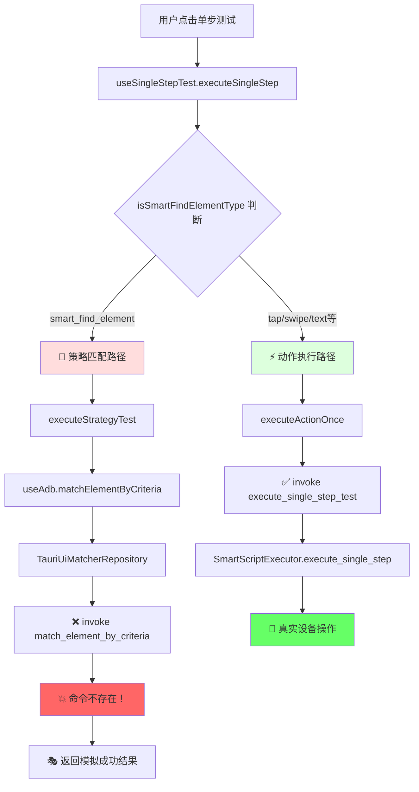

# 🚨 为什么说现在的架构不是统一的架构？

## 📋 核心问题：双路径执行系统

当前系统存在 **严重的架构分裂**，具体表现为两套完全独立且互不兼容的执行路径：

### 🔄 路径分裂示意图



## 💥 问题1: 命令系统断裂

### 被注释的关键命令
```rust
// src-tauri/src/main.rs 第281行
.invoke_handler(tauri::generate_handler![
    // ... 其他命令
    // match_element_by_criteria, // ❌ 关键命令被注释！
    execute_single_step_test,      // ✅ 这个命令存在
    // ...
])
```

### 结果：策略功能完全虚假
```typescript
// src/infrastructure/repositories/TauriUiMatcherRepository.ts
async matchByCriteria(deviceId: string, criteria: MatchCriteriaDTO): Promise<MatchResult> {
  try {
    // 尝试调用不存在的命令
    const result = await invoke('match_element_by_criteria', { deviceId, criteria });
    return result;
  } catch (error) {
    // 💥 必然走到这里，因为命令不存在
    
    // 🎭 返回硬编码的假成功
    if (criteria.strategy === 'hidden-element-parent') {
      return {
        ok: true,
        message: '✅ 隐藏元素父查找策略测试成功（模拟结果）',
        preview: {
          text: '模拟隐藏元素父容器',
          bounds: '[100,200][500,400]'  // 完全编造的坐标！
        }
      };
    }
    
    // 其他策略也返回假成功
    return {
      ok: true,
      message: '✅ 策略测试成功（模拟结果）',
      preview: { text: '模拟元素', bounds: '[0,0][100,100]' }
    };
  }
}
```

## 💥 问题2: 双重判断逻辑

### 前端路由判断
```typescript
// src/hooks/useSingleStepTest.ts 第67行
const runOnce = async (): Promise<SingleStepTestResult> => {
  // 🔀 在这里分叉：智能查找走策略匹配，其他走动作执行
  if (isSmartFindElementType(step.step_type)) {
    console.log('🎯 使用策略匹配模式测试元素查找（单次）');
    const strategyResult = await executeStrategyTest(step, deviceId);
    // ↑ 这个路径得到的是假结果
  } else {
    // 其他步骤类型走真实执行
    return executeActionOnce(step, deviceId);
  }
};
```

### 判断函数
```typescript
// src/modules/script-builder/utils/smartComponents.ts
function isSmartFindElementType(stepType: string): boolean {
  return stepType === "smart_find_element";
}
```

## 💥 问题3: 后端策略系统孤立

### 完整的策略处理系统存在但无法访问
```rust
// src-tauri/src/services/execution/matching/strategies/mod.rs
pub fn create_strategy_processor(strategy: &str) -> Box<dyn StrategyProcessor + Send + Sync> {
    match strategy {
        "standard" => Box::new(StandardStrategyProcessor::new()),
        "hidden-element-parent" => Box::new(HiddenElementParentStrategyProcessor::new()),
        "relaxed" => Box::new(RelaxedStrategyProcessor::new()),
        "strict" => Box::new(StrictStrategyProcessor::new()),
        "positionless" => Box::new(PositionlessStrategyProcessor::new()),
        _ => Box::new(StandardStrategyProcessor::new()),
    }
}
```

**但这个完整的策略系统无法被前端调用，因为命令被注释了！**

## 💥 问题4: 脚本执行时策略配置被忽略

### 批量执行时的简化处理
```rust
// src-tauri/src/services/execution/smart_script_executor.rs
impl SmartScriptExecutor {
    async fn execute_smart_find_element(&self, step: &SmartScriptStep) -> Result<SmartExecutionLog> {
        // 即使步骤中有复杂的策略配置：
        // {
        //   "strategy": "hidden-element-parent",
        //   "hiddenElementParentConfig": {
        //     "targetText": "返回",
        //     "maxTraversalDepth": 5
        //   }
        // }
        
        // 也只能使用简化的查找逻辑：
        let elements = self.ui_finder.find_elements_by_attributes(&device_id, &criteria).await?;
        // ↑ 不支持复杂的策略配置
    }
}
```

## 🎭 虚假成功的具体表现

### 用户看到的"成功"
```
✅ 隐藏元素父查找策略测试成功（模拟结果）
找到元素: 模拟隐藏元素父容器
位置: [100,200][500,400]
```

### 实际情况
- ❌ 没有真正查找任何元素
- ❌ 没有验证策略是否有效
- ❌ 坐标是硬编码的假数据
- ❌ 在批量执行时策略会被完全忽略

## 🏗️ 什么才是统一的架构？

### 理想的统一流程
```typescript
// 理想的统一接口
interface UnifiedStepExecutor {
  async executeStep(step: SmartScriptStep, deviceId: string, mode: 'test' | 'execute'): Promise<StepResult> {
    // 1. 统一的步骤预处理
    const preprocessed = await this.preprocessStep(step);
    
    // 2. 统一的策略验证（如果需要）
    if (preprocessed.needsStrategyValidation) {
      const validation = await this.validateStrategy(preprocessed, deviceId);
      if (!validation.success && mode === 'test') {
        return validation; // 测试模式下返回验证结果
      }
    }
    
    // 3. 统一的执行引擎
    return await this.executeWithEngine(preprocessed, deviceId, mode);
  }
}
```

### 统一的命令系统
```rust
// 所有操作都通过一个统一的命令
#[tauri::command]
async fn execute_unified_step(
    device_id: String,
    step: SmartScriptStep,
    mode: ExecutionMode, // Test | Execute
    app: tauri::AppHandle,
) -> Result<UnifiedStepResult, String> {
    let executor = UnifiedStepExecutor::new();
    executor.execute_step(step, device_id, mode).await
}
```

## 📊 总结：架构不统一的根本问题

| 问题类型 | 当前状态 | 影响 |
|---------|---------|------|
| **执行路径** | 双路径分裂 | 策略测试和动作执行完全隔离 |
| **命令系统** | 关键命令缺失 | 策略功能完全虚假 |
| **数据流** | 前后端断裂 | 复杂策略配置无法传递到后端 |
| **用户体验** | 虚假反馈 | 用户以为功能正常，实际完全无效 |
| **维护性** | 双重维护负担 | 需要维护两套不同的执行逻辑 |

**结论**：当前架构是典型的"非统一架构"，存在严重的功能分裂和虚假反馈问题。策略功能看起来在工作，实际上完全是假的。